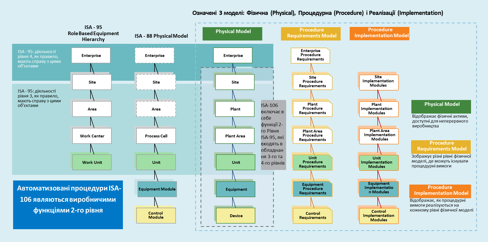
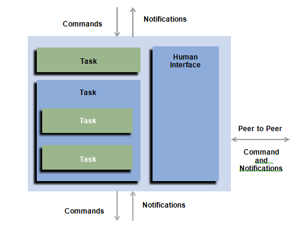
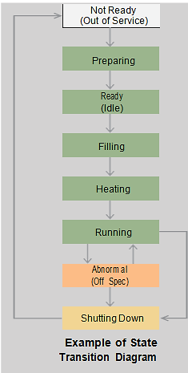
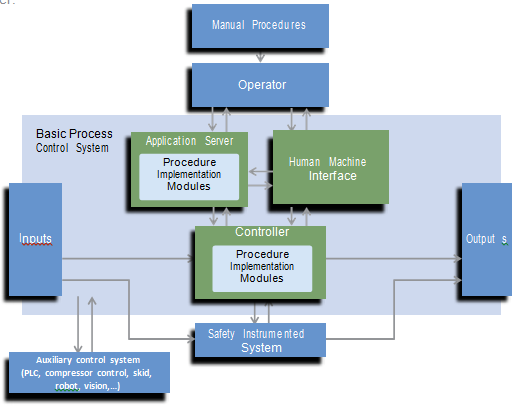

# ISA-106 Procedure Automation for Continuous Process Operations Technical Report 1

Оригінал https://web-material3.yokogawa.com/ISA_106_TR1_Infographic.us.pdf

Переклад: Олександр Пупена, Володимир Полупан

## Анотація по Технічному Звіту (Technical Report Summary)

**Цілі комітету**: Розробка стандарту для автоматизації процедур в неперервних технологічних операціях.

**Областю дії технічного звіту** є забезпечення загальних основ для розуміння переваг, кращих практик застосувань і мови, включаючи терміни та означення, що дозволить застосовувати процедурну автоматизацію в неперервних технологічних процесах.

Згідно погодженій з ISA106 комітетом областю дії, цей Технічний Звіт фокусується на автоматизованих Процедурах, які в основному знаходяться в межах підсистем диспетчерського керування, контролю і автоматизованого керування технологічними процесами. У область дії Технічного Звіту не входить розгляд виконання Процедур рівня функціонування MES/MOM.

У центрі уваги даного Технічного Звіту є процеси неперервного виробництва. Тим не менше, зміст Технічного Звіту може бути використаний і в керуванні технологічними процесами інших типів виробництв, такими як порційні (batch) або дискретні (discrete).

Технічний Звіт призначений для застосування в керівних діяльностях в межах базової системи керування технологічними процесами (BPCS) і системах протиаварійного захисту (ПАЗ,SIS). Необхідні функції ПАЗ(SIF), повинні бути проаналізовані і реалізовуватися відповідно до ISA-84.

## Ключові Означення (Key Definitions)

**Базова система керування процесом (Basic Process Control System, BPCS)**: Система, що реагує на вхідні сигнали від процесу, пов'язаного з ним обладнання, інших програмованих систем і/або оператора і формує вихідні сигнали, тим самим забезпечуючи роботу процесу і пов'язаного з ним обладнання в потрібному порядку, але яка не виконує ніяких функцій автоматичного захисту з вимогами SIL >=1

**Метод реалізації (Implementation method)**: Інструмент, який використовується для створення Задачі. Наприклад: Мови програмування, утиліти конфігурування BPCS і текстовий процесор.

**Операція, що підтверджується Оператором (Operator confirmation operation)**: Команда, що виконується за допомогою системи керування, проте повинна бути підтверджена оператором.

**Процедурна автоматизація (Procedural automation)**: Реалізація процедури в програмованій механічній, електричній або електронній системі.

**Точка зору процесу (Process point of view)**: точка зору конкретного Технологічного вузла (Unit) як цілісного, а не як сукупності окремих контурів. Програма керування написана з точки зору процесу дозволяє оператору взаємодіяти з цілісним процесом, в противагу взаємодії з конкретним контуром регулювання.

**Стан процесу (Process state)**: Окремий режим функціонування через який проходить Технологічний вузолу міру проходження процесу від зупинки до роботи і назад до зупинки. Кожний стан процесу представляє собою унікальний режим функціонування, який підтримує цілі Технологічного вузла по переробці входу процесу в бажаний вихід.

**Стан-орієнтоване керування (State based control)**: Методологія програми керування на базі каркасу, що означує "стани процесу", через які проходить обладнання (в загальному розумінні) під час запуску, роботи і зупинки. Ці стани означують статус кожного регулятору, двигуна, клапану і тривог в роботі Технологічного вузла.

**Стан-орієнтована тривога (режим-орієнтована тривога) (State-based alarm (mode-based alarms))**: Тривога, яка автоматично змінюється або виводиться з експлуатації на основі стану або умов процесу. 

## Анотація по цінності пропозицій (Value Proposition Summary).

1. **Підвищення показників безпеки (Improved safety performance)** -Використання в керуванні тривогами (alarm management) Автоматизованих процедур (Automated procedures) і ситуаційної обізнаності (awareness) через змінні стану знижує навантаження на експлуатаційний персонал в нештатних ситуаціях. Це дозволяє більш ефективно реагувати на ненормальні умови і знижує ймовірність людської помилки.

2. **Підвищення надійності (Improved reliability)** - Автоматизовані процедури можуть допомогти в підтримці максимальних темпів виробництва, зводячи до мінімуму час відновлення і уникнути простоїв.

3. **Зниження втрат, пов’язаних з помилками оператора (Reduced losses from operator errors)** – Автоматизація процедур дозволяє виробничому персоналу стандартизувати свої робочі процедури. Стандартизація знижує ймовірність людської помилки, яка могла б привести до несприятливих ситуацій, а також зменшує час, необхідний для відновлення роботи після нештатних ситуацій.

4. **Збільшення виробництва, за рахунок покращення запуску і зупинки (Increased Production by improving startups and shutdowns)** - За рахунок автоматизації процедурних кроків може бути досягнутий швидший, безпечніший і більш послідовний запуск і зупинка технологічних процесів.

5. **Збільшення виробництва і якості за допомогою ефективних переходів (Increased Production and Quality via efficient transitions)** – У більшості випадків при нормальних умовах експлуатації технологічному персоналу потрібно переводити процес з одного стану в інший. Автоматизація процедур дозволяє проводити операції для виконання переходів більш стабільно і за менший час.

6. **Зниження втрат за рахунок кращих реакцій на збурення (Reduced losses through improved responses to disturbances)**. Для передбачених збурень можуть бути підготовлені автоматизовані процедури, які скорочують час повернення до нормального функціонування процесу в необхідному усталеному режимі.

7. **Підвищення ефективності роботи оператора (Improved Operator Effectiveness)** - скорочує час оператора забезпечуючи автоматичне виконання повторюваних задач, і дозволяє їм зосередитися на оптимізації процесів і запобіганні нештатних ситуацій.

8. **Можливість Збереження і Поширення Знань (Higher Retention and Improved Dissemination of Knowledge)** - Автоматизовані процедури можуть бути використані для збереження знань про процес. Це особливо важливо для процедур, які не виконуються часто.

9. **Покращене Навчання персоналу (Improved Training)** - Оскільки знання і кращі практики записуються в автоматизованих процедурах, отримана документація і код можуть бути використані в якості матеріалу для підготовки нових операторів процесу.

10. **Покращене розуміння процесу (Improved insight into the process)** – Записуючи дії системи і оператора з використанням процедурної автоматизації, користувачі мають можливість переглянути та проаналізувати дані з кожного запуску, зупинки, перехідних процесів і відновлення після нештатних ситуацій.

11. **Більш ефективне керування змінами виробництва (More efficient change control)** - Структурований, модульний підхід до процедурної автоматизації мінімізує витрати на керування змінами виробництва.

12. **Зниження витрат на адаптацію підприємства (Reduced costs of enterprise adaptation)** - Після означення і реалізації загальної і стандартної структури для послідовного керування (sequence control), вона може бути створена у вигляді модулів бібліотеки коду/процедури/документації, що дозволяє легко клонувати/копіювати їх між ділянками (area) або виробничими площадками (site). 

13. **Загальні означення і термінологія (Common definitions and terminology)** - Оперативний персонал отримує загальний набір термінів з однаковими означеннями для опису вимог до вдосконалень і змін в процедурній автоматизації. Це покращує зв'язок з EPC, системними інтеграторами, постачальниками та внутрішніми підрозділами компанії.

## Приклади імен рівнів фізичної моделі (Examples of Physical Model Level Names)

 

| Рівень фізичної моделі     | Рівень означення імені                                       | Приклади                                                     |
| -------------------------- | ------------------------------------------------------------ | ------------------------------------------------------------ |
| Технологічний вузол (Unit) | Обладнання, згруповане разом для виконання однієї або кількох операцій по обробці, таких як реагування, кристалізація, або перегонка. Технологічний вузол поєднує в собі все необхідне устаткування для фізичної обробки і керування технологічним процесом, необхідних для виконання цих заходів в якості самостійної групи технологічного обладнання. | Реактор, Танк, Ректифікаційна колона, Фільтраційна колона, Автоматизована установка перекачування (LACT), Компресор, Контактор, Трубопровідний насос, Сепаратор, Гідроциклон |
| Обладнання (Equipment)     | Набір фізичних пристроїв і технологічної арматури, які виконують кінцеве число конкретних заходів по обробці. | Насосний агрегат, Контур регулювання, Компресор, Система подачі, Система відбору доз та аналізу |
| Пристрій (Device)          | Найнижчий рівень фізичного обладнання у фізичній моделі процесу. Наприклад регулюючі клапани, прилади і двигуни | Аналізатор, регулюючий клапан, Насос, Датчик температури     |

## Стиль автоматизації (An Automation Style)

**Стиль Автоматизації (Automation Styles)** – це послідовний підхід до розробки і впровадження Модулів Реалізації (Implementation Modules). Стилі Автоматизації дозволяють операторам послідовно використовувати автоматизовані Процедури і можуть знизити витрати на розробку шляхом впровадження каркасу, який стимулює повторне використання процедурної логіки.

Стилі Автоматизації охоплюють широкий спектр способів функціонування від повної відсутності автоматизації, тобто повного Ручного керування до комплексної автоматизації з повністю автоматизованим функціонуванням.

Важливим аспектом Стилю Автоматизації є кількість знань про процес, що перебувають в Автоматизованих Процедурах. Більш складні Стилі Автоматизації містять більше знань про процеси і, тому можуть обробляти більше ситуацій нормального і ненормального функціонування процесу, автоматично забезпечуючи тим самим більш послідовну і ефективну його роботу. Простіші Стилі Автоматизації містять менше знань про процеси, тому оператор повинен провести більше процедур і більш уважно стежити за процесом. Нижче наведені три приклади Стилів Автоматизації:

**Ручний Стиль Автоматизації (Manual Automation Style)** - Оператор несе відповідальність за відправку команди, її виконання і перевірку робочих елементів. Оператор може використовувати консоль базової системи керування (BPCS) чи індикатори та виконавчі механізми за місцем, але без участі розрахункових Процедур Автоматизації.

**Комп’ютеризований Стиль Автоматизації (Computer Assisted Automation Style)** - Модулі Реалізації базуються на використанні комп'ютеру, коли оператор і комп'ютер поділяють відповідальність за відправку команди, виконання і перевірку робочих елементів. Кількість використаних автоматизованих Задач може змінюватися.

**Повністю Автоматизований Стиль Автоматизації (Fully Automated Automation Style)** - Модулі Реалізації вважаються цілком автоматизованими, коли комп'ютер/контролер відповідає за більшу частину функцій відправки команд, виконання і перевірки робочих елементів.

## Модулі Реалізації (Implementation Modules)

Модулі Реалізації складаються з набору упорядкованих задач (Tasks). Задачі можуть містити інші задачі. Кожна задача забезпечує роботу операцій устаткування з покроковими інструкціями для виконання дій, які повинні бути виконані, та їх перевірки. З точки зору функціонування, процедура представляє собою один або більше Модулів Реалізації. На рисунку показані компоненти і входи/виходи Модуля Реалізації.

## Стани Процесу (Process States)

Використання Станів Процесу є одним з методів який надає каркасу організовувати автоматизовані процедури в більш складні Стилі Автоматизації.

При використанні Станів Процесу, Процедурна Автоматизація зосереджується на основній частині технологічного обладнання, як правило Технлогічний вузлах (Unit). Стани означуються з використанням фізичних умов етапів технологічного обладнання для того, щоб забезпечити безпечну і ефективну роботу.

Концепція станів процесу може бути розширена для здійснення Стан-Орієнтованого Керування (State Based Control).

## Відображення Модулів Реалізації на BPCS Компоненти (Mapping Implementation Modules to BPCS Components )

Модулі Реалізації виконуються в контролері BPCS (базової системи керування процесом) або сервері застосунків BPCS. На рисунку нижче представлена концептуальна схема BPCS, яка показує Модулі Реалізації на контролері і сервері додатків.

Якщо Метод Реалізації Задачі випливає в такий, що не може бути запущений на комп'ютері/контролері, він вважається ручною Процедурою і виходять за рамки BPCS. Деякі з цих Модулів Реалізації можуть бути виконані за допомогою Оператора безпосередньо на польовому обладнанні за допомогою друкованого або ручного електронного контрольного списку. Рішення по запуску Модулів Реалізації в дорадчому комп'ютері або контролері базується на безпеці, ризику, вартості і вигод.

Модуль Реалізації, що вимагає швидкого реагування, такий як послідовне керування насосами і клапанами в критичному масштабі часу, можуть бути реалізовані в реал-тайм контролері. Інші Модулі Реалізації, які не вимагають такої високої швидкості реакції, або включають більше взаємодії з Оператором можуть бути реалізовані в комп'ютері на базі ПК/серверу.

Критерії для прийняття рішення доречного розташування Модуля Реалізації включають в себе:

- вартість реалізації Процедури 
- вартість життєвого циклу
- час реакції, необхідний для процесу 
- здоров'я, безпека і екологічний ризик
- філософія взаємодії Оператора з Процедурами
- наявність контрольно-вимірювальних приладів для виконання автоматизованих задач
- потреба в покроковому виконанні автоматизованих Процедур

## Три робочих елемента, необхідних для виконання Модуля Реалізації (Three work items are required for the Implementation Module to Execute)

**Команда (Command)** – Тригер для введення в дію Модулю Реалізації. При її отриманні Модуль Реалізації призводить до Виконання своїх Задач. Команда може бути видана Оператором або іншим Модулем Реалізації.

**Виконання (Perform)** – Виконання Задач Модуля Реалізації. Задача може використовувати будь-який тип Методу Реалізації, але в кінцевому рахунку Задача виконується Оператором або комп'ютером/контролером.

**Перевірка (Verify)** - Перевірка, що Задачі Модуля Реалізації були Виконані успішно або зазнали невдачі. Перевірка може використовувати будь-який тип Методу Реалізації, але в кінцевому рахунку перевірка здійснюється Оператором або комп'ютером/контролером.

