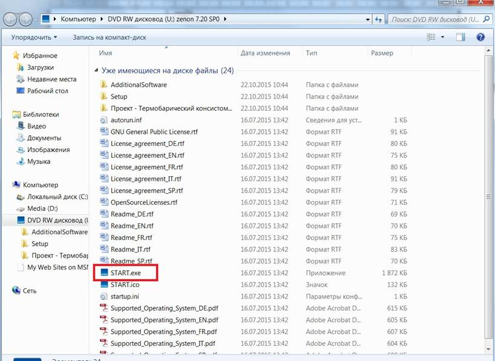

[Лабораторні](README.md)

# Лабораторна робота №1. Встановлення та налаштування SCADA zenon

**Тема. Загальні положення, і середовище виконання**

**Тривалість**: 2 акад. години (1 пара).

**Мета:** підготовка робочого місця, ознайомлення з можливостями середовищ виконання SCADA на базі zenon

**Цілі.** 

1. Встановити середовище розроблення та виконання SCADA zenon 

2. Навчитися запускати, зупиняти, перезапускати середовище виконання  SCADA zenon . 

3. На прикладі демонстраційного проекту ознайомитися з основними можливостями середовища виконання: анімацією, тривоговими екранами, трендами та інш.

У цьому лабораторному практикумі Ви познайомитеся з базовими можливостями системи керування та навчитеся створювати нескладні проекти візуалізації виробничих операцій. Тут розглянуті найбільш  важливі етапи проектування, такі як розробка екранів мнемосхем, елементів керування, ведення архівів, адміністрування користувачів та  багато інших моментів з якими стикається інженер під час створення систем моніторингу та диспетчеризації. Дана лабораторна робота дає можливість ознайомитися з основними можливостями середовища виконання з точки зору користувача а не розробника. 

Концептуально SCADA zenon представляє собою  програмно-технічний комплекс який складається з середовища розроблення  проектів – Editor та середовища виконання – Runtime. Це дві незалежні  оболонки, які виконують кожна свою функцію і можуть встановлюватися на  робочу станцію окремо одна від одної. Середовище розроблення містить набір модулів та  інструментів необхідних для написання повнофункціональних програм і  пакет драйверів для підключення до найбільш розповсюджених апаратних  засобів. Воно потрібне для встановлення на робочі станції розробників. Середовище виконання встановлюється на робочі станції операторів і лише виконує розроблений проект. Для перевірки працездатності проекту середовище розроблення включає також середовище виконання.  

У лабораторній роботі використовується версія SCADA  zenon 7.6. Наразі є новіші версії, однак для навчальних цілей цієї версії буде достатньо. Відповідно до задач, які необхідно вирішувати, SCADA zenon 7.6 має чотири редакції:

| Реадакція                | Пояснення                                                    |
| ------------------------ | ------------------------------------------------------------ |
| **zenon Operator**       | HMI-cистема, призначена для створення нескладних проектів візуалізації для панелей оператора, вбудованих  систем та локальних диспетчерських пунктів на ПК з певними  функціональними обмеженнями. |
| **zenon Supervisor**     | Незалежна SCADA-система, яка містить  повний набір функцій для реалізації диспетчерського керування та збору  даних. Ефективно вирішує задачі побудови систем автоматизації будь-які  складності. |
| **zenon Energy Edition** | Спеціальна редакція системи, яка містить додатковий набір функцій для енергетичної промисловості. |
| **zenon Pharma Edition** | Спеціальна редакція системи, яка містить додатковий набір функцій для фармацевтичної промисловості. |

Вибір необхідної редакції здійснюється на етапі всатновлення системи.  Для цього курсу буде використовуватися редакція **zenon Supervisor**.

Система ліцензується по кількості змінних вводу/виводу та тих додаткових модулів, які використовуються в проекті і не  входять в базову поставку. Оскільки в навчальному курсі не потребується ліцензія, то програма (Editor\Runtime) після установки запуститься в DEMO-режимі. Єдина відмінність ліцензованої версії від  демонстраційної – це часові обмеження що накладаються на систему. Перші 40 запусків програма буде працювати 30 хвилин, після чого час  безперебійної роботи урізається до 10 хвилин. По закінченню визначеного  часу, з’явиться відповідне повідомлення і система буде закрита. Проект,  який розробляв користувач, повністю зберігається. Для продовження роботи необхідно повторно запустити систему. 

Додаткові матеріали по zenon можна знайти на сайті http://www.copa-data.com.ua/. Офіційним дистрибутором компанії COPA DATA в Україні є компанія [СВ Альтера ](http://www.svaltera.ua/) У підготовці лабораторного практику брали участь: Олександр Пупена (АКТСУ НУХТ), Олег Клименко (АКТСУ НУХТ) 

**Лабораторна установка**

- Апаратне забезпечення: ПК. 

- Програмне забезпечення: SCADA zenon.

## Порядок виконання роботи 

### 1. Встановлення середовища розроблення SCADA zenon та перший запуск системи

Комп’ютер, на який буде інсталюватися програмне забезпечення SCADA zenon 7.6 повинен відповідати наступним вимогам:

|      | Мінімальні           | Рекомендовані         |
| ---- | -------------------- | --------------------- |
| ОС   | Windows 7            | Windows 7 або новіша  |
| CPU  | Pentium 4            | Quad Core             |
| RAM  | 2 GB                 | 4 GB                  |
| HD   | 25 GB вільного місця | 200 GB вільного місця |

#### 1.1: Інсталювання середовища розроблення 

 Інсталюйте середовище розроблення разом з середовищем виконання.

- [ ] Завантажте дистрибутив SCADA [zenon 7.6](http://download.copadata.com/fileadmin/user_upload/Downloads/installation_cd/zenon760/SP0B36068/zenon760_FinalBuild36068_COPA-DATA.iso). Дана версія потребує ОС Windows 7 та вище.

- [ ] Відкрийте образ і скопіюйте усі файли в окрему папку. 

- [ ] Запустіть процес установки системи за допомогою файлу “START.exe”.

рис.1.1.

- [ ] У вікні, що з’явилось натисніть кнопку “Next”.

рис.1.2

- [ ] Прийміть умови ліцензійної угоди і натисніть кнопку “Next”.

рис.1.3

- [ ] Виберіть інсталяцію середовища розробки проекту **zenon Editor**
- [ ] У наступному вікні виберіть версію **zenon Supervisor**.

рис.1.4.

- [ ] На завершальному етапі виберіть пункт *Install now* та завершіть встановлення

#### 1.2: Запуск середовища розроблення та виконання

- [ ] Запустіть zenon Startup Tool
- [ ] У командах Start виберіть `Start 32-bit zenon Editor`

рис.1.5.

- [ ] Вийде пропозиція запустити середовище розроблення в демо-режимі, зробіть підтвердження
- [ ] Повинно автоматично завантажитися робоче середовище SUPERVISORDEMO760 та проект SUPERVISOR760 (рис.1.6)
- Викличте контекстне меню проекту (натисніть праву кнопку миші на проект), проконтролюйте щоб там стояли опції `Set project as start project` та `Activate project` , якщо не стоять - виставте їх.   

рис.1.6.

- Натисніть кнопку Start Runtime 
- Вийде пропозиція запустити середовище виконання в демо-режимі, зробіть підтвердження
- Перший раз при запуску необхідно підтвердити доступ до портів (рис.1.8)

рис.1.8

- З'явиться основна сторінка демопроекту, в якому можна перейти на різні демонстраційні частини проекту (рис.1.9)

рис.1.9 