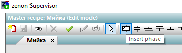
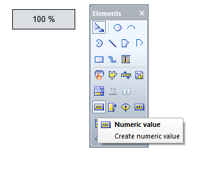
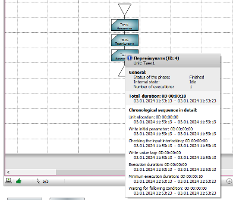

[Лабораторні](README.md)

# ЛАБОРАТОРНА РОБОТА 2. Основи роботи з Batch Control

Мета роботи – навчитися працювати з базовими елементами ISA-88 в zenon Batch Control: етапами та апаратами, рецептами, мовою PFC та тегами.

## Загальні теоретичні відомості

Метою даного проекту є розуміння того, як працює модуль Batch Control, як можна створювати проекти zenon з Batch Control з незалежним один від одного створенням і виконанням рецептів. У зв'язку з цим, основний акцент робиться на передачу знань про модуль Batch Control і менше про розробку функціональних рецептів, які відповідають вимогам реального виробництва.

Модуль Batch Control надає можливість автоматизувати періодичні виробничі процеси, що орієнтовані на виготовлення партій. Модуль відповідає вимогам стандарту ANSI/ISA-88.01-1995 також відомого як ANSI/ISA-S88 та IEC-61512 .

Модуль розроблений таким чином, щоб бути незалежним від реалізації систем керування. Це значить, що передача даних відбувається через всі доступні драйвери zenon з будь-якими ПЛК або навіть віддаленими терміналами RTU. Ці пристрої можуть виконувати тільки дії процесу. Вся обробка рецепта проводиться на комп'ютері в виконавчій машині рецептів REE (Recipe Execution Engine). Для змін в Batch рецепті (надалі рецепт) або для створення нових майстер рецептів (Master Recipe), ніяких змін в коді ПЛК проводити не потрібно.

Модуль слідує жорсткому розділенню процедури рецепту (згідно ISA процедурної моделі керування) і виконання технологічних функцій (згідно ISA процесної моделі), як описано в ISA-S88, главі 5.2.1.

Розглянемо реальний приклад для легшого розуміння. Це проект для керування об’єктом «Танк перемішування» з використанням Batch Control. Припускаємо, що «Танк» можна наповнювати і вивантажувати, а його вміст – перемішувати. Всі інші функції і властивості «Танку» можуть бути вільно означені.

Коротко розглянемо основні поняття. 

**Рецепт** (**Recipe**\) є об'єктом, який містить мінімальний набір інформації, що однозначно ставить вимоги до виробництва для конкретного продукту. Рецепти надають спосіб для опису продуктів і способи вироблення цих продуктів. Залежно від конкретних вимог підприємства, можуть існувати різні типи рецепту. Проте, в стандарті ISA-88 обговорюються лише чотири типи рецептів:

- загальний рецепт (на рівні підприємства):

- місцевий рецепт (на рівні виробничою площадки);

- майстер рецепт (шаблонний рецепт технологічної комірки);

- керівний рецепт (конкретний екземпляр рецепту для кожної партії).

**Майстер рецепт** (**Master recipe**\) орієнтований на конкретну технологічну комірку і є «шаблоном» для керівного рецепту, що використовується для створення однієї партії продукту (напівпродукту). Він може бути отриманий із загального або місцевого рецепту, однак може бути створений як незалежна сутність, якщо автор рецепту має знання про необхідний процес і продукт.

Центральним елементом рецептів є **етапи** (**phase**). Вони призначені для передачі значень в ПЛК і можуть керувати виконанням рецепту з використанням умов. Кожен етап розміщений в **апараті** (**unit**, **технологічний вузол**). Апарати представляють собою частини машин або обладнання, наприклад, таких як Танк. Цей зв'язок відображається в zenon у вигляді деревовидної структури. Ця структура відображається у вікні детального перегляду (detail window), якщо натиснути по розділу проекту «Batch Control» в дереві проекту.

На рис.2.1 показана деревовидна структура апаратів в проекті zenon. Там є два апарати під головним вузлом («Unit1» і «Unit2»). «Unit1» містить дваетапи «Phase1» і «Phase2». У правій частині вікна деталізації відображаються властивості або вміст об'єкта, виділеного в дереві.

                               

Рис.2.1. Деревовидна структура обладнання з апаратами (Unit)

Етап може взаємодіяти з контролером за допомогою тегів. При цьому проводиться різниця між **командними тегами** (**command tags**\) і **зворотними тегами** (**return tags**\):

- Командні теги використовуються для запису значень в контролер.

- Зворотні теги можуть бути використані для отримання значень з контролера. 

В обох випадках фактичний зв'язок здійснюється за допомогою змінних (variable). Тому з кожним тегом повинні бути пов'язані змінні. Командні теги в свою чергу поділяються на **ініціювальні теги** (**initial tags**\) і **теги значень** (**value tags**\):

- ініціювальні теги – це командні параметри, які задаються перед запуском етапу; 

- теги значень – це командні параметри, які передаються в контролер під час роботи етапу за їх зміни. 

## Завдання до виконання лабораторної роботи

1. Створити проект в zenon та драйвер зв'язку по Modbus. У цій роботі драйвер буде працювати в режимі імітації, тому зв'язку з ПЛК не буде.
2. Створити Unit (апарати) та pahase (етапи) для Танку приготування сумішей.
3. Розробити екран Batch Control який використовуватиметься надалі в усіх лабораторних роботах для керування Batch рецептами.
4. Створити і виконати майстер рецепт мийки танку на мові PFC та перевірити його роботу.
5. Створити теги для взаємодії етапів з ПЛК. Перевірити їх роботу.
6. Створити умови для для контролю часу та керування часом виконання рецепту.

## Порядок проведення роботи

### 1. Створення проекту

- [ ] Запустіть редактор zenon і створіть новий робочий простір `File->Workspace->New` з іменем `BatchWSP`

- [ ] Створіть новий проект `File -> Proect new`  з іменем `BATCHLAB`.  Відмовтеся від помічника.
- [ ] Додайте в проект драйвер Modbus TCP/IP і налаштуйте його на роботу в режимі імітації `Simulation - static` (рис.2.2).

 

Рис.2.2. Вставка драйверу Modbus TCP/IP та налаштування його на режим імітації

### 2. Створення обладнання та етапів (Units and phases)

- [ ] Створіть в дереві `Batch Control ->Unit -> New Unit`  Unit з назвою «Танк1» (рис.2.3).

 

Рис.2.3. Створення нового апарату (Unit)

- [ ] Додайте новий етап (phase) до апарату. Для цього використовуйте контекстне меню апарату або відповідну іконку в панелі інструментів списку `New phase`.
- [ ] Змініть назву етапу на «Перемішувати».
- [ ] Створіть ще два етапи «Наповнити» та «Вивантажити».

 

Рис.2.4. Етапи апарату «Танк1»

### 3. Створення екрану Batch Control

Рецепти можуть бути створені і виконані тільки в Runtime (режимі виконання). Для цього попередньо необхідно створити екран типу `BatchControl`.

- [ ] Створіть два фрейми (frame) для екранів:

- `Основний шаблон екрану` – десь на 8/9 верхньої частини вікна для відображення основних екранів.

- `Шаблон меню` – десь на 1/9 нижньої частини вікна для екранів з кнопками перемикання.

- [ ] Створіть новий екран на базі `Шаблону меню` і дайте йому ім'я `Екран меню`.

- [ ] Створіть функцію перемикання на новостворений екран (`Screen Switch`) з іменем `Перемикання на екран меню`, та вкажіть новостворену сторінку

- [ ] Зробіть `Екран меню` стартовим, якщо він таким не являється (`Властивості проекту -> Graphical Design -> Start Screen`) 

- [ ] Створіть функцію `Application -> Reload project online` з іменем `Перезавантажити`. 
- [ ] Відкрийте  `Екран меню`. Добавте на екран кнопку. 

- [ ] Вкажіть для кнопки функцію `Перезавнтажити`. Напишіть напис на кнопці `Reload`

- [ ] Створіть новий екран на базі `Основний шаблон екрану`  (надалі основного шаблону) і дайте йому ім'я `Екран Batch`. Змініть тип екрану на `Batch Control`.

- [ ] Добавте на екран елемент керування Recipe Editor (рис.2.5). Розтягніть його десь на 2/3 ширини екрану по горизонталі і на всю висоту по вертикалі. 

 Рис.2.5. Додавання елементу Recipe Editor

Для екранів типу Batch Control доступні і інші елементи, але тут зосередимося тільки на Recipe Editor, додаткові елементи керування будуть додані пізніше.

- [ ] Створіть функцію zenon перемикання на даний екран. У вікні налаштування фільтра залиште все за замовченням і натисніть «ОК». Дайте ім’я функції, наприклад `Перемикання на екран Batch`.

- [ ] На екрані `Екран меню`  (надалі по тексту будемо вживати просто "екран меню") проекту створіть нову кнопку і позначте її як `Екран Batch`. Прив’яжіть до неї функцію `Gеремикання на екран Batch`.

За допомогою цих кількох кроків, Ви створили основу для створення рецепта в Runtime і можливість його виконати.

### 4. Створення і перевірка роботи рецептів

На цьому кроці Ви будете створювати і виконувати свій перший рецепт. 

- [ ] Збережіть усі зміни та скомпілюйте проект

- [ ] Запустіть zenon Runtime.

- [ ] Використовуючи кнопку на панелі меню, перейдіть на екран «Екран Batch».

- [ ] Покажіть список майстер рецептів в редакторі рецептів. Для цього натисніть на іконку в правому нижньому кутку редактора рецептів (recipe editor) і виберіть Master Recipe List (рис.2.6). З'являється панель переліку майстер рецептів, яку можна рухати і закріплювати в межах редактора рецептів. 

 

Рис.2.6. Відображення списку майстер рецептів в Recipe Editor

- [ ] У списку майстер рецептів створіть новий рецепт: New Master recipe. Відображається діалог для налаштування нового рецепта (рис.2.7). 

 

Рис.2.7. Вікно створення нового рецепту

- [ ] Виберіть тип `PFC recipe` і введіть в полі name назву рецепту `Мийка`. Введіть в полі `Description` текст для опису `Рецепт для мийки танку`. Натисніть `Ok`.

Після підтвердження в редакторі рецептів автоматично відкривається новий майстер рецепт. 

- [ ] Використайте кнопки масштабування, щоб весь рецепт розмістився в екрані. 

Рецепт не має ніяких інших елементів за винятком стартового елемента і кінцевого елемента. Він знаходиться в режимі редагування, що показано зображенням олівця на лівій частині панелі статусу (внизу редактора). У цьому режимі рецепт може бути тільки відредагований. Для виконання ж рецепту його необхідно перевести в тестовий режим.

- [ ] Додайте три етапи, які ви заздалегідь створили в zenon Editor. Для цього натисніть на іконку `Insert phase` в панелі інструментів і помістіть етапи на робочу область рецепту.

При переміщенні покажчика миші на рецепт, позиція, в яку може бути вставлений елемент, буде виділена зеленим кольором. Позиція, де вставка неможлива, виділена червоним кольором. 

- [ ] Помістіть етап в потрібне положення, натиснувши на потрібну позицію. 

- [ ] З'являється діалог для вибору етапу. У діалозі виберіть етап `Наповнити` і натисніть `Ok`.

Після вставки етапу можна відразу додавати інші етапи, або перейти в режим режим вибору через клавішу Esc.

- [ ] Вставте два інші етапи, спочатку `Перемішувати` а потім `Вивантажити`.

- [ ] Переключіться в режим редагування, натиснувши кнопку `Esc`.

- [ ] Перемістіть елемент завершення процедури рецепту до останнього етапу, як показано на рис 2.8.

 

Рис.2.8. Процедура рецепту 

- [ ] Збережіть рецепт за допомогою кнопки збереження. 

Рецепт створено. Тепер необхідно перевірити його роботу:

- [ ] Переведіть рецепт в режим тестування. Для цього використовуйте відповідну іконку в панелі інструментів списку рецептів або редактора рецептів (рис.2.9). Підтвердьте свою дію у наступному діалоговому вікні. 

 

Рис.2.9. Переведення в режим тестування

У рядку заголовка редактора рецептів тепер можна побачити, що рецепт знаходиться в тестовому режимі, а не в режимі редагування (рис.2.10).

 

Рис.2.10. Панель редактору в режимах редагування та тестування

- [ ] Запустіть рецепт на виконання за допомогою кнопки `Start Recipe` на панелі інструментів редактора рецептів.

Всі три функції змінюють колір в зелений один за іншим, а потім синій. Колір заливки показує стан етапу.

| Колір   | Значить                  |
| ------- | ------------------------ |
| зелений | Етап зараз виконується   |
| синій   | Етап завершив виконання. |

Про інші статуси етапів будуть розглянуті пізніше.

- [ ] Переведіть рецепт в стан редагування.

 

### 5. Робота з тегами

Створений рецепт не виконує зв'язку з PLC, тому не може служити для керування обладнанням. Тому потрібно створити теги, як будуть взаємодіяти з ПЛК через змінні. 

Спочатку необхідно створити змінні що з'єднані з джерелом в ПЛК.

- [ ] У розділі `Variables` створіть нову змінну

- [ ] Виберіть драйвер `MODRTU` ,тип даних `REAL`, назву змінної вкажіть `Заданий рівень наповнення T1` і натисніть `Finish`

- [ ] У властивостях змінної розділу `Addressing` залиште все за замовченням:
  - `Driver Object Type = Holding Register`
  - `Data Type = REAL`
  - `Net Address = 0`
  - `Offset = 0`

- [ ] У властивостях змінної `Value Calculation` змініть: 
  - `Value Range PLC`: 0-100 
  - `Value adjustment linear` : 0-100

- [ ] введіть % в якості одиниці вимірювання `General -> Measuring unit`. 

Тепер необхідно створити параметри для етапу `Наповнити` . 

- [ ] Перейдіть до zenon Editor.
- [ ] Натисніть етап `Наповнити` у «Танк1». У області списку відображається список параметрів обраного етапу, який на даний момент порожній (рис.2.11).
- [ ] На панелі інструментів натисніть `New value tag`

 

Рис.2.11. Список параметрів для етапу

У список вставляється рядок, який представляє собою тег значення (value tag) з іменем `Parameter1`. Стовпці списку показують властивості тега, які також показані у вікні властивостей. 

- [ ] Виділіть параметер і подивіться на його властивості у розділі `General` . 

| Властивість                            | Опис                                                         |
| -------------------------------------- | ------------------------------------------------------------ |
| Name(Ім’я)                             | Довільне ім’я тегу. Мусить бути унікальним в межах етапу (phase). |
| Description(Опис)                      | Текст для детального опису тегу (не обов'язково).            |
| Type (Тип)                             | Тип тегу: `Initial`, `value` або `return`. Тип тегу може бути змінений у будь  який момент часу. |
| Tag data type(Тип даних тегу)          | `Binary`, `numerical`, `string` або `duration (time)`. Означує тип тегу і фільтри  для вибору змінної . |
| Variable linking(Прив'язка до змінної) | Прив'язка змінної до тегу і його властивостей .              |

- [ ] Подивіться на властивості тегу у розділі `Write set value` . 

| Властивість                                                  | Опис                                                         |
| ------------------------------------------------------------ | ------------------------------------------------------------ |
| TAG value (Значення тегу)                                    | Значення яке має бути записане в змінну при виконанні етапу. |
| Min./Max. Value (Мін. максим значення)                       | Межі, в яких у режимі виконання може бути змінено значення тегу. |
| Min./Max. Value of variable (Мін. максим значення  змінної)  | Діапазон значень змінної. Межі тегу повинні бути в межах змінної. |
| Edit tag (редагування тегу)                                  |                                                              |
| Change able in the master recipe (Змінюваний в майстер  рецепті) | Активний: значення тегу можна редагувати в режимі виконання в рецепті. |

- [ ] Змініть ім'я (name) для тегу в `Заданий рівень наповнення`.

- [ ] Введіть опис (description) `Вказується заданий рівень, після досягнення якого завершиться заповнення танку`.

- [ ] Змініть тип даних тегів (tag data type) на `numeric`.

- [ ] Натисніть на кнопку вибору змінної `Variable -> Variable Linking (…)`  і виберіть змінну `Заданий рівень наповнення T1`. 

- [ ] Перейдіть до групи властивостей `Write Set Value` створеного тегу етапу, де видно межі та одиниці вимірювання змінної. 
  - Активуйте опцію `Change able in the master recipe`.
  - Введіть `tag value = 20`, `Min.Value = 10`, `Max.Value = 100`.

Ці налаштування вказують, що як тільки етап `Наповнити` почне виконуватися, то в `Заданий рівень наповнення T1` записується значення 20. Однак це значення може бути змінене в рецепті в межах від 10 до 100.

- [ ] Вставте на `Екран Batch` елемент `Numerical Value`, в якому відображається значення змінної `Заданий рівень наповнення T1`.

- [ ] Збережіть проект, зробіть компілювання змінених файлів виконання.
- [ ] Переключіться в zenon Runtime і натисніть кнопку `Reload`, якщо zenon Runtime запущений, або запустіть Runtime.
- [ ] Відкрийте екран `Batch` і в режимі тестування запустіть на виконання рецепт `Мийка`  і спостерігайте за значенням змінної. Як тільки етап `Наповнити` активується відображене значення змінюється з 0% на 20%.

Розглянемо зміну тегу в рецепті. Якщо заданий рівень заповнення потрібен не 20%, а 50%, то це можна зробити безпосередньо в режимі Runtime, без необхідності змінювати конфігурацію проекту в редакторі. Для цього необхідно виконати наступні дії.

- [ ] Переключіть рецепт в режим редагування. У  Runtime зробіть подвійний клік на етапі `Наповнити`. З'являється діалогове вікно для настройки етапу.

- [ ] Переключіться на закладку `Parameters`. Тут відображається список параметрів етапу. 
- [ ] За допомогою `Column selection...`  залиште тільки колонки `Name`, `Tag value`, `Min.value`, `Max.value`

- [ ] Натисніть `Ok`, у вікні параметрів буде відображатися тільки вибрані параметри (рис.2.12) 

 

Рис.2.12. Налаштування параметрів етапу

- [ ] Подвійним натисканням по імені тегу відкрийте діалогове вікно `change the tag properties` (рис.2.13).

 

Рис.2.13. Налаштування властивостей тегу в Runtime

- [ ] Змініть поле `tag value` рівним 50. Підтвердьте дії кнопкою `Ок`. Збережіть рецепт.

- [ ] У тестовому режимі виконайте рецепт знову. Значення змінної тепер змінено в 50%. 

Значення тегів в редагованих в zenon Editor майстер рецептах завжди оновлюються тільки там. У Runtimeзавжди можна синхронізуватися з цим значенням (кнопка ).

- [ ] Створіть наступні змінні з драйвером ModbusTCP/IP

| Назва змінної                     | Data type | Addresing Offset | Range | Measuring Unit |
| --------------------------------- | --------- | ---------------- | ----- | -------------- |
| Задана швидкість перемішування Т1 | Real      | 2                | 0-100 | об/хв          |
| Заданий нижній рівеньТ1           | Real      | 4                | 0-100 | %              |

- [ ] Створіть необхідні командні теги значень (Value Tag) і відповідні змінні для етапів `Перемішувати` і `Вивантажити`:

| Етап         | Тег                            | Тип     | Змінна                            | Tag Value | Min-Max Value | Додаткові налаштування                    |
| ------------ | ------------------------------ | ------- | --------------------------------- | --------- | ------------- | ----------------------------------------- |
| Перемішувати | Задана швидкість перемішування | numeric | Задана швидкість перемішування Т1 | 15        | 0-100         | `Change able in the master recipe = true` |
| Вивантажити  | Заданий нижній рівень          | numeric | Заданий нижній рівеньТ1           | 5         | 0-50          | `Change able in the master recipe = true` |

- [ ] На сторінці `Екран Batch` розмістіть `Numerical Value` для встановлення та зміни значення «`аданий нижній рівеньТ1`
- [ ] За допомогою елементу `Static Text` підпишіть поля для обох заданих рівнів (наповнення та нижній).

- [ ] Збережіть проект

### 6. Мінімальний час виконання

Є дві можливості, доступні для того, щоб вплинути на часові налаштування виконання етапу. Одна з них є `minimum duration of execution`. За допомогою цієї властивості етапу, можна означити, як довго етап повинен залишатися активним. У нашому випадку це може бути корисним, наприклад, для етапу `Перемішувати`. Необхідно означити, що етап повинен бути активним протягом 10 секунд. 

- [ ] У zenon editor відкрийте властивості етапу `Перемішувати`. Введіть для властивості `minimum duration of execution`, в групі `General` значення `0T00:00:10`.

- [ ] Скомпілюйте проект, перезавантажте Runtime і запустіть рецепт знову.

Тепер етап `Перемішувати` залишається активним протягом 10 секунд до того, як активізується наступний етап. Хронологічна послідовність етап показується в спливаючій підказці етапу.

### 7. Умови

На хронологічну послідовність виконання рецептів можуть вплинути умови. З їх допомогою можна запросити інформацію про стан обладнання і перейти до наступного етапу рецепта в потрібний час. Кожний етап передбачає дві умови, які можуть бути налаштовані в редакторі:

- `Input lock` (Вхідне блокування\);

- `phase done condition` (Умова закінчення етапу\).

Спочатку налаштуємо `phase done condition` для етапу `Наповнити`. Цей етап повинен залишатися активним до того часу, поки не буде досягнутий заданий рівень заповнення. Тому необхідно отримувати поточний рівень заповнення.

- [ ] Cтворіть нову змінну `Рівень Т1` (для Modbus TP/IP, Real, Offset=6, 0-100%).

- [ ] На сторінці `Екран Batch` розмістіть Numerical Value для встановлення та зміни значення `Рівень Т1`. 

- [ ] Добавте зворотний тег (`return tag`) до етапу `Наповнити`.

- [ ] Задайте ім'я `Плинний рівень` , тип REAL та прив'яжіть до змінної `Рівень Т1`.

- [ ] Відкрийте властивості `General` етапу `Наповнити` та для `phase done condition` натисніть на кнопку `…`.

- [ ] За допомогою кнопки `Add` добавте два параметри `Плинний рівень` і `Заданий рівень наповнення`

- [ ]  Створіть умови, як це показано на рис. 2.14. 

 

Рис.2.14. Налаштування умови закінчення етапу

- [ ] Підтвердьте діалог кнопкою OK.

- [ ] Аналогічним чином добавте зворотний тег `Плинний рівень` до етапу `Вивантажити` та налаштуйте відповідні умови завершення етапу.

- [ ] Збережіть проект. Скомпілюйте файли Runtime, виконайте функцію перезавантаження Runtime. 
- [ ] У середовищі виконання Перейдіть на `Екран Batch`. Переведіть рецепт в режим редагування потім у тестовий.
- [ ] Запустіть рецепт на виконання в тестовому режимі. Проводячи перевірку спостерігайте за тим як змінюються задані значення. 

Етап `Наповнити` тепер буде залишатися активним до того часу , поки значення змінної `РівеньТ1` не стне такою ж або більше, ніж значення `Заданий рівень наповнення Т1`. 

- [ ] Введіть в поле плинне значення 60%. Активується етап Перемішування. Після 10 с, активується етап `Вивантажити`
- [ ] Введіть в поле плинне значення 4%. Процедура рецепту повинна завершитися.

На практиці, перевірка досягнення заданого значення як правило, не перевіряється в zenon. Замість цього, це робить ПЛК, і таким чином завершує етап, передаючи цю інформацію в zenonза допомогою параметра стану. 

### 8. Контроль часу виконання етапу 

Для умов може бути налаштований час очікування. Таким чином, можна реагувати на умови, які не були виконані. Після того, як час очікування минув, етап отримує червону рамку, а також червоний значок помилки, який показує, що очікуваний час був перевищений. Ця інформація також відображається в підказці. 

Означимо `maximum execution duration` 10 секунд для заповнення резервуара. Для цього виконайте наступні дії:

- [ ] У zenon Editor відкрийте властивості для етапу `Наповнити`.

- [ ] Введіть значення `0T 00:00:10` для `Maximum execution duration` в групі `General`.

- [ ] Скомпілюйте файли Runtime, виконайте функцію перезавантаження Runtime.

- [ ] Перезавантажте рецепт (переведіть в режим редагування потім знову тестування). У режимі тестування дочекайтеся поки перший етап буде виконуватися більше 10 секунд.

 

## Контрольні питання

1. Яке призначення модуля Batch Control в zenon як називається його виконавча частина? 
2. Які спеціальні сторінки (екрани) існують в zenon для керування рецептами? 
3. Розкажіть про основні принципи розділення апарутрного та рецептурного керування згідно ISA-88.
4. Що представляє собою рецепт з точки зору ISA-88?
5. Які типи рецептів Ви знаєте?
6. З яких складових складаються процедури рецептів?
7. Як означується в zenon етапи з яких будуються процедури апаратів?
8. Як етапи в zenon взаємодіють з контролером?
9. Розкажіть про основні елементи PFC, які були задіяні в даній лабораторній роботі.
10. Які типи тегів означені для етапів, і для чого вони використовуються?
11. Поясніть відмінність між керівним рецептом та майстер рецептом.
12. Розкажіть про налаштування часових інтервалів виконання етапів.
13. Розкажіть яким чином налаштовується умова завершення етапів.
14. Розкажіть як можна проконтролювати максимальний час виконання етапів.