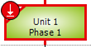
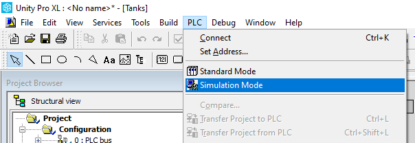
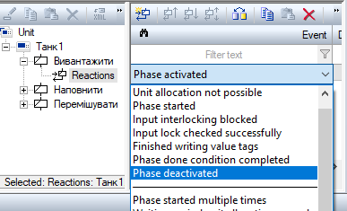

[Лабораторні](README.md)

# ЛАБОРАТОРНА РОБОТА 3. Зв'язок рецептурного та апаратурного керування

Мета роботи – навчитися створювати взаємозв’язані етапи в SCADA та контролері, створювати реакції та події, означувати стани та команди. 

## Загальні теоретичні відомості

Етапи в рецептах пов’язані з аналогічними етапами в системі керування (рис.3.1). Однак логіка етапу в системі керування може бути реалізовано різними способами. 


Рис.3.1. Взаємодія етапів в рецепті та системі керування

У SCADA zenon етап може виконувати усю логіку виконання, взаємодіючи з модулями керування (Control Module, CM) на контролері (наприклад виконавчими механізмами та датчиками, що підключені до ПЛК). У більшості ж випадків компонувальні блоки-етапи (phase) в апаратах (Unit), з яких будується рецепт для REE в zenon надають тільки інтерфейс для взаємодії з такими саме етапами в ПЛК (рис.3.13). Тобто етап в zenon при ініціалізації або зміні стану передає на ПЛК тільки задані значення, команди керування, а отримує з нього дійсні значення та стан етапу. Таким чином відбувається синхронізація між етапом в zenon та його реалізацією в ПЛК. Керування самими клапанами відбувається виключно в ПЛК через функції базового керування (base control).

 

Рис.3.2. Можливості взаємодії етапів в REE SCADA zenon та ПЛК

У даній лабораторній роботі буде використовуватися реалізація логіки виконання етапів тільки в zenon, а ПЛК буде виконувати функції вводу/виводу. Така конструкція дає можливість реалізувати batch-керування навіть використовуючи разом з zenon тільки модулі вводу/виводу. У наступній лабораторній роботі вся логіка виконання етапів буде записуватися в ПЛК. 

У ПЛК вже створені змінні, які будуть взаємодіяти з виконавчими механізмами, а на SCADA реалізований з ними зв’язок. Тепер необхідно вписати в етапи командні теги (параметри), які будуть давати команди керування цим виконавчим механізмам. 

Кожен процедурний елемент згідно ISA-88 виконується в залежності від режиму (ручний, автоматичний, напівавтоматичний) та стану (state, status), в якому він знаходиться. Режими будуть розглянуті в наступній лабораторній роботі. Стан вказує на особливості виконання етапу (початок, кінець, штатний або нештатний режим і т.д.), тому в кожному з станів може бути означено свій алгоритм виконання. Перехід зі стану в стан відбувається або згідно виконання певних внутрішніх умов (наприклад, виконання умови закінчення етапу) або надсилання процедурному елементу команди.Команда може надсилатися оператором або іншим процедурним елементом (наприклад, процедура апарату надсилає команду етапу). Правила переходу між станами описується автоматом станів. У ISA-88.1 поданий типовий автомат станів, який підходить до більшості технологічний процесів (рис.3.3). 

 

Рис.3.3. Типовий автомат станів етапу

 Основні стани:

- Idle : простоювання (очікування), не виконання діяльності процедурного керування;

- Running: виконується логіка процедури до завершення; 

- Paused: стоїть в паузі;

- Complete: процедура завершена за внутрішньою логікою;

- Hold: утримування, довготривала «пауза» (як правило, в нештатних ситуаціях);

- Stopped: зупинено за командою;

- Aborted: терміново зупинено за командою відміни.

Серед станів є перехідні, назва яких закінчується на «-ing». У перехідних станах відбувається виконання логіки переходу. Навіть «Running» можна назвати перехідним між «Idle» та «Complete». 

Для інформування ПЛК про події (events), пов’язані з виконанням рецептів, у Zenon використовуються реакції (reactions). Реакції можуть бути налаштовані для багатьох подій, які може ініціювати етап або інші частини REE тасередовище виконання zenon взагалі. Реакції можуть впливати на виконання рецепту, вони можуть привести до запису значень параметрів або можуть бути виконані необхідні функції zenon. Далі використаємо події та реакції на них для закривання клапанів в кінці етапів, вимиканню мішалки та для формування повідомлень в журнал CEL.

У середовищі виконання SCADA zenon логіка виконання процедур, що прописані в рецепті, обробляється в модулі REE. Процедура комірки та апарата керується командами (Commands) та умовами переходу PFC, які в свою чергу передають команди етапам (phase). Типові команди в ISA-88 також означені (рис.3.3). Етапи в REE пов’язані з етапами в контролері за допомогою змінних (через теги етапів), у тому числі змінні команд та статусу. 

Наприклад, якщо в SCADA zenon при відправці команди «Stop» процедурі апарата, кожному етапу апарата, що зараз виконується, відправляється така сама команда, після якої етапи переходять в стан «Stopping». Для завершення переходу в кінцевий стан «Stop», повинна обробитися логіка переходу (наприклад, в програмі ПЛК), тому команда повинна відправитися етапу в контролері. Після обробки логіки переходу, етап (наприклад в контролері) переходить в стан «Stop», про що повідомляється етапу в SCADA zenon.  

При виконанні рецепту в PFC, кожен етап підсвічується кольором в залежності від стану:

| Колір                                                        | Сататус:                               |
| ------------------------------------------------------------ | -------------------------------------- |
|        білий | **Idle state** (простоювання)          |
|     зелений | **in execution** (виконується)         |
|  помаранчевий | **Paused** (пауза)                     |
|         сірий | **Hоld** (утримування)                 |
|         жовтий | **Stopped** (зупинено)                 |
| червоний        | **Aborted** (перервано)                |
| світло-синій        | **Completed** (завершено)              |
| два кольори                                                  | Перехідні стани (**Transient status**) |

Також в кутку етапів символами надається додаткова інформація:

| Символ                                                       | Значення                                                     |
| ------------------------------------------------------------ | ------------------------------------------------------------ |
|  | Етап запускається                                            |
|  | Очікування  виділення апарату (unit). Апарат або етап вже використовується у іншому  рецепті |
|  | Очікування закінчення вхідного  блокування.                  |
|  | 1.   Протягом виконання етапу:  очікування реакції «завершення».  2.   На переході: очікування  виконання умови переходу.  3.   У кінці паралельного  розгалуження: Очікування завершення виконання усіх гілок . |
|  | При підготовці  до старту. Після команди рестарту, коли очікується перехід до стану  старту. |
|  | 1.   Реакція на штатне завершення;  очікування реакції completed.  2.   При переходах: очікування  умови переходу.  3.   При виконанні паралельних  гілок: очікування завершення послідовності в паралельних гілках за виконання  умови. |
|  | Очікування виконання процедури **Minimum  execution duration**. |
|  | Очікування  ексклюзивного виконання .                        |
|  | Тайм-аут очікування unit allocation закінчився.              |
|  | Тайм-аут  очікування вхідного блокування закінчився.         |
|  | Надмірно довге очікування запису.                            |
|  | Закінчився  тайм-аут на реакцію completed.                   |
|  | Закінчився  тайм-аут на реакцію ended.                       |

Команди можуть бути викликані оператором, використовуючи іконки в панелі керування, реакцією або через функції zenon. На рис.3.4, а показані команди керування усією процедурою (апарату чи технологічної комірки) означеної рецепті. На рис. 3.4.б показані команди керування окремим (виділеним в PFC) етапом.

 

Рис.3.4. Команди керування процедурою (апарату або технологічної комірки) означеної в рецепті (а) та етапі (b).

Для означення логіки, яка буде виконуватися при зміні стану етапу в Zenon, можна скористатися відповідними реакціями етапу на події, зокрема:

- Status change: In execution

- Status change: Pausing

- Status change: Paused

- Status change: Continue

- Status change: Holding

- Status change: Hоld

- Status change: Restarting

- Status change: Stopping

- Status change: Stopped

- Status change: Aborting

- Status change: Aborted

- Status change: Executed.

У даній роботі використовуватимуться реакції на зміну стану, для означення поведінки етапу `Наповнити` в станах `Паузи` та `Утримання` для закриття клапану набору, та відкриття його по продовженню виконання. 

## Завдання до виконання лабораторної роботи

1. Створити проект для ПЛК. В проекті створити змінні для обміну з віртуальною установкою, масштабування.
2. Створити в SCADA zenon з’єднання з ПЛК. Створити змінні IO для SCADA, стартову мнемосхему для керування установкою. 
3. Налаштувати та виконати етапи в SCADA, які забезпечують взаємодію з ПЛК.
4. Розглянути та створити реакції та події, які видають команди та реагують на стани.

## Порядок проведення роботи

### 1. Створення та запуск проекту в ПЛК

У лабораторній роботі №2 значення змінних ПЛК імітувалися в самій SCADA zenon. У цій лабораторній роботі необхідно завантажити підготовлений проект Unity Pro з імітатором об’єкту та реалізувати з’єднання змінних SCADA zenon з зовнішнім імітатором ПЛК. Результатом повинно служити правильне відображення змінних на мнемосхемі та можливість зміни заданих значень та керування виконавчими механізмами. У даній лабораторній роботі ПЛК використовується як засіб введення/виведення, вся логіка керування реалізовується прямо в SCADA. 

- [ ] За відсутності завантажте та встановіть UNITY PRO (>v6.0).

- Образ UNITY  PRO 13.1. Режим доступу: https://schneider-electric.app.box.com/s/ozvysr1qmpx6fe0zk11l/file/349813509817 
- У назві образу вказаний серійний номер та номер PV для тріал-версії.

- [ ] Завантажте файл `MES2017_BASE.XEF` [за посиланням](https://drive.google.com/file/d/18aksYsca55MBKeF4V-0aCvlWHO8PcnYT/view?usp=sharing) там міститься експортний варіант проекту з імітатором установки
- [ ] Запустіть UNITY PRO. Відкрийте файл MES2017_BASE.XEF. 
- [ ] Переключіть режим роботи контролера в режим емуляції ПЛК`Simulation mode`



- [ ] Скомпілюйте проект. 


- [ ] Збережіть проект з назвою `batchlab3`


- [ ] Підключіться до емулятора ПЛК.


- [ ] Завантажте проект в емулятор ПЛК.


- [ ] Запустіть проект на виконання.


### 2. Аналіз роботи імітаційної установки для ПЛК

- [ ] Зайдіть в розділ `Varabless & FB instancess` , подивіться перелік змінних в проекті (рис.3.5).

 

Рис.3.5. Перелік змінних демо-проекту UNITY PRO

- [ ] Зайдіть в розділ проекту `Operator Screens` відкрийте операторський екран `Tanks`
- [ ] Активуйте режим керування. Для цього натисніть в області анімаційного екрану, щоб активувалася панель керування. Далі натисніть `Enable write variable`


- [ ] Використовуючи кнопки керування (рис.3.6) зробіть наступні дії:

  - для пришвидшення імітування використовуйте кнопки керування швидкістю

    

  - наповніть танки рідиною десь на 50%, для цього скористайтеся клапанами набору; 

  

  - задайте значення швидкості перемішування, що дорівнює 5000 одиниць контролера;

  - наповніть дозатори повністю за допомогою кнопок керування дозаторами;

  - подайте по одній дозі кожного компоненту в танки Т1 та Т2;

  - нагрійте рідину в танках до 4000 од. контролера;

  - злийте рідину з танків і закрийте усі клапани.

 

 Рис.3.6. Операторський екран «Tanks»

### 3. Створення змінних для ПЛК 

- [ ] Завантажте експортний варіант додаткових змінних для проекту за [цим посиланням](https://drive.google.com/file/d/1Hgs7Wu8dBzTxcW5g1tKCo3AYtmz-8oLG/view?usp=sharing)

- [ ] Імпортуйте змінні з файлу, для чого зробіть `Variabless & FB instancess -> import` і вкажіть файл, який завантажили


- [ ] У розділі `Variables & FB instances` натисніть по заголовку колонки Address, щоб змінні упорядкувалися за адресою  


- [ ] Подивіться на змінні для масштабованих значень аналогових датчиків та завдань, як це показано на рис.3.7. Зверніть увагу, у них є адреси з області `%MW`, що надає змогу звертатися до них по протоколу Modbus. 

 

Рис.3.7. Перелік змінних проекту

###  4. Створення секцій масштабування для ПЛК 

- [ ] Створіть секції масштабування вхідних каналів `Inputs`  та вихідних каналів `Outputs` на мові `ST`.


- [ ] Розмістіть їх як це показано на рис.3.8. 

- [ ] Впишіть туди наступний код:

- масштабування вхідна секція `Inputs`

```pascal
(*масштабування*)
TT1 := int_to_real(TE_T1) * 0.01; (*0-10000 -> 0-100 C*)
TT2 := int_to_real(TE_T2) * 0.01; (*0-10000 -> 0-100 C*)
LT1 := int_to_real (LE_T1) * 0.01; (*0-10000 -> 0-100%*)
LT2 := int_to_real (LE_T2) * 0.01; (*0-10000 -> 0-100%*)
```

- масштабування вихідна секція `Outputs`

```pascal
(*масштабування*)
SC1 := real_to_int (SC1_SP * 1000.0); (*0-10 -> 0-10000*)
SC2 := real_to_int (SC2_SP * 1000.0); (*0-10 -> 0-10000*)
```

 

Рис.3.8. Секції масштабування

- [ ] Скомпілюйте зміни в коді (`Build Changes`), що приведе до автоматичного завантаження їх в імітатор ПЛК, якщо це робиться в режимі онлайн. 


- [ ] Збережіть проект Unity PRO

### 5. З'єднання zenon з імітатором ПЛК

У цьому пункт необхідно налаштувати в редакторі zenon драйвер Modbus TCP/IP та перевірити його роботу зі зв’язкою з імітатором UNITY PRO.

- [ ] Запустіть на виконання zenon editor.
- [ ] Перейдіть на налаштування драйверу `Modbus RTU and Open Modbus TCP/IP`, натиснувши на `...` у властивості `Configuration`


- [ ] Змініть налаштування  як це показано на рис.3.9. На вкладці `TCP/IP` спочатку натискається `New`, потім в створеному підключенні задається IP адреса `127.0.0.1` , `Net address = 0` після чого натискається кнопка `Save`

 

Рис.3.9. Налаштування драйверу Modbus TCP/IP

- [ ] Скомпілюйте зміни в проекті zenon та запустіть на виконання.

- [ ] У середовищі виконання перейдіть на сторінку `Екран Batch` і впевніться, що значення змінних відображаються вірно відповідно до ПЛК. Для перевірки можна набрати в «Танк Т1» рідину до певного рівня і подивитися на його значення на мнемосхемі zenon.


### 6. Створення секцій для керування ВМ та контролю дискретних входів зі SCADA 

У цьому пункті у проекті Unity Pro в секціях `Inputs` та `Outputs` необхідно написати код, який буде переприсвоювати значення внутрішніх дискретних змінних вихідним та навпаки вхідним.

У проекті UNITY PRO створіть внутрішні змінні, що відповідають за всі дискретні виходи ПЛК (рис.3.10). 

- [ ] У проекті UNITY PRO відкрийте перелік змінних. Зверніть увагу, що для всіх вихідних змінних (що мають адресу з області `%Q`) є аналогічні змінні з внутрішніми адресами (що мають адресу з області `%M`) відповідно до рис.3.10. Вони мають суфікс `_M` і призначені для взаємодії зі SCADA.

 

Рис.3.10. Створення внутрішніх «дублікатів» дискретних вихідних змінних

- [ ] Зверніть увагу що подібним чином сформовані дзеркальні внутрішні змінні для вхідних змінних (що мають адресу з області `%I`) 

- [ ] У проекті Unity Pro в секції Outputs до існуючого коду допишіть код, який буде переприсвоювати значення внутрішніх дискретних змінних вихідним (рис.3.11).

```pascal
VDoz_T1toT2 := VDoz_T1toT2_M ; 
VSliv_D2 := VSliv_D2_M;
VSliv_D1 := VSliv_D1_M;
VNabor_D2 := VNabor_D2_M;
VNabor_D1 := VNabor_D1_M;
VSliv_T2 := VSliv_T2_M;
VNabor_T2 := VNabor_T2_M;
VSliv_T1 := VSliv_T1_M;
VNabor_T1 := VNabor_T1_M;
KM1 := KM1_M;
KM2:= KM2_M; 
```

 

Рис.3.11. Секція Outputs після вставки коду переприсвоєння дискретних змінних

- [ ] Аналогічно зробіть з переприсвоєнням в секції `Inputs`

```pascal
LSL_D1_M := LSL_D1;
LSH_D1_M := LSH_D1;
LSL_D2_M := LSL_D2;
LSH_D2_M := LSH_D2;
```

 

- [ ] Зробіть компіляцію змін в проекті Unity PRO та збережіть проект.

### 7. Імпорт змінних в SCADA

У даному пункті необхідно створити або імпортувати змінні в SCADA, які в попередньому пункті були добавлені в проект ПЛК.

- [ ] Завантажте файл імпорту змінних `lab3_vars.XML` за [даним посиланням](https://drive.google.com/file/d/1a2zCHepMmhxw_nm8IQ0HwDw9YDY7SSKC/view?usp=sharing).

Це експортовані наперед сконфігуровані змінні, які підготовлені для зменшення витрати часу на їх створення.

- [ ] У контекстному меню розділу `Variables` проекту zenon виберіть пункт `Import XML...`


- [ ] Виберіть завантажений файл `lab3_vars.XML`, у наступному вікні виберіть внизу драйвер `Modbus RTU ...` і натисніть кнопку  `Allocate driver` щоб вказати, що імпортовані змінні тепер будуть прив'язуватися саме до обраного драйверу. Натисніть `Ok`


- [ ] У наступному вікні вказуються які типи та змінні будуть переписуватися, якщо вони конфліктують (мають однакову назву). Виберіть змінні, які вже у Вас є в проекті і вкажіть для них `Do not ipmport`  


- [ ] Після імпорту подивіться на змінні, що з'явилися в zenon, має бути перелік як на рис.3.12. 


Рис.3.12. Змінні в zenon

- [ ] Зробіть компіляцію, запустіть проект на виконання. Перевірте чи існуючі змінні все ще відображаються на екрані Batch.

### 8. Створення мнемосхеми в SCADA

У даному пункті необхідно зробити мнемосхему процесу. Для пришвидшення виконання пункту пропонується імпортувати існуючу схему та за необхідності переприв'язати до потрібних змінних в проекті.

- [ ] Завантажте файл експорту символу `lab3_equip.XML` [за посиланням](https://drive.google.com/file/d/1-QbUdXdBh_Tdcv8elJZRbV2ZG5nlI3vW/view?usp=sharing).
- [ ] У контекстному меню `Screens->Symbols Library` проекту zenon виберіть `Import XML` і вкажіть завантажений файл `lab3_equip.XML`


У результаті у локальній бібліотеці з'явиться символ.


- [ ] Відкрийте `Екран Batch` . У контекстному меню символу бібліотеки виберіть `Insert symbol as element group in screen` щоб скопіювати символ на сторінку.


- [ ] При вставленні з'явиться вікно, в якому можна замінити існуючі прив'язки до графічних елементів. Для цього необхідно зробити подвійний клік на потрібній прив'язці і вибрати потрібну змінну. За необхідності (якщо змінні називаються по іншому) замініть прив'язки. Після чого натисніть `Ok`  


- [ ] Вирівняйте всі графічні елементи на екрані. За необхідності переведіть символ в редагування `Switch to single edit mode` для того, щоб скоригувати символ.


- [ ] Після коригування символу необхідно знову відключити режим коригування


Варто зауважити, що дана мнемосхема є тимчасовою, в процесі подальших робіт вона буде змінюватися, тому не варто витрачати багато часу на коригування.

- [ ] Збережіть зміни та зробіть компіляцію проекту. Запустіть середовище виконання, перевірте роботу мнемосхеми.

### 9. Виконання етапів в SCADA

У наступних пунктах реалізація самих етапів відбувається в SCADA, тобто ПЛК використовується як введення/виведення.   

У цьому пункті в zenon batch control для етапу `Наповнити` треба створити змінний тег (`Value tag`) з назвою `Клапан набору` (рис.3.16), який буде відкриватися (`on`) при ініціюванні етапу і закриватися (`off`) при його деактивації:

- [ ] В етапі `Наповнити` створіть новий тег значення `Value tag` та іменем `Клапан набору`.

- [ ] У групі властивостей `General` у властивості Variable, прив’яжіть тег до змінної `Клапан набору Т1`.

- [ ] У групі властивостей `Write Set Value` у властивості `Tag Value` вкажіть значення `On(1)`, для того, щоб при ініціалізації етапу туди записалося значення `1`. 

 

Рис.3.16. Створення та налаштування тегу «Клапан набору» для етапу «Наповнити»

- [ ] Аналогічно попередньому пункту створіть та налаштуйте:

- Тег `Клапан зливу` в етапі `Вивантажити` (рис.3.17).

- Тег `Двигун мішалки` в етапі `Перемішувати` з прив'язкою до змінної `Мішалка Т1`.

 

Рис.3.17. Створення та налаштування тегу «Клапан зливу» для етапу «Вивантажити»

Тепер при запуску етапу `Наповнити` змінній `Клапан набору Т1` буде присвоєне значення 1, а при запуску етапу `Перемішування` – в змінну `Мішалка Т1` запишеться `1` , при запуску `Вивантажити` –  в змінну `Клапан зливу Т1`. Однак, згідно логіки виконання, клапани по завершенню етапів повинні закриватися, а мішалка відключатися. За умови виконання логіки керування етапів тільки в SCADA, ці змінні повинні змінитися за певною подією. Для цього необхідно створити події та прописати для них відповідні реакції.

### 10. Використання подій та реакцій для керування

У цьому пункт необхідно створити реакції на подію деактивації етапів для того щоб закрити клапани набору та зливу танку після завершення етапу, а також перевірити роботу системи. 

- [ ] Для етапу `Вивантажити` створіть реакцію на подію `Phase deactivated`, в якій пропишіть закривання клапану зливу (рис.3.18), для цього:
- відкрийте вузол етапу `Вивантажити` в дереві апарату (unit) так щоб вузол `Reactions` став видимий;
- натисніть на `Reactions` для відображення всіх сконфігурованих реакцій в списку;
- створіть нову реакцію натиснувши на іконці `New reaction` в панелі інструментів;


- виберіть в колонці `Event Phase deactivated`;



- виберіть в полі `Parameter` властивостей реакції параметр `Клапан зливу`, в результаті сформується `Танк1. Вивантажити. Клапан зливу`,  а в поле `Value Boolean` значення Off(0).

 

Рис.3.18. Створення реакцій на події

Таким чином, при деактивації етапу `Вивантажити` викличеться обробник реакції і автоматично закриється клапан зливу. 

- [ ] Аналогічно зробіть для клапану набору в події `Phase deactivated` етапу `Наповнити`, який при деактивації закриє клапан набору, та для мішалки в етапі `Перемішування`, який вимкне мішалку.

- [ ] Збережіть та скомпілюйте проект. Запустіть на виконання zenon Runtime;

- [ ] Відкрийте `екран Batch` та завантажте рецепт `Мийка`, що був створений в лабораторній роботі №2 та переведіть його в режим тестування.

- [ ] Запустіть рецепт на виконання. Танк 1 повинен заповнитися продуктом, перемішуватися і вивантажуватися після паузи. 

### 11. Використання подій та реакцій для формування записів в CEL

У цьому пункті необхідно створити реакцію на подію не заповнення Танку 1 протягом 15 секунд, яка буде створювати відповідний запис в CEL. 

- [ ] Скопіюйте фрейм `Основний шаблон екрану` та зробіть новий на його основі, наприклад `Основний шаблон екрану 1`. 


- [ ] Створіть новий екран `Екран CEL` на основі новоствореного шаблону та типу `Chronological Event List`.


Не рекомендується використовувати той самий фрейм, що для `екрану Batch`, інакше завжди прийдеться відкривати рецепти кожного разу після переключення на `екран CEL` з `екрану Batch`. 

- [ ] Відкрийте `екран CEL`. Розмістіть елементи керування на екрані за замовченням: `Control elements -> Insert template ...` після чого виберіть шаблон екрану що Вам підходить і натисніть `Accept`.


- [ ] Створіть функцію `Screen switch` з назвою  `Перемикання на екран CEL`. Виберіть  `Екран CEL`. У налаштуваннях фільтру і залиште все за замовченням і натисніть `Ok`. 
- [ ] Прив'яжіть виклик функції до кнопки, яку розмістіть на екрані меню. 


- [ ] Відкрийте властивості етапу `Наповнити` і перевірте, що `maximum execution duration` стоїть рівним 10 секунд. Якщо це ще не було зроблено раніше, задайте цей параметр.

Для створення запису CEL entry, в наступних кроках необхідно сконфігурувати реакцію на подію `Maximum waiting period phase done condition exceeded` (рис.3.19).

- [ ] Розверніть вузол етапу `Наповнити` в дереві апарату (unit) так щоб вузол `Reactions` став видимий. Натисніть на `Reactions` для відображення всіх сконфігурованих реакцій в списку.
- [ ] Створіть нову реакцію, натиснувши на іконці `New reaction` в панелі інструментів.
- [ ] Виберіть в колонці `Event Maximum waiting period phase done condition exceeded`
- [ ] Активуйте опцію `Create CEL entry`, і введіть в поле `CEL message text` текст `Танк1 не наповнився за коректний час`.

 

 Рис.3.19. Налаштування реакції

- [ ] Збережіть проект, скомпілюйте і запустіть на виконання. Перейдіть на `екран Batch`
- [ ] Відкрийте клапан зливу Танку 1. 
- [ ] Запустіть в тестовому режимі рецепт мийки. Оскільки наповнення танку не буде відбуватися, бо відкритий клапан зливу, то після 10 секунд по запуску, просигналізується етап про помилку, а також буде зроблений запис в повідомлення CEL.

- [ ] Відкрийте `екран CEL` і знайдіть відповідний запис.

 

### 12. Використання команд та станів

У цьому пункті для етапу `Наповнити` необхідно створити реакції для закриття клапану набору при переході в стан `Holding` та `Pausing` а також відкриття його при виконанні (рис.3.20).

- [ ] Для етапу `Наповнити` створіть реакції на події `Status change: Pausing` та `Status change: Holding`, при яких клапан набору закривається.

- [ ] Створіть реакцію на подію `Status change: In execution`, при яких клапан набору відкривається.

 

Рис.3.20. Реакції для етапу «Наповнити»

- [ ] Збережіть проект, скомпілюйте, запустіть середовище виконання. 
- [ ] Запустіть рецепт в режимі тесту та перевірте його роботу на етапі `Наповнення` перевівши командою `Pause`.  


- [ ] У стані `Pause` клапан набору повинен закритися.
- [ ] Натисніть команду `Continue` клапан повинен відкритися


- [ ] Перевірте реакцію на команду `Hоld`, давши відповідні команди. 

Для етапу `Вивантажити` окрім керування клапаном зливу, в режимі утримування (Holding) необхідно також включити мішалку, щоб продукт зберігав свою консистенцію при тривалому зберіганні. Тому при переході в стан `Pausing` необхідно прописати реакції закриття клапану зливу, в стан `Holding` – закриття клапану, та включення мішалки, при робочому стані відкриття клапану зливу та відключення мішалки (рис.3.21):

- [ ] Для етапу `Вивантажити` створіть тег `Мішалка` та прив’яжіть його до змінної `Мішалка Т1`.

- [ ] Створіть реакції на події `Status change: Pausing` та `Status change: Holding` при яких клапан зливу закривається.
- [ ] Створіть ще одну реакцію на подію `Status change: Holding` , при якій включається мішалка.
- [ ] Створіть дві реакції на подію `Status change: In execution`, одна відкриває клапан набору, друга відключає мішалку.
- [ ] Запустіть середовище виконання, запустіть рецепт в режимі тесту та перевірте його роботу на етапі `Вивантаження` в станах `Pause` та `Held`, давши відповідні команди (рис.3.21).
- [ ] Перевірте роботу команд для окремо виділених етапів.

 

Рис.3.21. Реакції для етапу «Вивантажити»

## Контрольні питання

1. Опишіть взаємодію етапів в рецепті та системі керування. Як відбувається їх синхронізація?
2. Розкажіть про автомат станів процедурних елементів: призначення, переходи між станами?
3. Розкажіть про призначення проміжних та кніцевихстанів. 
4. Для чого в Batch Cotrol використовуються реакції і на що вони можуть впливати? Де в лабораторній роботі це було використано?
5. При виконанні рецепту в PFC, кожен етап підсвічується кольором в залежності від стану. Використовуючи таблицю, прокоментуйте, що означають той чи інший колір та символ.
6. Які реакції етапу на події Ви знаєте, щоб описати логіку, яка буде виконуватися при зміні стану етапу в zenon? Де в лабораторній роботі це було використано?
7. Розкажіть про команди керування виконанням рецептом та етапами.

 