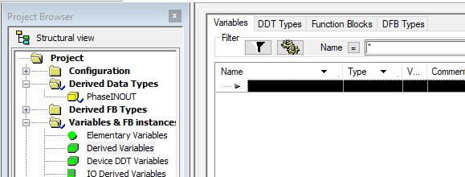
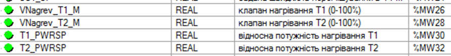
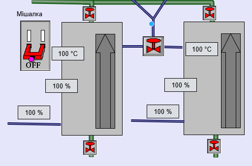
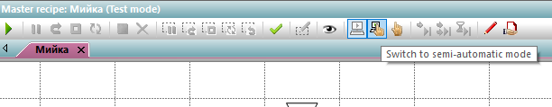

[Лабораторні](README.md)

# ЛАБОРАТОРНА РОБОТА 4. Виконання процедур на рівні SCADA та ПЛК. Базові можливості рецептів в PFC

Мета роботи – навчитися використовувати процедури на рівні SCADA та ПЛК. Розглянути можливості рецептів в PFC. 

## Загальні теоретичні відомості

У минулій лабораторній роботі вся логіка виконання етапу була реалізована в SCADA, а на ПЛК виконувались тільки базові функції реалізації керування та збір даних. Така реалізація має багато обмежень і, як правило, не застосовується. У цій лабораторній роботі використовується інший принцип, за яким логіка виконання етапів реалізована в ПЛК. Таким чином, етапи будуть функціонувати як в SCADA так і в ПЛК, зв’язуючись через команди та стани. 

Для початку, необхідно переробити вже існуючий функціонал для реалізації етапів `Наповнити`, `Перемішувати` і `Вивантажити` в контролері. Для обміну між SCADA та PLC статусною інформацією про режими та стани та командами синхронізації необхідно використати структурну змінну з 3-ма полями `CMD` (команда), `STA` (статус, стан) і `MODE` (режим). Поле `CMD` (команда) – буде направляти до PLC команду зміни стану процедурного елементу після зміни її в REE(в SCADA), кажучи про необхідність певних дій в тому ж елементі в PLC. Таким чином, процедурні елементи (наприклад етапи) в REE будуть переходити в проміжні стани (закінчуються на `–ing`: `Stopping`, `Pausing`, `Holding`, `Aborting`, `Restarting`) і повідомляти про це ПЛК, шляхом зміни значення `CMD`. Етапи в ПЛК в цих проміжних станах будуть виконувати певну логіку переходу, після чого переводити їх в усталені стани (`Stopped`, `Paused`, `Held`, `Aborted`, `Executed`). Стан етапів в ПЛК буде передаватися через поле змінної `STA` . Нижче в табл. 4.1 наведена відповідність значення змінної STAстану етапу:

Таблиця 4.1.

| STA (Status)        | Значення | Примітка                               |
| ------------------- | -------- | -------------------------------------- |
| Idle                | 0        | Очікування (початковий стан)           |
| Running             | 1        | Виконується                            |
| Complete (Executed) | 2        | Виконано, ініціюється в ПЛК.           |
| Stopping            | 3        | Зупиняється, ініціюється в SCADA.      |
| Stopped             | 4        | Зупинено, ініціюється в ПЛК.           |
| Pausing             | 5        | Призупиняється, ініціюється в SCADA.   |
| Paused              | 6        | Пауза, ініціюється в ПЛК.              |
| Holding             | 7        | Утримується, ініціюється в SCADA.      |
| Held                | 8        | Утримуване, ініціюється в ПЛК.         |
| Aborting            | 9        | Переривається, ініціюється в SCADA.    |
| Aborted             | 10       | Перервано, ініціюється в ПЛК.          |
| Restarting          | 11       | Перезапускається, ініціюється в SCADA. |

Змінна `MODE` буде вказувати на режим виконання процедурного елементу (табл. 4.2).

Таблиця 4.2.

| Mode           | Значення | Примітка            |
| -------------- | -------- | ------------------- |
| Ignore         | 0        | не використовується |
| Automatic      | 1        | Автоматичний        |
| Semi-automatic | 2        | Напівавтоматичний   |
| Manual         | 3        | Ручний              |

Для відправки команд в ПЛК, необхідно визначитися з їх значеннями. Команди будуть відправлятися в реакціях на події етапів, що пов’язані зі зміною стану або режиму. В табл. 4.3 наведені команди та їх числові значення, які прийнято використовувати в zenon.

Таблиця 4.3.

| CMD (Command) – реакція на подію                             | Значення | Примітка                                                     |
| ------------------------------------------------------------ | -------- | ------------------------------------------------------------ |
| Phase started                                                | 1        | Етап запущено на виконання                                   |
| Finished writing command tags                                | 2        | Завершено запис значення слова команди                       |
| Phase finished: Phase done condition fulfilled  and Minimum execution duration reached (if engineered) | 3        | Завершення виконання етапу                                   |
| Phase deactivated                                            | 4        | Деактивація етапу                                            |
| Status change: Pausing                                       | 10       | Зміна стану: Призупиняється                                  |
| Status change: Resuming                                      | 11       | Зміна стану: Вихід з паузи                                   |
| Status change: Holding                                       | 12       | Зміна стану: Утримується                                     |
| Status change: Restarting                                    | 13       | Зміна стану: Перезапускається                                |
| Status change: Stopping                                      | 14       | Зміна стану: Зупиняється                                     |
| Status change: Aborting                                      | 15       | Зміна стану: Переривається                                   |
| Mode change: Automatical                                     | 20       | Зміна режиму: Автоматичний                                   |
| Mode change: Semi-automatic                                  | 21       | Зміна режиму: Напівавтоматичний                              |
| Mode change: Manual                                          | 22       | Зміна режиму:Ручний                                          |
| Exit Runtime initiated                                       | 30       | Ініціювання виходу з середовища виконанняZenon               |
| Runtime restart                                              | 31       | Перезапуск середовища виконання Zenon                        |
| Unit allocation not possible                                 | 32       | Неможливо виділити апарат (або інший ресурс обладнання)      |
| Waiting period unit allocation exceeded                      | 33       | Перевищено період очікування виділення апарату               |
| Input interlocking blocked                                   | 34       | Умова входу заблокована                                      |
| Waiting period input interlocking exceeded                   | 35       | Перевищено період очікування завершення вхідного  блокування |
| Maximum execution period exceeded                            | 36       | Перевищено максимальний період виконання                     |
| Waiting period following condition exceeded                  | 37       | Перевищено максимальний період виконання умови переходу      |
| Phase started multiple times                                 | 38       | Етап запущено на виконання декілька раз                      |

З попередніх лабораторних робіт відомі деякі рецептурні елементи:

·          Початковий елемент позначає початок рецепту; він повинен з'являтися в рецепті рівно один раз.

·          Кінцевий елемент показує кінець рецепту; він повинен з'являтися в рецепті рівно один раз.

·          Етапи є основними компонентами рецепту.

·          Лінії з'єднання служать для зв’язку двох елементів.

Для того щоб мати можливість реалізувати складні рецепти в PFC є додаткові елементи:

Таблиця 4.4. Елементи PFC

| Зображення                                                   | Позначення                                                   |
| ------------------------------------------------------------ | ------------------------------------------------------------ |
|  | `Transition` (Перехід): містить вільно означувані умови, що базуються на параметрах,  які означені в етапах рецепту. |
|  | `Begin simultanious sequence` (Початок  послідовностей одночасного виконання або паралельне розгалуження): виконання  починається з цього елемента на декілька послідовностей одночасно. |
|  | `End simulаtіans sequence` (Кінець послідовностей одночасного виконання або паралельне сходження): тут об’єднуються послідовності  одночасного виконання. |
|  | `Begin sequence selection` (Початок вибору послідовностей або альтернативне розгалуження):  виконання продовжується в одній із двох послідовностей. |
|  | `End sequence selection` (Кінець вибраної послідовності): кілька альтернативних шляхів  з'єднуються знову |
|  | `Jump target` (Перехід на ціль): комбіновані альтернативні шляхи; можуть також  використовуватися з петлями (loops). |
|  | `Unital location` (Виділення апарату): резервування або вивільнення апарату. |
|  | `Operation` (Операція): Рецепт в рецепті.                    |

Для перехідних станів можуть бути означені умови. Це створює можливість для очікування реакції від ПЛК.

Якщо команда для рецепту встановлена в `pause` (призупинитися), усі активні етапи переключаються в `pause` (призупиняється) і запускаються на обробку події. ПЛК може бути інформований про заплановану зміну стану за допомогою реакцій. ПЛК тільки повідомляє про `pause` для центру керування REE, якщо він реально перейшов в paused (призупинений). Цей зворотний зв'язок може бути означений через умову для `paused`. Якщо ця умова була виконана, етап перемикається з `pause` на `paused`.

Розглянемо режими для виконання рецептів.

Доступні три режими для виконання рецептів:

- `Automatical` (Автоматичний);

- `Semi-automatic` (Напівавтоматичний);

- `Manual` (Ручний).

У автоматичному режимі (`Automatical`) (  ) рецепт виконується незалежно без будь якого впливу оператора. Однак для перевірки рецепту може знадобитися виконання етапу декілька раз, виконання вибраних етапів в довільній послідовності. У цьому випадку використовується напівавтоматичний режим.

Напівавтоматичний режим (`SEMI-AUTOMATIC MODE`)   . Після виконання рецептурного елементу, позиція виконання в рецепті показується стрілкою (вказівником), активні етапи рецепту призупиняються (`paused`). Тепер оператор може активувати потрібний елемент і продовжити рецепт у вказаному місці. Якщо активних елементів декілька (при одночасних послідовностях), позиція може бути переміщена і продовжена незалежно від інших. Для цього доступні іконки `Continue recipe at all execution positions` (  )та `Continue recipe at only on selected execution positions` (  ).

Ручний режим (`MANUAL MODE`)  .Додатково до функцій напівавтоматичного режиму, в ручному режимі можуть бути відмінені умови переходу `Skip active condition` (  ) та доступна команда `Escape from phase` (  ), яка завершує виконання етапу.

Режим може бути вибраний використовуванням іконки з панелі інструментів, а також через реакції та функції zenon.

## Завдання до виконання лабораторної роботи

1. У ПЛК створити структурні типи `Phase INOUT` та відповідні змінні для кожного етапу, для обміну статусом, командами та режимами між SCADA та PLC.
2. Те саме зробити в SCADA zenon.
3. Створити похідні функціональні блоки (типи та екземпляри) для реалізації етапів в ПЛК.
4. Видалити з етапів SCADA теги, що відповідають за виконавчі механізми (клапан набору, зливу, мішалка) та реакцій, які з ними пов’язані, так як керування ними буде відбуватися в ПЛК. 
5. Створити теги (параметри) `STA`, `CMD` та `MODE` для етапів в SCADA та прив’язати їх до відповідних змінних.
6. Для кожного етапу SCADA означити умови переходу з перехідних станів в усталені стани, по значенню змінної `STA` в ПЛК.
7. Для кожного етапу SCADA означити реакції на події змін стану для відправки команд на ПЛК.

## Порядок проведення роботи

### 1. Створення структурних типів та змінних INOUT в ПЛК

У цьому пункті в ПЛК необхідно створити структурні типи `Phase INOUT` та відповідні змінні для кожного етапу, для обміну статусом, командами та режимами між SCADA та PLC.

- [ ] Завантажте проект з попередньої лабораторної роботи в Unity Pro.

- [ ] Створіть структурний тип Derived Data Types (DDT) `PhaseINOUT` 


- [ ] Створіть поля `STA`, `CMD`, `MODE` типу INT (рис.4.1).
- [ ] Натисніть `Analyze project` щоб підтвердити структуру

 

Рис.4.1. Створення структурного типу Phase INOUT в Unity Pro

- [ ] Перейдіть в розділ `Variables & FB instances -> Derived Variables`



- [ ] Для кожного етапу створіть змінні типу `Phase INOUT`: `phioDRAIN`, `phioFILL` та `phioMIX` прив’яжіть змінні до адрес відповідно `%MW100`, `%MW104` та `%MW108` (рис.4.2).

 

Рис.4.2. Створення змінних для етапів в Unity Pro

- [ ] Скомпілюйте проект, якщо помилок немає – переходьте до наступного пункту.

### 2. Створення структурних типів та змінних INOUT в SCADA

У цьому пункті необхідно в SCADA zenon створити структурні типи `PhaseINOUT` та відповідні змінні для кожного етапу, для обміну статусом, командами та режимами між SCADA та PLC.

- [ ] Запустіть zenon Editor та відкрийте проект з попередньої лабораторної роботи

- [ ] Створіть новий структурний тип (structure data type) `PhaseINOUT` з полями `STA`, `CMD`, `MODE` типу `INT` (рис.4.3).


 

Рис.4.3. Створення структурного типу в Zenon

- [ ] Для кожного етапу створіть змінні типу `PhaseINOUT`: `phioDRAIN`, `phioFILL` та `phioMIX` прив’яжіть змінні до адрес (`offset`) відповідно `%MW100`, `%MW104` та `%MW108` (рис.4.4).

 


Рис.4.4. Створення структурних змінних в zenon 

### 3. Створення функціональних блоків для реалізації етапів в ПЛК

У цьому пункті необхідно створити похідні функціональні блоки (типи та екземпляри DFB) для реалізації етапів в ПЛК.

- [ ] В UNITY PRO створіть DFB-тип `phDRAIN` (рис.4.5); текст коду в секції DFB `phDrain`, він наведений нижче;

DFB включає три параметри типу `INOUT`:

- `phIO` – інтерфейсна змінна між SCADA та PLC;
- `VLV` – для керування клапаном зливу;
- `MIX` – для керування приводом мішалки.

 

 

Рис.4.5. Створення DFB-типу phDRAIN

- [ ] Проаналізуйте код для етапу `phDRAIN`

```pascal
(*обробка команд керування автоматом станів етапу phDRAIN*)
CASE phIO.CMD OF
  1:; (*Phase started*)
    phIO.STA:=1;
  2:;(*Finished writing command tags*)
  3:; (*Phase finished: Phase done condition fulfilled and Minimum execution duration reached (if engineered)*)
    phIO.STA:=3;
  4:; (*Phase deactivated*)
    phIO.STA:=0;
  10:; (*Status change: Pausing*)
    phIO.STA:=5;
  11:; (*Status change: Resuming*)
    phIO.STA:=1;
  12:; (*Status change: Holding*)
    phIO.STA:=7;
  13:; (*Status change: Restarting*)
    phIO.STA:=11;
  14:; (*Status change: Stopping*)
    phIO.STA:=3;
  15:; (*Status change: Aborting*)
    phIO.STA:=9;
  20:; (*Mode change: Automatical*)
  21:; (*Mode change: Semi-automatic*)
  22:; (*Mode change: Manual*)
  30:; (*Exit Runtime initiated*)
  31:; (*Runtime restart*)
  32:; (*Unit allocation not possible*)
  33:; (*Waiting period unit allocation exceeded*)
  34:; (*Input interlocking blocked*)
  35:; (*Waiting period input interlocking exceeded*)
  36:; (*Maximum execution period exceeded*)
  37:; (*Waiting period following condition exceeded*)
  38:; (*Phase started multiple times*)	
  ELSE
      ;	
END_CASE;
phIO.CMD:=0;(*після обробки команда обнуляється*)

CASE phIO.STA OF
  0:;(*Idle*)
  1:;(*Running*)
   VLV:=true; 	
  2:;(*Complete (Executed)*)
   VLV:=false; 
  3:;(*Stopping*)
   VLV:=false; 
   phIO.STA:=4; 
  4:;(*Stopped*)
  5:;(*Pausing*)
   VLV:=false;
   phIO.STA:=6; 
  6:;(*Paused*)
  7:;(*Holding*)
   VLV:=false;
   MIX:=true;
   phIO.STA:=8; 
  8:;(*Held*)
  9:;(*Aborting*)
   VLV:=false;
   phIO.STA:=10;
  10:;(*Aborted*)
  11:;(*Restarting*)
    MIX:=false;
    phIO.STA:=1; 	
  ELSE
   (*якщо значення відрізняється від 
    доступних - перехід в Idle*)
    phIO.STA:=0; 
END_CASE;
```

Вибір типу IN OUT диктується міркуваннями можливості зміни цих змінних як ззовні функціонального блоку так і всередині нього.  Перша частина коду функціонального блоку вміщує реалізацію керування автоматом станів в залежності від команди, що надходить зі SCADA. Числове значення для кожної команди наведено в табл.4.3. Обробку деяких команд поки не будемо реалізовувати. У кінці обробника команди обнуляються, щоб повторно не обробитися на наступному циклі. 

Друга частина коду функціонального блоку реалізує логіку станів, тобто дії, які буде робити етап з ВМ у кожному зі станів. Перелік станів та відповідних числових значень дано в табл. 4.1. У логіці станів прописані тільки дії для забезпечення такого ж функціоналу, що був в лабораторній роботі №3.     

- [ ] Аналогічно створіть DFB-типи `phFILL` та `phMIX` (рис.4.6); тексти кодів наведені нижче;

 

Рис.4.6. Створення DFB-типівphFILL та phMIX

- [ ] Проаналізуйте код для етапу `phFILL`

```pascal
(*обробка команд керування автоматом станів етапу phFill*)
CASE phIO.CMD OF
  1:; (*Phase started*)
    phIO.STA:=1;
  2:;(*Finished writing command tags*)
  3:; (*Phase finished: Phase done condition fulfilled and Minimum execution duration reached (if engineered)*)
    phIO.STA:=3;
  4:; (*Phase deactivated*)
    phIO.STA:=0;
  10:; (*Status change: Pausing*)
    phIO.STA:=5;
  11:; (*Status change: Resuming*)
    phIO.STA:=1;
  12:; (*Status change: Holding*)
    phIO.STA:=7;
  13:; (*Status change: Restarting*)
    phIO.STA:=11;
  14:; (*Status change: Stopping*)
    phIO.STA:=3;
  15:; (*Status change: Aborting*)
    phIO.STA:=9;
  20:; (*Mode change: Automatical*)
  21:; (*Mode change: Semi-automatic*)
  22:; (*Mode change: Manual*)
  30:; (*Exit Runtime initiated*)
  31:; (*Runtime restart*)
  32:; (*Unit allocation not possible*)
  33:; (*Waiting period unit allocation exceeded*)
  34:; (*Input interlocking blocked*)
  35:; (*Waiting period input interlocking exceeded*)
  36:; (*Maximum execution period exceeded*)
  37:; (*Waiting period following condition exceeded*)
  38:; (*Phase started multiple times*)	
  ELSE
      ;	
END_CASE;
phIO.CMD:=0;(*після обробки команда обнуляється*)

CASE phIO.STA OF
  0:;(*Idle*)
  1:;(*Running*)
   VLV:=true; 	
  2:;(*Complete (Executed)*)
   VLV:=false; 
  3:;(*Stopping*)
   VLV:=false; 
   phIO.STA:=4; 
  4:;(*Stopped*)
  5:;(*Pausing*)
   VLV:=false;
   phIO.STA:=6; 
  6:;(*Paused*)
  7:;(*Holding*)
   VLV:=false;
   phIO.STA:=8; 
  8:;(*Held*)
  9:;(*Aborting*)
   VLV:=false;
   phIO.STA:=10;
  10:;(*Aborted*)
  11:;(*Restarting*)
    phIO.STA:=1; 	
  ELSE
	phIO.STA:=0; (*якщо значення відрізняється від доступних - перехід в Idle*)
END_CASE;
```

- [ ] Проаналізуйте код для етапу `phMIX`

```
(*обробка команд керування автоматом станів етапу phFill*)
CASE phIO.CMD OF
  1:; (*Phase started*)
    phIO.STA:=1;
  2:;(*Finished writing command tags*)
  3:; (*Phase finished: Phase done condition fulfilled and Minimum execution duration reached (if engineered)*)
    phIO.STA:=3;
  4:; (*Phase deactivated*)
    phIO.STA:=0;
  10:; (*Status change: Pausing*)
    phIO.STA:=5;
  11:; (*Status change: Resuming*)
    phIO.STA:=1;
  12:; (*Status change: Holding*)
    phIO.STA:=7;
  13:; (*Status change: Restarting*)
    phIO.STA:=11;
  14:; (*Status change: Stopping*)
    phIO.STA:=3;
  15:; (*Status change: Aborting*)
    phIO.STA:=9;
  20:; (*Mode change: Automatical*)
  21:; (*Mode change: Semi-automatic*)
  22:; (*Mode change: Manual*)
  30:; (*Exit Runtime initiated*)
  31:; (*Runtime restart*)
  32:; (*Unit allocation not possible*)
  33:; (*Waiting period unit allocation exceeded*)
  34:; (*Input interlocking blocked*)
  35:; (*Waiting period input interlocking exceeded*)
  36:; (*Maximum execution period exceeded*)
  37:; (*Waiting period following condition exceeded*)
  38:; (*Phase started multiple times*)	
  ELSE
      ;	
END_CASE;
phIO.CMD:=0;(*після обробки команда обнуляється*)

CASE phIO.STA OF
  0:;(*Idle*)
  1:;(*Running*)
   MIX:=true; 	
  2:;(*Complete (Executed)*)
   MIX:=false; 
  3:;(*Stopping*)
   MIX:=false; 
   phIO.STA:=4; 
  4:;(*Stopped*)
  5:;(*Pausing*)
   MIX:=false;
   phIO.STA:=6; 
  6:;(*Paused*)
  7:;(*Holding*)
   MIX:=true;
   phIO.STA:=8; 
  8:;(*Held*)
  9:;(*Aborting*)
   MIX:=false;
   phIO.STA:=10;
  10:;(*Aborted*)
  11:;(*Restarting*)
    phIO.STA:=1; 	
  ELSE
	phIO.STA:=0; (*якщо значення відрізняється від доступних - перехід в Idle*)
END_CASE;
```

- [ ] Зробіть аналіз (`Analyze`) проекту для перевірки на помилки.

- [ ] Створіть екземпляри функціональних блоків для 1-го танку (рис.4.7): `phDRAIN_T1`, `phFILL_T1`, `phMIX_T1`

 

Рис.4.7. Екземпляри функціональних блоків для виконання етапів для 1-го танку 

- [ ] Створіть секцію `Tank1` в якій реалізуйте виклик екземплярів блоків для 1-го танку (рис.4.8). Можете вставити код фрагменту програми або набрати самостійно.
- [ ] Проаналізуйте код для секції `Tank1`

```pascal
phDRAIN_T1 (phIO := phIODrain, VLV := Vsliv_T1_M, MIX := KM1_M);
phFILL_T1 (phIO := phIOFill, VLV := Vnabor_T1_M);
phMIX_T1 (phIO := phIOmix, MIX := KM1_M);
```

Зверніть увагу, що етапи викликаються завжди безумовно, що передбачається ідеологією ISA-88. 


 

Рис.4.8. Секція Tank1 з викликом етапів

- [ ] Скомпілюйте проект і запустіть на виконання в емуляторі ПЛК.

### 4. Редагування етапів в SCADA

У цьому пункті необхідно видалити з етапів SCADA теги, що відповідають за виконавчі механізми (клапан набору, зливу, мішалка) та реакцій, які з ними пов’язані, так як керування ними буде відбуватися в ПЛК. А також добавити нові теги.

- [ ] В SCADA zenon в етапах видаліть теги (параметри): `клапан набору`, `клапан зливу` та `мішалка`.

- [ ] Видаліть усі реакції етапів, так як логіка вже прописана в ПЛК.

- [ ] Створіть теги (параметри) `STA`, `CMD` та `MODE` для етапів в SCADA та прив’яжіть їх до відповідних змінних.

- Для етапів пропишіть теги значень (Value tag)  `CMD` та `MODE` а також return tag `STA`(рис.4.9).

- Пропишіть для них відповідні змінні (рис.4.9).

 

Рис.4.9. Теги для етапів

Далі для кожного етапу SCADA налаштуйте умови переходу з перехідних станів в усталені стани, по значенню змінної `STA` в ПЛК.

- [ ] У групі властивостей `Condition transienstates` для етапу `Вивантажити`, у полі `Paused` за допомогою редактору формул вкажіть умову переходу: `Танк1.Вивантажити.STA.Value=6`. 

Подивіться таблицю 4.1, у якій вказані числові значення станів. Після такого налаштування етапу в zenon, у перехідному стані `Pausing`, щоб перейти в стан `Paused`, REE буде очікувати виконання умови рівності значення етапу `STA=6`, який у нашому випадку змінюється в ПЛК. Якщо ж поле залишити порожнім (як це було до цього часу), перехід зі стану `Pausing` в `Paused` в етапі zenon відбувається одразу. 

- [ ] Аналогічним чином пропишіть умови для станів: `Held`, `Restarted`, `Stopped`, `Aborted`.

 

Рис.4.10. Означення умов переходу для етапу «Вивантажити» Танку 1

- [ ] Аналогічними чином пропишіть умови для станів етапів `Наповнити` (зі змінною `Танк1.Наповнити.STA`) `Перемішувати` (зі змінною `Танк1.Перемішувати.STA`).

Далі для кожного етапу SCADA необхідно створити та налаштувати реакції на події змін стану для відправки команд на ПЛК.

- [ ] Створіть реакції на події змін стану та режиму для етапу `вивантажити`, як це показано рис. 4.11.

Таким чином, при зміні стану в змінну `CMD` буде записуватися команда (табл. 4.3), а при зміні режиму, режим буде записуватися в змінну `MODE` (табл. 4.2).

 

Рис.4.11. Реакції на події для етапу `Вивантажити`  Танку 1 

- [ ] За допомогою клавіші `Shift` виділіть усі реакції, скопіюйте та вставте в реакції етапу `Наповнити` та `Перемішувати`, параметри повинні автоматично замінитися.

### 5. Перевірка роботи рецепту

- [ ] збережіть, скомпілюйте проект та запустіть середовище виконання zenon.
- [ ] Відкрийте сторінку `екран Batch` запустіть рецепт `Мийка` в режимі тесту та перевірте його роботу: рецепт повинен пройти від початку до кінця аналогічно як в лабораторній роботі №3.

- [ ] Запустіть рецепт в режимі тесту ще раз; на кожному етапі перевірте правильне виконання станів `Pause` та `Hоld`. Наприклад на етапі набору в стані `Pause` повинен зупинитися набір. При `Continue` повинен продовжитися. Проаналізуйте ще раз, код програми ПЛК, де прописані ці алгоритми.   

### 6. Створення рецептурного елементу `phHEAT`

У даному пункті створимо ще один рецептурний елемент `phHEAT` , який передбачає не тільки взаємодію через зміні стану та режиму, а також заданими параметрами.

Спочатку у ПЛК необхідно створити змінну для етапу `phHEAT`, для обміну статусом, командами та режимами між SCADA та PLC.

- [ ] У Unity PRO cтворіть змінну `phioHEAT` типу `PhaseINOUT` .  Прив’яжіть змінну до адреси `%MW112` (рис.4.12).

 

Рис.4.12. Створення змінної для етапу в Unity Pro

- [ ] Створіть масштабовані змінні типу REAL для клапанів (рис.4.13) та задані значення потужностей нагріву.
- `VNagrev_T1_M` - клапан нагрівання Т1 (0-100%)
- `VNagrev_T2_M` - клапан нагрівання Т2 (0-100%)
- `T1_PWRSP` - відносна потужність нагрівання Т1
- `T2_PWRSP` - відносна потужність нагрівання Т2

 

Рис.4.13. Створення масштабованих змінних для клапанів нагріву та заданих значень потужностей нагріву (в Unity Pro)

- [ ] В секції Outputs добавте код для зміни аналогових виходів (рис.4.14) за значеннями масштабованих змінних.

```pascal
VNagrev_T1 := real_to_int (VNagrev_T1_M*100.0);
VNagrev_T2 := real_to_int (VNagrev_T2_M*100.0); 
```


Рис.4.14. Частина коду для зміни значення аналогових виходів секції Outputs

- [ ] Скомпілюйте проект, якщо помилок немає – збережіть проекті і переходьте до наступного пункту .

Тепер необхідно створити функціональний блок (тип та екземпляр DFB) для реалізації етапу нагрівання в ПЛК.

- [ ] В UNITY PRO створіть DFB-тип `phHEAT` (рис.4.15); текст коду наведений нижче. DFB включає три параметри типу INOUT:

- `phIO` – інтерфейсна змінна між SCADA та PLC;

- `VLV` – для керування клапаном нагрівання;

- `PWR` –задане значення потужності нагрівання (у %).

 

Рис.4.15. Створення DFB-типу phDRAIN 

- [ ] Проаналізуйте код для етапу `phHEAT`. Зверніть увагу, яка етап забезпечує керування клапаном нагрівання `VLV` в залежності від заданої потужності.  

```pascal
(*обробка команд керування автоматом станів етапу phHEAT*)
CASE phIO.CMD OF
  1: (*Phase started*)
    phIO.STA:=1;
  2:;(*Finished writing command tags*)
  3: (*Phase finished: Phase done condition fulfilled and Minimum execution duration reached (if engineered)*)
    phIO.STA:=3;
  4: (*Phase deactivated*)
    phIO.STA:=0;
  10: (*Status change: Pausing*)
    phIO.STA:=5;
  11: (*Status change: Resuming*)
    phIO.STA:=1;
  12: (*Status change: Holding*)
    phIO.STA:=7;
  13: (*Status change: Restarting*)
    phIO.STA:=11;
  14: (*Status change: Stopping*)
    phIO.STA:=3;
  15: (*Status change: Aborting*)
    phIO.STA:=9;
  20:; (*Mode change: Automatical*)
  21:; (*Mode change: Semi-automatic*)
  22:; (*Mode change: Manual*)
  30:; (*Exit Runtime initiated*)
  31:; (*Runtime restart*)
  32:; (*Unit allocation not possible*)
  33:; (*Waiting period unit allocation exceeded*)
  34:; (*Input interlocking blocked*)
  35:; (*Waiting period input interlocking exceeded*)
  36:; (*Maximum execution period exceeded*)
  37:; (*Waiting period following condition exceeded*)
  38:; (*Phase started multiple times*)	
  ELSE
      ;	
END_CASE;
phIO.CMD:=0;(*після обробки команда обнуляється*)

CASE phIO.STA OF
  0:;(*Idle*)
  1:;(*Running*)
   VLV:=PWR; 	
  2:;(*Complete (Executed)*)
   VLV:=0.0; 
  3:;(*Stopping*)
   VLV:=0.0; 
   phIO.STA:=4; 
  4:;(*Stopped*)
  5:;(*Pausing*)
   VLV:=10.0;
   phIO.STA:=6; 
  6:;(*Paused*)
  7:;(*Holding*)
   VLV:=0.0;
   phIO.STA:=8; 
  8:;(*Held*)
  9:;(*Aborting*)
   VLV:=0.0;
   phIO.STA:=10;
  10:;(*Aborted*)
  11:;(*Restarting*)
    phIO.STA:=1; 	
  ELSE
   (*якщо значення відрізняється від 
    доступних - перехід в Idle*)
    phIO.STA:=0; 
END_CASE;
```

- [ ] Зробіть аналіз проекту (`Analyze`) для перевірки на помилки а також для валідації типу.

- [ ] Створіть екземпляр функціонального блоку для 1-го танку `phHEAT_T1` (рис.4.16).

 

Рис.4.16. Екземпляр функціонального блоку для виконання етапу нагрівання для 1-го танку

- [ ] Добавте в секцію Tank1 виклик екземпляру блоку phHEAT_T1 для 1-го танку (рис.4.17).

```pascal
phHEAT_T1 (phIO := phIOHeat, VLV := VNagrev_T1_M, PWR := T1_PWRSP);
```

 

Рис.4.17. Секція Tank1 з викликом етапів

- [ ] Скомпілюйте проект і збережіть.

Тепер необхідно у SCADA zenon створити змінну типу `PhaseINOUT` для етапу `HEAT`. Змінні для клапанів нагрівання та заданих потужностей нагріву були імпортовані в попередній лабораторній роботі (Рис.4.18):

 

Рис.4.18. Змінні для клапанів та потужностей нагріву в Zenon

- [ ] У SCADA zenon для етапу `HEAT` створіть змінну `phіоHEAT` типу `PhaseINOUT`, прив’яжіть змінну до адреси `%MW112`, тобто `offset=112` (рис.4.19).

 

Рис.4.19. Створення структурної змінної `phioHEAT` в zenon

- [ ] В SCADA zenon на `екрані Batch` знайдіть елементи, в яких відображаються значення для кожного з танків:

- на клапан нагрівання;

- задану потужність нагрівання;

- температуру.



- [ ] У SCADA zenon створіть етап `Нагрівати` з відповідними параметрами. Для цього скопіюйте етап `Наповнити` та перейменуйте в `Нагрівати` та відредагуйте параметри (рис.4.20). 


Рис.4.20. Створення етапу «Нагрівати»

Зверніть увагу, що необхідно видалити умову завершення етапу `Phase done condition` та `Maximum rexecution duration`

- [ ] Збережіть проект.

### 7. Зміна рецепту для паралельного виконання та умови 

У цьому пункті необхідно змінити рецепт з паралельним виконанням та умовою і перевірити його роботу.

- [ ] Зробіть компілювання проекту. Запустіть середовище виконання zenon, відкрийте сторінку `екран Batch` , переведіть рецепт `Мийка` в режим редагування.
- [ ] Відредагуйте рецепт так, як це показано на рис.4.21 для цього скористайтеся елементами:
- `Begin parallel branch`
- `End parallel branch`
- `transition`

 

Рис.4.21. Модифікація рецепту «Мийка»

- [ ] Можете змінити в рецепті максимальний час виконання етапу `Наповнити` щоб він не сигналізував про помилку


- [ ] Збережіть, запустіть рецепт `Мийка` в режимі тесту та перевірте його роботу. 

### 8. Режими виконання

У цьому пункті необхідно навчитися керувати рецептом в різних режимах.

Спочатку перевірте роботу рецепту в напівавтоматичному режимі.

- [ ] Запустіть середовище виконання zenon, відкрийте сторінку `екран Batch`, переведіть рецепт `Мийка` в режим тестування.
- [ ]  Переведіть рецепт в напівавтоматичний режим (`semi-automatic mode`).



- [ ] Зверніть увагу на зміну індикатору режиму ліворуч внизу дисплейного елемента рецепту.


- [ ] Запустіть рецепт на виконання .

Перед кожним переходом до наступного етапу буде засвічуватися червона стрілка, яка вказує на місце в якому призупинився рецепт.


- [ ] Використовуючи команди продовження рецепту  `Continue recipe at all execution positions` доведіть виконання рецепту до завершення.


- [ ] Зверніть увагу на стан активних етапів перед їх деактивацією.


Тепер використаємо напівавтоматичний режим для виконання рецепту без виконання фаз нагрівання з двома повторними наборами та зливами.

- [ ] В напівавтоматичному режимі запустіть рецепт `Мийка` на виконання.

- [ ] Після виконання етапу `Наповнити` і виконання розгалуження перемістіть вказівник до етапу `Вивантажити`, а вказівник з етапу `Перемішувати` нижче нього, так як це показано на рис.4.22.

- [ ] Виконайте команду `Continue recipe at all execution positions` з панелі інструментів.

 

Рис.4.22. Переміщення вказівників з етапу `Нагріти` до етапу `Вивантажити`, та пропуск етапу `Перемішувати`

- [ ] Після виконання зливу дойдіть до виходу з паралельного розгалуження.


- [ ] Перемістіть вказівник знову перед етапом набору і повторіть набір і злив знову, без етапів нагрівання та перемішування.
- [ ] Після зливу доведіть рецепт до закінчення. 

Тепер при наборі та нагріванні в ручному режимі необхідно виконати вихід з етапу (закінчення етапу) та перестрибнути через умову виконання.

- [ ] В автоматичному режимі запустіть рецепт `Мийка` на виконання
- [ ] При виконанні етапу `Наповнити`, не чекаючи виконання умови набору, перейдіть в ручний режим `Manual mode`


- [ ] Вийдіть з етапу не чекаючи виконання умови завершення`Skip active coditions` . Зробіть підтвердження у вікні попередження.


- [ ] Перейдіть знову в автоматичний режим.

- [ ] При виконанні етапу вивантаження, не чекаючи умови виконання, перейдіть в ручний режим, перемістіть вказівник і виділіть етап нагрівання і відмініть умову переходу командою `Escape fromphase`.


- [ ] Завершіть виконання рецепту в автоматичному режимі.

## Контрольні питання

1. Які основні змінні були створені для синхронізації роботи етапів в ПЛК та SCADA?
2. Використовуючи таблицю 4.1 прокоментуйте усі значення STA.
3. Використовуючи таблицю 4.2 прокоментуйте усі значення MODE.
4. Використовуючи таблицю 4.3 прокоментуйте усі значення CMD.
5. Які додаткові елементи для рецепту в PFC Ви знаєте?

6) Які режими для виконання рецептів Ви знаєте? Коротко опишіть їх.