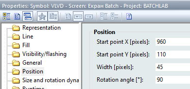

[Лабораторні](README.md)

# ЛАБОРАТОРНА РОБОТА 5. Реалізація Control Module

Мета роботи – навчитися створювати для ПЛК логіку модулів керування відповідно до ISA-88. 

## Загальні теоретичні відомості

У попердніх лабораторних роботах для керування виконавчими механізмами (ВМ) використовувались безпосередньо вихідні змінні. Однак ВМ, наприклад клапан,  це більш складний об’єкт, який окрім дискретних сигналів (відкрити/закрити) потребує:

- контролю стану за наявними датчиками положення;

- сигналізування при несправності: не відкрився, не закрився, зрушив зі стану;

- функціонування в режимах ручний/автоматичний: при ручному режимі команди керування видаються оператором.

Окрім цього, в залежності від типу ВМ, додатково може знадобитися ведення певної статистичної інформації про кількість включень, кількість тривог за певний час і т.д. З точки зору фізичної моделі, виконавчий механізм – це реальний фізичний пристрій, який знаходиться на найнижчому рівні ієрархії фізичних пристроїв підприємства. В термінах ISA-88, виконавчий механізм – це Модуль Керування (Control Module). Модуль Керування може виконувати тільки базові функції керування (basic control). Реалізація цих функцій в поєднані з описом стану Модуля Керування є апаратурним об’єктом (Equipment Entity). У даній лабораторній роботі необхідно реалізувати апаратурні об’єкти, та базові функції керування для цих об’єктів.

На рис.5.1 показаний можливий варіант виділення Модулів Керування (Control Module, надалі CM) для нашого об’єкта керування, а в табл. 5.1 наведений перелік цих об’єктів, вхідні та вихідні параметри, режими, стани та особливості керування.

Таблиця 5.1. Перелік CM та параметрів їх роботи

| Назва CM  | Опис                        | Вихідні змінні (на ВМ) | Вхідні змінні (датчики)          | Примітка                                                     |
| --------- | --------------------------- | ---------------------- | -------------------------------- | ------------------------------------------------------------ |
| CMVnab_D1 | Клапан набору D1            | VNabor_D1_M            | VNabor_D1_CLS_M                  | Можна реалізувати єдиним типом `cmVLVD`;  Команди програмного керування: відкрити/закрити;  Команди оператора: перевести в ручний/автоматичний, відкрити,  закрити;  Стани: відкритий, закритий, відкривається,  закривається, невизначений;  Стани тривог: не відкрився, не закрився, порушення  стану;    Режими: ручний/автоматичний; |
| CMVslv_D1 | Клапан зливу D1             | VSliv_D1_M             | VSliv_D1_CLS_M                   |                                                              |
| CMVnab_D2 | Клапан набору D2            | VNabor_D2_M            | VNabor_D2_CLS_M                  |                                                              |
| CMVslv_D2 | Клапан зливу D2             | VSliv_D2_M             | VSliv_D2_CLS_M                   |                                                              |
| CMVnab_T1 | Клапан набору T1            | VNabor_T1_M            | VNabor_T1_OPN_M  VNabor_T1_CLS_M |                                                              |
| CMVslv_T1 | Клапан зливу T1             | VSliv_T1_M             | VSliv_T1_OPN_M  VSliv_T1_CLS_M   |                                                              |
| CMVnab_T2 | Клапан набору T2            | VNabor_T2_M            | VNabor_T2_OPN_M  VNabor_T2_CLS_M |                                                              |
| CMVslv_T2 | Клапан зливу T2             | VSliv_T2_M             | VSliv_T2_OPN_M  VSliv_T2_CLS_M   |                                                              |
| CMVdoz    | Клапан перемикання дозатору | VDoz_T1toT2_M          | VDoz_T1_OPN_M  VDoz_T2_OPN_M     |                                                              |
| CMVngr_T1 | Клапан нагрівання Т1        | VNagrev_T1_M           | відсутні                         | Можна реалізувати єдиним типом «cmVLVA»;  Команди програмного керування: задане значення на клапан;  Команди оператора: перевести в ручний/автоматичний,  ручне завдання на ВМ;  Стани тривог: відсутні;    Режими: ручний/автоматичний; |
| CMVngr_T2 | Клапан нагрівання Т2        | VNagrev_T2_M           | відсутні                         |                                                              |
| CMMix_T1  | Мішалка Т1                  | KM1_M  SC1_SP          | GSM1_M                           | Можна реалізувати єдиним типом `cmMIX`;  Команди програмного керування: включити/відключити,  задане значення на ПЧ;  Команди оператора: перевести в ручний/автоматичний,  ручне завдання на ПЧ, ручне вмикання/розмикання;  Стани: вмикається, вимикається, увімкнений, вимкнений,  невизначений;  Стани тривог: не включився, не відключився;    Режими: ручний/автоматичний; |
| CMMix_T2  | Мішалка Т2                  | KM2_M  SC1_SP          | GSM2_M                           |                                                              |

- вихідні змінні є проміжними внутрішніми змінними, які в секції `Outputs` присвоюються реальним виходам 

 - вхідні змінні треба створити як внутрішні і переприсвоїти входами в секції `Inputs`

                          

Рис.5.1. Виділення Модулів Керування (CM)

Для взаємодії ЛМІ з CM стандарт ISA-88 рекомендує аналогічний до етапів механізм використання слова статусу та команди. Для цього в лабораторній роботі треба створити тип `CM_INOUT`, змінні на основі якого будуть повідомляти оператора про стан CM, та дадуть можливість відправляти команди до CM. Таким чином такий тип повинен включати принаймні два поля: `STA` (статус) та `CMD` (команда). Кожний біт статусу буде відповідати за певний стан, а команда буде задаватися певним числовим кодом. 

У табл. 5.2 показаний варіант побітового представлення статусу та значення команд які використовуватимуться в даній лабораторній роботі для дискретних клапанів. Слід зазначити, що кодування `STA` та `CMD`, як і їх обов’язкова наявність, не означена в стандарті ISA-88. 

Таблиця.5.2.  Опис структури `CM_INOUT` з бітовими станами для клапану

| Атрибут | Тип  | Біт       | Опис                                                         |
| ------- | ---- | --------- | ------------------------------------------------------------ |
| STA     | INT  | 0 ALMOPN  | =1 Не відкрився (скидаються при зміні команди або стану датчика) |
|         |      | 1 ALMCLS  | =1 Не закрився (скидаються при зміні команди або стану датчика) |
|         |      | 2 ALMSNSR | =1 Помилка датчика (одночасне спрацювання обидвох датчиків положення) |
|         |      | 3 ALMSHFT | =1 Порушення стану (при закритому чи відкритому стані клапану зміна стану  датчику без зміни команди на клапан) |
|         |      | 5 OPNS    | =1 Відкривається                                             |
|         |      | 6 CLSS    | =1 Закривається                                              |
|         |      | 7 OPND    | =1 Відкритий                                                 |
|         |      | 8 CLSD    | =1 Закритий                                                  |
|         |      | 9 MAN     | =1 ручний режим                                              |
|         |      | 10 GSSOPN | стан датчика відкриття                                       |
|         |      | 11 GSSCLS | стан датчика закриття                                        |
|         |      | 12 OUT    | стан виходу на клапан                                        |
| CMD     | INT  |           | Команди:  16#0001 - CMD_OPN (відкрити);  16#0002 - CMD_CLS (закрити);  16#0301 – перевести в ручний режим;  16#0302 – перевести в автоматичний режим |

## Завдання до виконання лабораторної роботи

1. Створити в Unity Pro внутрішні змінні для датчиків положення та прив’язати їх до реальних входів.
2. Створити в UnityPro похідні функціональні блоки (DFB) для реалізації логіки керування CM, тобто апаратурні об’єкти.
3. Створити в SCADA zenon інтерфейсні змінні для взаємодії з створеними CM та реалізація людино-машинного інтерфейсу для контролю та керування ними.
4. Модифікувати етапи з прив’язкою їх до CM.

## Порядок проведення роботи

### 1. Реалізація змінних CM (`CM_INOUT`) в ПЛК для обміну зі SCADA 

У цьому пункті необхідно створити типи для змінних CM для дискретних клапанів, що будуть взаємодіяти зі SCADA. Крім цього необхідно добавити змінні, які будуть містити інформацію про значення датчиків кінцевого положення для клапанів.

Спочатку необхідно в UNITY PRO створити тип `CM_INOUT` та змінні для CM виконавчих механізмів.

- [ ] Завантажте проект UNITY PRO з минулої лабораторної роботи.

- [ ] Створіть структурний тип `CM_INOUT` та зробіть `Analyze`


- [ ] Створіть внутрішні змінні що показані на (рис.5.1) або імпортуйте їх в проект як показано нижче


Рис.5.2. Створення типу та змінних `CM_INOUT`

- [ ] Якщо Ви хочете імпортувати змінні, тоді:
- завантажте їх [за посиланням](https://drive.google.com/file/d/1IvxhSMC5YaJq0qESw9nlgS5ZZ5tUC-5A/view?usp=sharing) та натисніть в контекстному меню `variabless & FB inst -> Import`


- виберіть завантажений файл `cmvarlab5.xsy` у наступному вікні биберіть `Keep All` щоб залишити тип, який означений в проекті та натисніть `Ok`


- проконтролюйте, у Вас повинні з'явитися змінні як на рис.5.2.

- [ ] У секції `INPUTS` зробіть переприсвоєння зовнішнім вхідним змінним (типу EBOOL), що відповідають за кінцеві положення виконавчих механізмів, як це показано нижче

Код для секції INPUTS

```pascal
VNabor_D1_CLS_M := %I0.1.8;
VSliv_D1_CLS_M := %I0.1.10;
VNabor_D2_CLS_M := %I0.1.9;
VSliv_D2_CLS_M := %I0.1.11;
VNabor_T1_OPN_M := %I0.1.0;
VNabor_T1_CLS_M := %I0.1.4;
VSliv_T1_OPN_M := %I0.1.2;
VSliv_T1_CLS_M := %I0.1.6;
VNabor_T2_OPN_M := %I0.1.1;
VNabor_T2_CLS_M := %I0.1.5;
VSliv_T2_OPN_M := %I0.1.3;
VSliv_T2_CLS_M := %I0.1.7;
VDoz_T1_OPN_M := %I0.3.0;
VDoz_T2_OPN_M := %I0.3.1;
GSM1_M := %I0.3.2;
GSM2_M := %I0.3.3;
```

Тепер секція `Inputs` матиме наступний вигляд


- [ ] Зробіть компіляцію проекту та збережіть його.

### 2. Реалізація змінних CM  (`CM_CFG`) в ПЛК для збереження стану та конфігураційних налаштувань 

Окрім змінної, що забезпечує взаємодію з HMI, необхідно передбачити можливість конфігурування CM, збереження його внутрішнього стану а також керування з програмної логіки (в противагу ручному керуванню). Можливим варіантом є використання для цього даних екземпляру функціонального блоку. У цій лабораторній роботі стан CM, його конфігурування та керування реалізовується теж через змінну, а не через екземпляр. Опис такого структурного типу для дискретних клапанів показаний в табл.5.4. 

Таблиця 5.4. Опис структури `CM_VLVDCFG`

| Атрибут | Тип  | Опис                                                         |
| ------- | ---- | ------------------------------------------------------------ |
| STA     | INT  | статусне слово (аналогічне `CM_INOUT`)                       |
| CMD     | INT  | слово команди (аналогічне `CM_INOUT`)                        |
| PRM     | INT  | біти параметрування:  біт 0 – 1= наявність датчика відкриття  біт 1 – 1= наявність датчика закриття |
| STEP1   | INT  | крок:  0 – ініціалізація; 1 – невизначений стан (резерв для майбутнього застосування);  2 – закритий;  3 – відкритий;  4 – відкривається;  5 – закривається |
| TSTEP1  | INT  | час кроку (в секундах)                                       |
| TOPN_SP | INT  | заданий максимальний час відкриття (в секундах), використовується для організації  тривог |

У цьому пункті необхідно створити тип `CM_VLVDCFG` та відповідні змінні для CM виконавчих механізмів.

- [ ] Створіть структурний тип `CM_VLVDCFG` (рис.5.3) та змінні типу `CM_VLVDCFG` для дискретних клапанів, наведених в табл.5.3 (рис.5.3), або імпортуйте їх.

 

Рис.5.3. Створення типу та змінних CM_INOUT

Файл для імпорту `cmvlvdcfgrlab5.xsy` знаходиться за [посиланням](https://drive.google.com/file/d/13ZXLwU5_gwSIrfiVe4Ezp_0ndPEYQOCg/view?usp=sharing).

- [ ] Для щойно створених змінних виставте значення при ініціалізації (`VALUE`) `TOPN_SP` рівним `5` секунд (приклад наведений на рис. 5.4). Це значення затримки очікування датчиків кінцевого положення для клапанів. Якщо Ви імпортували змінні та тип, то у файлі імпорту ці значення вже виставлені, проконтролюйте, що це дійсно так.

 

Рис.5.4

- [ ] Зробіть компіляцію проекту та збережіть його.
- [ ] Для того, щоб значення ініціалізації вступили в силу, можна проініціалізувати ПЛК. Для цього, якщо ПЛК знаходиться в режимі RUN, та в онлайні, то переведіть ПЛК (емулятор) в режим Stop і в меню виберіть команду `PLC -> Init`. У іншому випадку завантажте проект в емулятор ПЛК.

### 3. Реалізація в ПЛК функціональних блоків для CM  (`смVLVD` ) для клапанів

У цьому пункті необхідно створити тип функціонального блоку для реалізації CM клапанів. 

- [ ] Завантажте експортний варіант типу DFB `cmVLVD` з імемен  `cmvlvd.xdb` [за цим посиланням](https://drive.google.com/file/d/1dz4JnCp8nZIJaFeQrC9s0nIMVprzzctv/view?usp=sharing)
- [ ] Імпортуйте файл в проект. У вікні що з'явиться натисніть `Keep All` і `Ok` для продовження роботи. 


- [ ] Натисніть `Analyze` та збережіть проект, якщо немає помилок. 
- [ ] Відкрийте редактор типів і ознайомтеся з його інтерфейсом. 
- [ ] Користуючись описом типу та його програмною реалізацією, що наведені на рис.5.5-5.7 та в коді, осмисліть його роботу.


Рис.5.6. Створення DFB типу та змінних `cmVLVD`


 Рис.5.7. Створення DFB типу та змінних `cmVLVD`

 

Рис.5.8. Створення DFB типу та змінних cmVLVD (продовження)

Тепер необхідно реалізувати в UNITY PRO обробку CM для виконавчих механізмів.

- [ ] Створіть один екземпляр функціонального блоку типу `cmVLVD` з назвою `CMVLVD`.

- [ ] Створіть змінну `MEA1S` типу `EBOOL` для секундного меандру .

- [ ] Створіть секцію `VLV` з кодом, наведеним на рис.5.7. Код наведений нижче. 

 

Рис.5.8. Секція VLV

- [ ] Проаналізуйте код для секції `VLV`

```pascal
(*використання одного екземпляру для усіх викликів дає ряд переваг:
- економя пам'яті
- використання глобальних змінних для всіх екзмеплярів
- відсутність необхідності дублювання інтерфейсних змінних в блоці і в змінних*)

CMVLVD.MEA1S:=%S6; (*бітовий меандр заводимо як глобальну змінну*)

(*конфігурвуання клапанів*)
CMVnab_D1.PRM.0:=false ;(*немає датчкива відкриття*)
CMVnab_D1.PRM.1:=true;(*є датчик закриття*)
CMVnab_D2.PRM.0:=false;CMVnab_D2.PRM.1:=true;
CMVSlv_D1.PRM.0:=false;CMVSlv_D1.PRM.1:=true;
CMVSlv_D2.PRM.0:=false;CMVSlv_D2.PRM.1:=true;
CMVnab_T1.PRM.0:=true;CMVnab_T1.PRM.1:=true;
CMVnab_T2.PRM.0:=true;CMVnab_T2.PRM.1:=true;
CMVslv_T1.PRM.0:=true;CMVslv_T1.PRM.1:=true;
CMVslv_T2.PRM.0:=true;CMVslv_T2.PRM.1:=true;
CMVslv_T2.PRM.0:=true;CMVslv_T2.PRM.1:=true;
CMVdoz.PRM.0:=true;CMVdoz.PRM.1:=true; 

(*для клапанів з одним датчиком кінцевого положення на інший подаєм інверс-ну копію існуючого*)
CMVLVD (not VNabor_D1_CLS_M , VNabor_D1_CLS_M, VNabor_D1_M, CMVnab_D1_HMI, CMVnab_D1);
CMVLVD (not VNabor_D2_CLS_M , VNabor_D2_CLS_M, VNabor_D2_M, CMVnab_D2_HMI, CMVnab_D2);
CMVLVD (not VSliv_D1_CLS_M , VSliv_D1_CLS_M, VSliv_D1_M, CMVSlv_D1_HMI, CMVSlv_D1);
CMVLVD (not VSliv_D2_CLS_M , VSliv_D2_CLS_M, VSliv_D2_M, CMVSlv_D2_HMI, CMVSlv_D2);
CMVLVD (VNabor_T1_OPN_M , VNabor_T1_CLS_M, VNabor_T1_M, CMVnab_T1_HMI, CMVnab_T1);
CMVLVD (VNabor_T2_OPN_M , VNabor_T2_CLS_M, VNabor_T2_M, CMVnab_T2_HMI, CMVnab_T2);
CMVLVD (VSliv_T1_OPN_M , VSliv_T1_CLS_M, VSliv_T1_M, CMVslv_T1_HMI, CMVslv_T1);
CMVLVD (VSliv_T2_OPN_M , VSliv_T2_CLS_M, VSliv_T2_M, CMVslv_T2_HMI, CMVslv_T2);

CMVLVD (VDoz_T1_OPN_M, VDoz_T2_OPN_M, VDoz_T1toT2_M, CMVdoz_HMI, CMVdoz);

```

- [ ] Скомпілюйте проект, якщо є помилки - виправте їх. Збережіть проект.

- [ ] Якщо в офлійні, тоді завантажте проект в емулятор ПЛК та запустіть його на виконання. 

### 4. Добавлення змінних СМ в SCADA zenon

У цьому пункті необхідно створити типи та змінні в SCADA zenon для реалізації інтерфейсних змінних `CM_INOUT`, наведених в табл. 5.1.

- [ ] Запустіть редактор zenon та відкрийте проект з лабораторної роботи 4.

- [ ] Створіть тип змінної `CM_INOUT` та змінні на базі нього, як це показано на рис.5.9. Ви можете також імпортувати змінні та тип, за інструкцією наведеною нижче. 

 

Рис.5.9. Створення типів та змінних в SCADA zenon для обміну з CM

- [ ] Якщо створюєте змінні самостійно, то для кожної змінної вкажіть коментар (коментар для кожної змінної знаходиться в описі табл. 5.1). Наведемо приклад на рис.5.10.

 

Рис.5.10.

Для імпорту змінних:

- завантажте файл імпорту `lab5CMV.XML` [за посиланням](https://drive.google.com/file/d/1KGRL6aVEBUlPxq6tzk0-raoer_hE5QWc/view?usp=drive_link) 
- імпортуйте змінні


- У вікні назначення драйверу натисніть `Ok` 
- У вікні переліку імпортованих елементів він запропонує імпортувати тип та змінні, натисніть `Ok`


- проконтролюйте, що тип та змінні створилися відповідно до рис.5.9

- [ ] Збережіть зміни в проекті.

### 5. Створення символу та екрану клапану в SCADA 

Стан клапану повинен відображатися на мнемосхемі комбінацією кольорів та/або тексту. У лабораторній роботі пропонується використовувати для цього заздалегідь створений символ. Для керування клапаном також створений екран, який повинен викликатися при натисканні на зображення символу. Тобто символ та сторінка вже створені, необхідно їх імпортувати та використати в своєму проекті.

У цьому пунктів в SCADA необхідно імпортувати символ `VLVD` та екран для керування клапаном. 

- [ ] Завантажте імпортний файл символу `symbVLVD.XML` [за посиланням](https://drive.google.com/file/d/1TOvcShPllIGX_uer6HYF8b0OWkUiKxvr/view?usp=sharing) а також екрану `screenVLV.XML` [за посиланням](https://drive.google.com/file/d/1YqlVYkbgZef_g0BcU9O1OCEsBvp2fyEH/view?usp=sharing)
- [ ] В контекстному меню редактору zenon `Screens/Symbol Library` виберіть команду `ImportXML` і імпортуйте символ `Сивмол VLVD.XML`


У локальній бібліотеці символів з'явиться новий символ


- [ ] У контекстному меню редактору zenon `Screens` виберіть команду `ImportXML` і імпортуйте екран `screenVLV.XML` для вікна керування клапаном


У вас повинен з'явитися фрейм `AckWin` та екран `Керування клапаном`


### 6. Створення символу та екрану клапану в SCADA 

У цьому пункті необхідно видалити старі символи зображень клапанів на `Екрані Batch` та розмістити на їх місці нові символи для відображення станів клапанів.

- [ ] Відкрийте екран `Екран Batch`
- [ ] Виділіть символ установки на екрані і в контекстному меню виберіть команду `Symbol->Resolve`


- [ ] Розмістіть символи на екрані (як лінкований).


- [ ] З'явиться вікно в якому треба вказати правило заміни. У символі прив'язки йдуть для клапану `CMVslv_D2`, тому в правилі прив'язки в ресурсі (`source`) треба вказати що будуть замінюватися усі змінні що починаються з `CMVslv_D2` , тому в кінці виразу ставиться знак `*`.  Перший екземпляр символу буде використаний для клапану набору дозатору 1 (`CMVnab_D1`), тому вкажіть правило заміни, яке буде наступним:

- source: `CMVslv_D2*`
- target: `CMVnab_D1`

- [ ] Натисніть кнопку `Preview` , повинно показати заміну (рис.5.11). Натисніть `Ok`

 

Рис.5.11. Приклад заміни прив’язки для символу

- [ ] Видаліть старий клапан набору для дозатору, перемістіть на його місце новий кпапан.
- [ ] Розверніть символ на 90 градусів за бажанням змініть масштаб. 



- [ ] Видаліть усі інші клапани. На їх місце скопіюйте існуючий екземпляр.
- [ ] Для кожного клапану у властивостях `linking rule` замініть прив’язки до змінних відповідно до призначення символу.

| Клапан                  | target    |
| ----------------------- | --------- |
| Вивантаження дозатору 1 | CMVslv_D1 |
| Набору дозатору 2       | CMVnab_D2 |
| Вивантаження дозатору 2 | CMVslv_D2 |
| Набору Т1               | CMVnab_T1 |
| Вивантаження Т1         | CMVslv_T1 |
| Набору Т2               | CMVnab_T2 |
| Вивантаження Т2         | CMVslv_T2 |
| Між Т1 та Т2            | CMVdoz    |

- [ ] За допомогою кнопки `Preview` перевірте результати заміни. 

### 7. Створення функції виклику екрану клапану в SCADA 

У цьому пункті необхідно реалізувати виклики екрану керування клапаном. 

Екран керування клапаном налаштований тільки на один СМ - `CMVslv_D2`. Для керування іншими кранами в zenon буде використаний механізм заміни прив’язок при виклику функції `Screen switch`. Для цього у функції вказується параметр, замість якого буде передаватися текстове значення замінника в назві змінної. 

Спочатку необхідно створити в zenon функції виклику та закриття сторінки клапану. 

- [ ] Створіть функцію `Screen switch`, яка відкриває екран `Керування клапаном`.

- [ ] У параметрах функції у вкладці `Replace indices` (НЕ `Replace links`) вкажіть правило прив’язки заміни `CMVslv_D2*` на параметром `{PARAM}`, і натисніть кнопку `Add rule` як це показано на рис.5.12.

 

Рис.5.12. Налаштування правила заміни для функції виклику екрану керування клапаном

- [ ] У `Replace preview` з'являться змінювані змінні. Натисніть `Ok`
- [ ] Дайте назву функції `Відкрити вікно керування клапаном`

- [ ] Створіть функцію `Close screen` з розділу `Screens` з назвою `Закрити вікно`, яка закриває поточний екран (рис. 5.13).

 

Рис.5.13. Налаштування функції Close Screen

- [ ] Відкрийте екран `Керування клапаном` і прив’яжіть до кнопки `Ок` функцію `Закрити вікно`.

Тепер необхідно розмістити над клапанами прозорі кнопки для виклику вікон керування клапанами. 

- [ ] На `Екран Batch` поверх зображення клапану набору розмістіть кнопку.


- [ ] Прив’яжіть кнопкe до виклику функції `Відкрити вікно керування клапаном`. 

- [ ] У налаштуваннях параметрів вкажіть назву CM `CMVnab_D1`


Рис.5.14. 

- [ ] Зробіть кнопку прозорою, вказавши `Fill->Transparent`


- [ ] Скопіюйте прозорі кнопки і розмістіть поверх усіх інших клапанів.

- [ ] У налаштуваннях параметрів для кожної кнопки вкажіть назву CM, як це вказано в таблиці нижче.

| Клапан                  | Parameter for substitution |
| ----------------------- | -------------------------- |
| Вивантаження дозатору 1 | CMVslv_D1                  |
| Набору дозатору 2       | CMVnab_D2                  |
| Вивантаження дозатору 2 | CMVslv_D2                  |
| Набору Т1               | CMVnab_T1                  |
| Вивантаження Т1         | CMVslv_T1                  |
| Набору Т2               | CMVnab_T2                  |
| Вивантаження Т2         | CMVslv_T2                  |
| Між Т1 та Т2            | CMVdoz                     |

- [ ] Збережіть зміни

### 8. Перевірка роботи CM для клапанів 

- [ ] Скомпілюйте проект та запустіть його на виконання. 
- [ ] Натисніть на клапан набору танку 1, відкриється вікно керування. Натисніть на кнопку `РУЧ` щоб перевести клапан в ручний режим. Повинен засвітитися відповідний індикатор.
- [ ] Натискаючи кнопки `Відкрити` та `Закрити` спробуйте покерувати цим клапаном.


- [ ] Спробуйте покерувати іншими кранами в ручному режимі, перевірте, щоб всі вікна відкривалися для кранів вірно. 

- [ ] Для клапану перемикання у певному стані буде активована тривога. Ця тривога викликана помилкою в коді програми. Крім того, для цього ж клапану не будуть відображатися стани датчиків. Знайдіть помилки в програмі і виправте їх.

- [ ] У UNITY PRO створіть таблицю анімацій, впишіть в неї адреси `%I0.1.0` та `%I0.1.4`. За допомогою команд форсування проімітуйте тривоги `не закрився`, `не відкрився` та порушення стану.

### 9. Модернізація етапів з використанням СМ.

Тепер необхідно модернізувати реалізацію етапів так, щоб замість звичайних змінних там використовувалися CM. Такий підхід дасть можливість гнучко керувати процесом. На даному кроці побудови системи це дає можливість використовувати ручний режими керування виконавчими механізмами. У майбутньому це також дасть можливість реалізовувати додаткову поведінку етапу в нештатних ситуаціях. 

У цьому пункті необхідно модифікувати DFB `phFILL` для етапу набору та `phDRAIN` для етапу зливу так, щоб в якості VLV використовувався тип `CM_VLVDCFG` та відповідно необхідно змінити виклик етапів та перевірити працездатність програми.

- [ ] У `phFILL` для формального параметру `VLV` змініть тип з `EBOOL` на `CM_VLVDCFG`. 

- [ ] Змініть реалізацію секції `phFILL` (рис.5.15) вказавши `VLV.CMD:=1` для відкриття та  `VLV.CMD:=2` для закриття.

- [ ] Змініть виклик `phFILL_T1` (рис.5.15)  вказавши в `VLV := CMVnab_T1`
- [ ] Зробіть `Analyze` . Виправте помилки за необхідності.

 

 

Рис.5.15. Зміна інтерфейсу, реалізації та використання CM_VLVDCFG

- [ ] Зробіть те саме для етапу `phDRAIN`.

- [ ] Скомпілюйте проект, зробіть щоб він змінився в емуляторі ПЛК, збережіть його та запустіть на виконання zenon. 
- [ ] Переведіть клапани набору та зливу для Танку 1 в автоматичний режим.
- [ ] Перевірте працездатність існуючого рецепту в автоматичному режимі. 
- [ ] Після виконання рецепту, перемкніть клапан набору в ручний режим та закрити його. Запустіть рецепт подивіться на стан клапану і знову переключіть його в автоматичний режим. Подмайте, чому така поведінка клапану?

### 10. Створення СМ в ПЛК для клапанів нагрівання 

Окрім дискретних клапанів необхідно реалізувати CM для аналогових клапанів. На відміну від дискретних клапанів інтерфейсні змінні окрім `STA` та `CMD` потребують ще аналогове значення виходу на клапан, яке буде використовуватися як для відображення, так і для ручної зміни (табл.5.7).

Для керування всередині етапів в даній лабораторній роботі можна, як і раніше, використовувати звичайне значення аналогового виходу, яке буде за необхідності в ручному режимі замінюватися значенням з HMI.

 Таблиця 5.7. Опис структури `CM_INOUTA` з бітовими станами для аналогового клапану

| Атрибут | Тип  | Біт   | Опис                                                         |
| ------- | ---- | ----- | ------------------------------------------------------------ |
| STA     | INT  | 9 MAN | =1 ручний режим                                              |
| CMD     | INT  |       | Команди:  16#0301 – перевести в ручний режим  16#0302 – перевести в автоматичний режим |
| VAL     | REAL |       | стан виконавчого механізму, ручне значення вводу; в автоматичному режимі  значення повторює вихід, в автоматичному – навпаки, значення задає вихід на  ВМ |

У цьому пункті необхідно створити в UNITY PRO тип CM для аналогового клапану та реалізувати його для клапанів нагрівання (рис.5.16). 

- [ ] Створіть в UNITY PRO тип `CM_INOUTA`. 

- [ ] Створіть змінні `CMVngr_T1` та `CMVngr_T2` типу `CM_INOUTA` та прив’яжіть їх до реальних адрес (рис.5.16). Зробіть `Analyze` щоб перевірити помилки.

 

Рис.5.16. Створення в UNITY PRO CM для аналогового клапану

- [ ] Створіть DFB  `cmVLVA` (рис.5.1.6) та зробіть `Analyze`

Код секції:

```pascal
MAN := HMI.STA.9;(*ручний режим*)

(*команди з HMI*)
case HMI.CMD of
  16#0301:(*перевести в ручний*)
	MAN:=true; 
  16#0302:(*перевести в автомат*)
	MAN:=false;
end_case;
HMI.CMD:=0;

if man then (*в автоматичному режимі*)
	OUT:=HMI.VAL;
else (*в ручному режимі*)
	HMI.VAL:=OUT;
end_if;

HMI.STA.9:=MAN;
```

- [ ] Створіть один екземпляр типу `cmVLVA` з таким саме іменем.

- [ ] У секції `VLV` допишіть фрагмент коду з викликом `cmVLVA` для двох клапанів.

```pascal
CMVLVA (VNagrev_T1_M, CMVngr_T1);
CMVLVA (VNagrev_T2_M, CMVngr_T2);
```

- [ ] Скомпілюйте проект, забезпечте щоб він змінився в емуляторі та збережіть його. 

### 11. Створення СМ в SCADA для клапанів нагрівання 

У цьому пункті необхідно створіть в zenon тип CM для аналогового клапану та реалізувати його для клапанів нагрівання (рис.5.17) та перевірити роботу програми. 

- [ ] У SCADA zenon створіть структурний тип даних `CM_INOUTA` з полями: `STA`, `CMD`, `VAL` (рис.5.17).

- [ ] Створіть змінні `CMVngr_T1` та `CMVngr_T2` типу `CM_INOUTA` та вкажіть для них адреси (рис.5.17).

 

 

Рис.5.17. Створення в zenon CM для аналогового клапану та графічного інтерфейсу для нього

- [ ] На мнемосхемі `Екран Batch` змініть прив’язку для елементу відображення значення клапану `CMVngrT1.VAL`та `CMVngrT2.VAL` з можливістю їх зміни.

- [ ] Скопіюйте з екрану `Керування клапаном` елементи відображення та зміну автоматичного/ручного режиму. Розмістіть їх так, як показано на рис.5.17  Змініть прив’язки на змінні `CMVngrT1.STA` та відповідно `CMVngrT2.STA`. 


- [ ] Скомпілюйте та запустіть на виконання zenon. Змініть режим роботи клапану на ручний. Задайте значення `0 %`. Запустіть на виконання рецепт. На етапі нагрівання клапан буде в позиції, яку було задано в ручному режимі. Переведіть на автоматичний режим та дочекайтеся закінчення виконання рецепту. 

### 12. Завдання для самостійного опрацювання: створення СМ для приводів мішалок 

У цьому пункті необхідно самостійно реалізувати CM для приводу мішалок. Для спрощення завдання будемо вважати що керування частотою приводу мішалки залишається без змін, хоча в реальності необхідно реалізовувати це як один CM, який має функції як дискретного так і аналогового керування. Тому за реалізацією спрощений CM для мішалок схожий на CM для дискретного клапану. Нижче наведемо деякі уточнення щодо роботи. 

Увімкнення двигунів мішалок керуються дискретними змінними: 

- двигун мішалки 1 - `%q0.1.26` (`KM1_M`)

- двигун мішалки 2 - `%q0.1.27` (`KM2_M`)

Стан приводу мішалки контролюється дискретними входами:

- стан приводу мішалки 1 - `%i0.3.2` (`GSM1_M`)

- стан приводу мішалки 2 -`%i0.3.3` (`GSM2_M`)

Таким чином коли на вихід керування увімкненням мішалки подається `1`, стан приводу практично миттєво (<1 сек) повинен повторити цю `1`, так само і команду вимкнення `0`. Тому для обміну зі SCADA можна використовувати тип в ПЛК `CM_INOUT`, однак при цьому біти стану будуть дещо відмінними

| Атрибут | Тип  | Біт       | Опис                                                         |
| ------- | ---- | --------- | ------------------------------------------------------------ |
| STA     | INT  | 0 ALMSTRT | =1 Не запустився (скидаються при зміні команди або стану датчика) |
|         |      | 1 ALMSTP  | =1 Не зупинився (скидаються при зміні команди або стану датчика) |
|         |      | 5 STRT    | =1 Вмикається                                                |
|         |      | 6 STP     | =1 Вимикається                                               |
|         |      | 7 RUN     | =1 Відкритий                                                 |
|         |      | 8 STP     | =1 Закритий                                                  |
|         |      | 9 MAN     | =1 ручний режим                                              |
|         |      | 10 GSRUN  | стан пускача                                                 |
|         |      | 12 OUT    | стан виходу на двигун                                        |
| CMD     | INT  |           | Команди:  16#0001 - `CMD_STRT` (запустити);  16#0002 - `CMD_STP` (зупинити);  16#0301 – перевести в ручний режим;  16#0302 – перевести в автоматичний режим |

Так само в якості конфігураційної змінної можна використати `CM_VLVDCFG`, однак `TOPN_SP` буде не час відкриття а час спрацювання приводу.

- [ ] Створіть в UNITYPRO DFB тип CM для приводу мішалки `cmMIX`. У якості прототипу можете використати DFB `cmVLVD`. 
- [ ] Створіть екземпляр `CMMIX` , реалізуйте в секції `VLV` виклики для мішалки `Т1` та `Т2`. 
- [ ] Модифікуйте DFB `phDRAIN_T1` та  `phMIX_T1` з передачею туди новостворених CM.
- [ ] Створіть в zenon вікно керування мішалкою подібно до вікна керування клапанами. Тип структурної змінної можна використовувати той самий що і для клапану. 

## Контрольні питання

1. Що таке виконавчий механізм, з точки зору фізичної моделі?
2. Чим може бути виконавчий механізм з точки зору фізичної моделів ISA-88?
3. Які модулі керування виділені в даній лабораторній роботі?
4. Які команди, режими і стани були виділені в даній лабораторній роботі?
5. Розкажіть про реалізацію в ПЛК вказаного викладачем CM.
6. Покажіть на прикладі, як реалізований обмін між CM в SCADA та ПЛК.