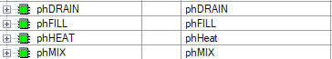
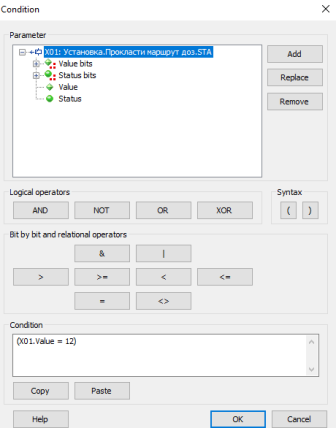

[Лабораторні](README.md)

# ЛАБОРАТОРНА РОБОТА 6. Модель апаратурних об’єктів та координаційне керування

Мета роботи – розглянути модель апаратурних об’єктів та координаційне керування. 

## Загальні теоретичні відомості

У попередніх лабораторних роботах в межах моделі обладнання (equipment model) установки приготування продукту для танків ми створили Апарати (Unit) `Танк1` та `Танк2` (рис.6.1) та модулі керування для реалізації виконавчих механізмів. У даній лабораторній роботі необхідно повністю реалізувати все процедурне керування, для чого виділимо усі процедурні елементи та обладнання (equipment). 

Установка, що розглядається в лабораторній роботі 6, робить повністю партію певного продукту, отже вона з точки зору ISA-88 є технологічною коміркою (Process Cell). Враховуючи, що продукт може готуватися одночасно в двох танках, то в цій технологічній комірці може одночасно виконуватися приготування двох партій продукту. 

Для обох танків використовується одна установка дозування, яка включає в себе два дозатори та клапан перемикання `CMVdoz`. З точки зору процедурного керування установка робить дві дії – дозування певної кількості компоненту A (Дозатор D1) та B (Дозатор D2). Ці технологічні дії найбільш підходять до функцій етапу (phase). Тому в межах обладнання необхідно створити етапи: `Добавити А` та `Добавити B`, в параметрах яких задавати необхідну кількість доз компоненту. 


Рис.6.1. Виділення Агрегату (EM) та Апаратів (UN) у технологічній комірці

Тепер необхідно визначитися з тим, до якого типу обладнання відноситься установка дозування. Оскільки етап – це процедурне керування, він може виконуватися в Апараті (Unit), в Агрегаті (Equipment Module) або в Технологічній Комірці (Process Cell). Установка дозування найкраще підходить до поняття Агрегату (Equipment Module), так як в ній не готовиться продукт і вона є допоміжним обладнанням. Самі дозатори зручно реалізувати у вигляді модулів керування, які будуть брати на себе усю логіку підрахунку кількості доз. Таким чином, до складу Технологічної комірки крім танків будуть входити два модулі керування дозаторами `CMDozator1` та `CMDozator2` , які будуть в складі Агрегату `EMDozators` .     

У моделі обладнання установка дозування не належить жодному танку, оскільки може використовуватися будь яким з них. З цього слідує декілька висновків:

- агрегат «Дозатори» (`EMDozators`) в моделі обладнання належить безпосередньо Технологічній Комірці;

- агрегат «Дозатори» є спільним ресурсом з ексклюзивним користуванням (exclusive used resource), так як може використовуватися будь яким танком, але не одночасно;

- перед користуванням дозаторів рецептам необхідно буде їх йому надати (allocation), щоб під час володіння ресурсом тільки один рецепт користувався ним;

- після надавання дозаторів у використання, клапан `CMVdoz` повинен стати у відповідну позицію; звідси слідує, що даний клапан теж належить технологічній комірці а не танкам.

Діяльність Allocation відноситься до координаційного керування, яке теж необхідно реалізувати.

Загальна модель апаратурних об’єктів показана на рис.6.2. Для спрощення на рисунку показані не всі об’єкти.  

 

Рис.6.2. Узагальнена модель апаратурних об’єктів (Equipment Entity Model)

Для можливості використання установки дозування в рецептах необхідно в межах Агрегату `EMDozators` створити етапи. Поки в явному створенні `EMDozators` в Unity Pro немає необхідності, тому достатньо створити етапи та викликати їх в програмі, аналогічно, як це було зроблено для етапів танків. Слід також відмітити, що в структурі означення компонувальних блоків Batch zenon немає інших типів апаратурних об’єктів, окрім Unit. Тим не менше, з точки зору означення рецепту немає різниці, як саме називається тип апаратурного об’єкту, оскільки користувач буде бачити тільки його назву. Іншими словами, як для Апаратів так і для Технологічних Комірок, і для Агрегатів в означенні компонувальних блоків Batch будуть використовуватися також Unit. Щоб користувач оперував зрозумілими для нього словами, замість `EMDozators` будемо використовувати назву агрегату «Дозатори».

Варто відмітити, що у ISA-88.01-2010 Агрегати (Equipment Modules), етапи яких можуть безпосередньо викликатися з рецептів, називаються рецептно-обізнаними агрегатами (recipe-aware equipment module).

Для дозування сумішей з дозаторів в Танк 2 необхідно зробити перемикання 3-х ходового клапану. Враховуючи, що клапан належить технологічній комірці, саме вона повинна реалізувати таке перемикання. Це можна зробити через базове керування, або через явний виклик етапу, який буде частиною технологічної комірки. Вибір реалізації для таких задач залежить від об’єкту і вимог. У даній лабораторній роботі використаємо окремий етап `Прокласти шлях для дозування`, в параметрах якого буде вказуватися номер танку, до якого необхідно перемкнути дозатори. Така реалізація дасть можливість в рецепті явно вказувати той момент, коли необхідно робити таке перемикання. Етап необхідно створити в межах технологічної комірки, так як згідно моделі апаратурних об’єктів (рис.6.2) клапан належить саме їй. 

Окрім керування необхідно реалізувати блокування запуску етапів та програм дозування без явного дозволу. Це загальноприйнята практика координаційного керування, коли запуск процедур повинно бути дозволено, або заборонено. Якщо оператор явно вибирає маршрут, то тільки після його прокладання можливий дозвіл на запуск дозаторів. У нашому випадку маршрутів для дозування буде лише два: 

- дозатори –> танк Т1;

- дозатори –> танк Т2.

Вибір маршруту буде задаватися окремою змінною `DOZROUTE_SP`, яка буде приймати значення:

- `0` – маршрут дозування не вибраний, тому дозування блоковане;
- `1` – маршрут дозування на танк Т1, дозвіл дозування при стані 3-х ходового клапану на Т1 (аналогічно стану «закритий»);
- `2` – маршрут дозування на танк Т2, дозвіл дозування при стані 3-х ходового клапану на Т1 (аналогічно стану «відкритий»);
- інші значення – аналогічно нулю.


Блокування необхідно зробити як в програмі модулів керування дозаторів (`CMDozator`), так і в етапах дозування, наприклад в SCADA (`Дозувати`). Для `CMDozator` введемо додатковий біт стану `DOZENBL` (`STA.13`). Цей біт буде змінюватися ззовні CM, а саме в реалізації програми керування Технологічної Комірки. Цей же біт буде використовуватися для дозволу дозування в zenon.

У ISA-88 описане вище керування, що не робить ніяких явних технологічних дій або керування обладнанням, а лише дозволяє/забороняє, змінює режим чи стан базового або процедурного керування прийнято називати Координаційним керуванням (Coordination Control). 

 

## Завдання до виконання лабораторної роботи

1. Створити CM для дозаторів (з боку ПЛК та SCADA) та перевірити їх роботу.
2. Створити EM для установки дозування (з боку ПЛК та SCADA) етапів для них, та реалізувати інтерфейс.
3. Створити етапи та апаратурні елементи для 2-го танку.
4. Забезпечити блокування етапів дозування при невірному стані 3-ходового клапану перемикання дозатору на танки.
5. Реалізувати перемикання дозаторів на необхідний танк в залежності від вибраного маршруту.
6. Реалізувати єдиний рецепт для приготування продукту у будь-якому вільному танку.

 

## Порядок проведення роботи

### 1. Створення СМ дозаторів в ПЛК

У цьому пункті спочатку необхідно в Unity Pro створити тип та змінні для керування та контролю дозаторами. 

- Завантажте Unity Pro та проект з минулої лабораторної роботи.

- Створіть тип `CM_Dozator` для контролю та керування дозаторами (рис.6.3).

- Створіть дві змінні для CM дозаторів з прив’язкою до адрес: `CMDozator1`, `CMdoztor2` (рис.6.3).

 

Рис.6.3.Тип та змінні в Unity Pro для керування/контролю дозування

Тепер треба створити DFB тип, екземпляри та виклики для керування та контролю дозаторами. 

- [ ] Створіть DFB тип `cmDozator` для контролю та керування дозаторами (рис.6.4) або імпортуйте його [за цим посиланням](https://drive.google.com/file/d/1FwZlDH4RRa3wIpTfx5iUyhhzFGeAdziH/view?usp=sharing).

- [ ] Створіть один екземпляр `CMDozator` типу `cmDozator`.

    


Рис.6.4.Тип та екземпляр DFBдля реалізації CM дозатору

- [ ] Проаналізуйте код для секції DFB  типу `cmDozator`

```pascal
(*плинний статус дозатору - розпаковка бітів*)
STEP1:=Dozator.STA and 16#000F;(*тільки молодший байт використовується для значення кроку*)
UP:=Dozator.STA.8;(*набирається*)
DOWN:=Dozator.STA.9;(*зливається*)
COMPL:=Dozator.STA.10;(*кількість доз досягнута*)
UP_PREV:=Dozator.STA.11;(*стан набору до зупинки*)
DOWN_PREV:=Dozator.STA.12;(*стан зливу до зупинки*)

if Dozator.CMD=2 then(*припинити дозування*)
	step1:=1;
	(*запамятати стан*)
	UP_PREV:=UP;DOWN_PREV:=DOWN;
end_if; 
if Dozator.CMD=3 then step1:=0; end_if; (*ініціалізувати дозатор*)

if dozator.DozesPV < Dozator.DozesSP then
	COMPL:=false;	
end_if;

CASE STEP1 OF
	  0: (*інціалізація/невизначений стан*)
		dozator.DozesPV:=0;
		UP_PREV:=false;DOWN_PREV:=false;COMPL:=false;
		STEP1:=1;
	  1: (*дозування припинено*)
		VLVin.cmd:=2;
		VLVout.cmd:=2;
		if Dozator.CMD=1 then (*продовжити/почати дозування*)
		  if LSH then step1:=3; (*повний*)
		  elsif NOT LSL then step1:=2; (*порожній*)
		  else (*наповнюється або зливаться залежить від попереднього стану*)
			if UP_PREV then step1:=4; 
			else step1:=5;
			end_if; 
		  end_if; 
		end_if;	
	  2: (*порожній*)
	  if VLVout.STA.8 then (*якщо вихідний клапан закритий*)
		if dozator.DozesPV >= Dozator.DozesSP then 
		   COMPL:=true; (*кількість доз досягнута*)
		   step1:=1;		
		else
		   step1:=4;	
		end_if;	
	  end_if;
	  3: (*повний*)
	  if VLVin.STA.8 then  (*якщо вхідний клапан закритий*)
		step1:=5;
		dozator.DozesPV:=dozator.DozesPV+1; (* +1 доза*)
	  end_if;	
	  4: (*наповнюється*)
	   VLVin.cmd:=1;
	  if LSH then 
		step1:=3; 
		VLVin.cmd:=2;
	  end_if; 	
	  5: (*зливається*)
	   VLVout.cmd:=1;
	  if not LSL then 
		step1:=2; 
		VLVout.cmd:=2;
	  end_if;			
	  ELSE (*інціалізація*)
	  STEP1:=0;   	
END_CASE;

(*блокування: закриття клапанів по датчику на будь якому кроці*)
if LSH then VLVin.cmd:=2; end_if;	
if not LSL then VLVout.cmd:=2; end_if;

UP:=(STEP1=4);
DOWN:=(STEP1=5);

Dozator.CMD:=0; (*обнулити команду*)

(*плинний статус дозатора - упаковка бітів*)
Dozator.STA:=0;
Dozator.STA.8:=UP;(*наповнюється*)
Dozator.STA.9:=DOWN;(*зливається*)
Dozator.STA.10:=COMPL;(*кількість доз досягнута*)
Dozator.STA.11:=UP_PREV;(*стан набору до зупинки*)
Dozator.STA.12:=DOWN_PREV;(*стан зливу до зупинки*)
Dozator.STA := Dozator.STA or STEP1;
```

- [ ] У основній задачі (MAST) створіть секцію `Dozators`, та запишіть виклики CM для дозаторів (рис.6.5).

```pascal
CMDozator (VLVin := CMVnab_D1, VLVout := CMVslv_D1, Dozator := CMDozator1, LSH := LSH_D1, LSL := LSL_D1);
CMDozator (VLVin := CMVnab_D2, VLVout := CMVslv_D2, Dozator := CMDozator2, LSH := LSH_D2, LSL := LSL_D2);
```

 

Рис.6.5. Програма виклику CM дозаторів в секції `Dozators`

- [ ] Скомпілюйте проект Unity Pro, завантажте в емулятор ПЛК та запустіть на виконання.

### 2. Створення змінних СМ дозаторів в SCADA

У цьому пункті необхідно в SCADA zenon створити типи, змінні та візуалізацію для реалізації керування та контролю дозаторів . 

- [ ] Запустіть на виконання середовище розроблення zenon та завантажте проект з минулої лабораторної роботи.

- [ ] Створіть структурний тип змінної з іменем `CM_Dozator` та налаштуйте параметри, як показано на рис.6.6.

 

Рис.6.6. Створення та налаштування в zenon типу `CM_Dozator`

- [ ] Створіть змінні `Dozator1` та `Dozator2` типу `CM_Dozator` та налаштуйте їх як показано на рис.6.7.

 

Рис.6.7. Створення та налаштування в zenon змінних `CM_Dozator`

- [ ] Завантажте `symbdozator.XML` за [цим посиланням](https://drive.google.com/file/d/1QQLZicr53QcM_bHqFEAgBAt2W_1gRL_1/view?usp=sharing) та `symbdozatorctrl.XML` за [цим посиланням](https://drive.google.com/file/d/14pqN9HIvzatVFFOQ67yG7mb2RZR8DeMa/view?usp=sharing).
- [ ] В контекстному меню редактору zenon `Screens/Symbol lybrary` виберіть команду `Import XML` і імпортуйте символи `symbdozator.XML` та `symbdozatorctrl.XML`.

- [ ] Розмістіть та налаштуйте імпортовані символи поверх зображень дозаторів, як це показано на рис.6.8. Для дозатору 2 змініть також правило прив’язки.

 

Рис.6.8. Створення та налаштування в zenon ЛМІ для керування та контролю дозаторів

- [ ] За допомогою елементів Numerical Value виведіть біля дозаторів значення уставки (DozesSP) та плинної кількості доз (DozesPV) для кожного дозатору (рис.6.8). 

- [ ] Збережіть зміни в проекті.

### 3. Перевірка роботи СМ дозаторів

- [ ] Скомпілюйте проект zenon та запустіть його на виконання.

- [ ] В середовищі виконання перейдіть на `екран Batch`. Виставте усі клапани дозування в автоматичний режим. 
- [ ] Для дозаторів виставте задане значення (SP) 3 та 2 відповідно.

- [ ] Для кожного дозатору натисніть команду «ініціалізувати».

- [ ] Використовуючи команди «дозувати», запустіть дозатори на дозування, дочекайтеся відпрацювання доз, після чого знову скиньте лічильники доз командою «ініціалізувати».

- [ ] На дозаторі 1 перевірте роботу команди «зупинити» та «дозувати» при наборі та зливі дози; зверніть увагу чи продовжує дозатор виконувати правильні дії зливу/набору та підрахунку доз.

### 4. Створення ЕМ, етапів для установки дозування в ПЛК

У цьому пункті спочатку необхідно створити DFB-тип `phDoze` та один екземпляр цього типу для реалізації етапу `Дозувати`.

- [ ] Створіть DFB-тип `phDoze`, як це показано на рис.6.9, або імпортуйте його [за посиланням](https://drive.google.com/file/d/1fWP4OR4HwxletbcpDuFNsPpdrW6vBu30/view?usp=sharing). 

 


Рис.6.9. Створення типу DFB для етапу «Дозувати»

- [ ] Проаналізуйте код для секції DFB типу `phDoze`

```pascal
(*обробка команд керування автоматом станів етапу phDRAIN*)
CASE phIO.CMD OF
  1: (*Phase started*)
    phIO.STA:=1;
  2:;(*Finished writing command tags*)
  3: (*Phase finished: Phase done condition fulfilled and Minimum execution duration reached (if engineered)*)
    phIO.STA:=3;
  4: (*Phase deactivated*)
    phIO.STA:=0; 
    Dozator.CMD:=3; (*ініціалізувати дозатор*)
  10: (*Status change: Pausing*)
    phIO.STA:=5;
  11: (*Status change: Resuming*)
    phIO.STA:=1;
  12: (*Status change: Holding*)
    phIO.STA:=7;
  13: (*Status change: Restarting*)
    phIO.STA:=11;
  14: (*Status change: Stopping*)
    phIO.STA:=3;
  15: (*Status change: Aborting*)
    phIO.STA:=9;
  20:; (*Mode change: Automatical*)
  21:; (*Mode change: Semi-automatic*)
  22:; (*Mode change: Manual*)
  30:; (*Exit Runtime initiated*)
  31:; (*Runtime restart*)
  32:; (*Unit allocation not possible*)
  33:; (*Waiting period unit allocation exceeded*)
  34:; (*Input interlocking blocked*)
  35:; (*Waiting period input interlocking exceeded*)
  36:; (*Maximum execution period exceeded*)
  37:; (*Waiting period following condition exceeded*)
  38:; (*Phase started multiple times*)	
  ELSE
      ;	
END_CASE;
phIO.CMD:=0;(*після обробки команда обнуляється*)


CASE phIO.STA OF
  0:;(*Idle*)

  1:;(*Running*)
	Dozator.CMD:=1; (*продовжити/почати дозування*)
	if dozator.STA.10 then (*кількість доз досягнута*) 
		phIO.STA:=12;
	end_if;	
  2:;(*Complete (Executed)*)
	Dozator.CMD:=2; (*припинити дозування*)  
  3:;(*Stopping*)
	Dozator.CMD:=2; (*припинити дозування*) 
	phIO.STA:=4; 
  4:;(*Stopped*)
  5:;(*Pausing*)
	Dozator.CMD:=2; (*припинити дозування*)   
	phIO.STA:=6; 
  6:;(*Paused*)
  7:;(*Holding*)
	Dozator.CMD:=2; (*припинити дозування*)  
	phIO.STA:=8; 
  8:;(*Held*)
  9:;(*Aborting*)
	Dozator.CMD:=2; (*припинити дозування*)   
	phIO.STA:=10;
  10:;(*Aborted*)
  11:;(*Restarting*)
	phIO.STA:=1;
  12: (*Completed*)
	Dozator.CMD:=2; (*припинити дозування*)		
  ELSE
   (*якщо значення відрізняється від 
    доступних - перехід в Idle*)
    phIO.STA:=0;Dozator.CMD:=3; (*ініціалізувати дозатор*) 
END_CASE;
```

- [ ] Створіть однойменний екземпляр для типу `phDoze` (рис.6.9). 

Тепер необхідно створити інтерфейсні змінні `phioDOZE_A` та `phioDOZE_B` типу `PhaseINOUT` та реалізувати виклик етапів.  

- [ ] У Unity Pro створіть інтерфейсні змінні `phioDOZE_A` та `phioDOZE_B` типу `PhaseINOUT` та прив’яжіть їх до адрес, як це показано на Рис.6.10.

 

Рис.6.10. Створення змінних та програми виклику етапів

- [ ] У секції `Dozators` запишіть виклики `phDoze` з потрібними аргументами для кожного етапу, розмістіть їх вище за виклики обробників CM  (рис.6.10).

```pascal
 phDoze (phIO := phioDOZE_A, Dozator := CMDozator1);
 phDoze (phIO := phioDOZE_B, Dozator := CMDozator2); 
```

- [ ] Зробіть компілювання, забезпечте щоб він з'явився в ПЛК та збережіть проект.

### 5. Створення ЕМ, етапів для установки дозування в SCADA

Тепер у SCADA zenon необхідно створити змінні та компонувальні блоки для етапів `Добавити А` та `Добавити B`.  

- [ ] У SCADA zenon створіть інтерфейсні змінні `phioDOZE_A` та `phioDOZE_B` для етапів дозування, як це показано на рис.6.11.

 

Рис.6.11. Створення змінних та програми виклику етапів

- [ ] В Batch Control створіть Unit `Дозатори`, який буде відповідати з Агрегат установки дозування.

 

Рис.6.12. Створення компонувальних блоків-етапів для дозування

- [ ] Скопіюйте з Апарату `Танк1` в Unit `Дозатори` етап `Вивантажити`, змініть назву на `Добавити А`  (рис.6.12)
- [ ] Перейменуйте параметр `Заданий нижній рівень` на `Задана кількість`, а `Рівень` на `Дійсна кількість`  (рис.6.12)
- [ ] Прив’яжіть параметри до потрібних змінних (рис.6.12).  

- [ ] Для етапу `Добавити А` змініть умову завершення етапу на виконання рівності параметру `STA=12` (рис. 6.13); стан рівний `12` – це стан `Completed`, таким чином, коли кількість доз буде досягнутою, програма етапу в ПЛК дасть знати про це відображення цього етапу в SCADA.

 

Рис.6.13. Зміна умови завершення етапу

- [ ] Скопіюйте етап `Добавити А`, перейменуйте в `Добавити B` та налаштуйте його прив'язки до потрібних змінних аналогічно для роботи з іншим дозатором.
- [ ] Збережіть зміни.

### 6. Перевірка роботи EМ дозаторів

- [ ] Скомпілюйте проект SCADA zenon та запустіть його на виконання.

- [ ] Відкрийте `Екран Batch` і створіть новий майстер рецепт типу PFCз назвою `Коктейль 1`, як показано на рис.6.14.


 

Рис.6.14. Вигляд майстер-рецепту `Коктейль 1`

- [ ] Зробіть наступні налаштування рецептурних блоків (табл. 6.3).

Таблиця 6.3. Налаштування елементів майстер рецепту `Коктейль 1`

| Елемент                          | Налаштування                                                 | Примітка |
| -------------------------------- | ------------------------------------------------------------ | -------- |
| етап `Наповнити`                 | `Maximum Execution Duration  = 00:02:00`  `Заданий рівень  наповнення = 70%` |          |
| етап `Добавити А`                | `Задана кількість = 2`                                       |          |
| етап `Добавити B`                | `Задана кількість = 3`                                       |          |
| етап `Перемішувати`              | `Задана швидкість  перемішування = 20 об/хв`  `Minimum execution duration  = 00:01:00` |          |
| етап `Нагрівати`                 | `Задана потужність  нагрівання = 80%`                        |          |
| Умова переходу після `Нагрівати` | `Танк1.Нагрівати.Температура>35`                             |          |
| етап `Вивантажити`               | `Заданий рівень = 1%`  (`Мін=0% Макс=100%`)                  |          |

- [ ] Перевірте рецепт на помилки


- [ ] У тестовому режимі перевірте роботу майстер рецепту

### 7. Створення компонувальних блоків для 2-го Танку в ПЛК та SCADA

До сих пір етапи були створені тільки для 1-го танку. Тепер необхідно створити етапи для 2-го танку. Спочатку необхідно перейменувати змінні для посилання їх на 1-й танк та добавити змінні для 2-го танку.  

- [ ] Існуючі змінні, що відповідають за інтерфейс для етапів в Unity Pro та SCADA zenon перейменуйте з суфіксом Т1 (рис.6.15).

 

Рис.6.15. Перейменовані змінні в Unity Pro та SCADA zenon

- [ ] Добавте в UnityPro інтерфейсні змінні для етапів 2-го танку: для цього скопіюйте змінні для 1-го танку, перейменуйте їх та прив’яжіть до нових інші адреси (рис.6.16). 


 

Рис.6.16. Інтерфейсні змінні етапів для 2-го танку

- [ ] Аналогічні дії зробіть в zenon. 

Звертайте увагу на однаковість найменування в zenon, наприклад `T1` пишіть у кожній змінній на латиниці, а не кирилиці! Це вплине на автоматизацію заміни та функціонування правил прив’язки.

- [ ] Застосуйте фільтр, щоб показалися усі змінні які містять крилічне `*Т1*`


- [ ] Замініть в назві замість крилічного `Т1`  латиницею `T1`.
- [ ] Зробіть те саме зі змінними, що містять `Т2`

- [ ] Створіть в zenon змінні, яких не вистачає для керування та контролю за 2-м танком (рис.6.17). 

 

Рис.6.17. Додаткові змінні в zenon для контролю та керування 2-м танком

Тепер необхідно реалізувати процедурне керування, будівельні блоки для 2-го танку.

- [ ] У Unity Pro створіть секцію `Tank2`, скопіюйте туди вміст секції `Tank1` та модифікуйте її для керування 2-м танком. Зверніть увагу, що нові екземпляри для етапів створювати необов'язково так як уся необхідна конфігураційна інформація зберігається в змінних. Тому, для уникнення плутанини варто перейменувати екземпляри функціональних блоків, без суфікса `_T1` 



- [ ] Зробіть компілювання та збережіть проект.
- [ ] В SCADA zenon в Batch Control скопіюйте Unit `Танк 1` та перейменуйте його в `Танк 2`.

- [ ] Для скопійованого Unit в контекстному меню виберіть команду `Replace linking in phases…` та замініть прив'язки з `T1` (source = `*T1*`) на `Т2` (target = `T2`), використовуючи `Accept` та після перевірки замін – натисніть `Ok`.

 

Рис.6.18. Зміна зв’язків для Unit `Танк2`

- [ ] Завантажте файл експорту символу клапану `VLVDoz.XML`  [за посиланням](https://drive.google.com/file/d/1pSx1FVuS5I44qEMTdARYgkJEa0tiMqrr/view?usp=sharing) та імпортуйте в бібліотеку символів проекту.

- [ ] Розмістіть символ (як лінкований) на місці зображення клапану перемикання дозатору з танку на танк на сторінці `Екран Batch`, старе зображення видаліть. 

- [ ] Замініть прив’язку до змінної відповідно до призначення символу. Для цього скористайтеся вкладкою символу `Linking rule` та кнопкою `Preview` для перевірки результату заміни. Не забудьте залишити прозору кнопку та перемістити її над клапаном по осі z.

- [ ] Збережіть та скомпілюйте проекти для ПЛК та SCADA та запустіть їх на виконання.

### 8. Створення та перевірка нового майстер рецепту для танку 2 

- [ ] Відкрийте `екран Batch`
- [ ] Скопіюйте майстер рецепт `Коктейль 1` з новою назвою `Коктейль 2`

 

- [ ] Виділіть етап набору, натисніть на символ `Change Phase/Operation`  


- [ ] Використовуючи команду `Columne selection ...` налаштуйте відображення тільки самих необхідних полів


- [ ] змініть етапи з `Танку 1` на аналогічні з `Танку 2`; 

 

Рис.6.19. Використання можливості групування та фільтрації при виборі етапу

- [ ] Аналогічно зробіть з іншими етапами та переходом, що містить етапи Танку 1.


- [ ] Перевірте рецепт на  помилки`Check recipe for errors`

- [ ] Перевірте роботу рецепту в режимі тесту, зверніть увагу на стан клапану перемикання дозатору. Дайте відповідь на запитання, чому клапан перемикання дозатору автоматично не переключається?

### 9. Створення змінної для прокладання шляху для дозування в танки та блокування

До цього було створено два майстер-рецепти по одному на кожний танк, які використовують одну і ту саму систему дозування. Однак вони не можуть використовувати підсистему дозування одночасно, а також необхідно передбачити переключення її на конкретну установку за допомогою 3-х ходового клапана. У цьому та наступних пунктах необхідно забезпечити щоб підсистема дозування працювала тільки на вибраний танк.   

Спочатку в Unity Pro та zenon необхідно створити змінну заданого маршруту для дозування, та вивести їх на екран. 

- [ ] Створіть змінні в Unity Pro та zenon `DOZROUTE_SP`, як це показано на рис.6.20.

 


Рис. 6.20. Змінні заданого маршруту дозування

- [ ] Виведіть `DOZROUTE_SP`  на `екран Batch` з можливістю введення значення. 

Тепер у Unity Pro необхідно реалізувати блокування модулів керування дозування при невідповідності заданого маршруту дійсному положенню клапану. 

- [ ] В Unity Pro створіть секцію `Production`, яка буде реалізовувати логіку обробки Технологічної Комірки, введіть туди код програми, що показана на рис.6.21.

```pascal
(*дозвіл керування дозаторами*)
CMDozator1.STA.13:=(CMVdoz_HMI.STA.8 and DOZROUTE_SP=1) (*якщо клапан закритий (дозатор на Т1) і вибраний шлях на Т1*) 
		   or(CMVdoz_HMI.STA.7 and DOZROUTE_SP=2);(*або якщо клапан відкритий (дозатор на Т2) і вибраний шлях на Т2 *)
(*дозвіл для 2-го дозатору надається за тими ж правилами*)		    
CMDozator2.STA.13:= CMDozator1.STA.13; 
```

 

Рис.6.21. Код для секції Production

- [ ] Змініть DFB-тип для дозаторів `cmDozator` так, щоб команда запуску не працювала при відсутності дозволу на дозування (рис. 6.22), а також, щоб дозатор зупинявся при відсутності дозволу на дозування.

 

 

Рис.6.22. Зміна типу DFB cmDozator

- [ ] Зробіть компілювання та збережіть проект Unity PRO
- [ ] Завантажте експортний варіант символу блокування `symbblock.XML` за [цим посиланням](https://drive.google.com/file/d/1NgzmeF68s2aupzthM61LpNZ_nEtyhK-p/view?usp=sharing) та імпортуйте його в бібліотеку проекту.
- [ ] Зробіть так, щоб на `екрані Batch` біля кожного дозатору висвічувався символ блокування.

 

- [ ] Замініть правило прив'язки 

 

- [ ] Даний символ показує напис «ДОЗВ» при наявності дозволу дозування та «БЛОК» при відсутності

- [ ] Скомпілюйте проекти zenon та Unity Pro запустіть їх на виконання.

- [ ] Спробуйте різні комбінації заданого значення маршрутів та положення клапану перемикання дозатору (зміна можлива в ручному режимі), подивіться на відображення індикатору блокування та реагування на команди дозатору.


### 10. Блокування етапів в SCADA

У zenon необхідно реалізувати логіку блокування етапів запуску дозування при невідповідності заданого маршруту положенню клапану. 

- [ ] В zenon для етапів `Добавити А` та `Добавити B` добавте параметри стану `Return tag` дозаторів (рис.6.23).

 

Рис.6.23. Налаштування умови блокування для запуску етапу `Добавити А`

- [ ] Для цих же етапів добавте умову дозволу виконання `Interlocking Condition`  (рис.6.24).

 

Рис.6.24. Налаштування умови блокування для запуску етапу «Добавити А»

- [ ] Зробіть компіляцію проекту, перезапустіть середовище виконання zenon, 
- [ ] Переведіть 3-х позиційний клапан в бік Танку 2, задайте змінну шляху рівною 1, щоб була відсутність дозволу на дозування.
- [ ] Запустіть рецепт `Коктейль 1` в режимі тестування. Дійшовши до етапів дозування вони переходять в стан очікування дозволу блокування `Waiting for input enterlocking` 


- [ ] Переведіть 3-ходовий клапан до танку 1, щоб з'явився дозвіл. Рецепт повинен виконуватися далі.
- [ ] Дочекайтеся завершення рецепту. 

### 11. Реалізація етапу прокладення маршруту

У цьому пункті необхідно реалізувати етап прокладення маршруту дозування до танків `phDOZROUTE_SP` та включити його в рецепти. 

- [ ] Завантажте файл експорту `phdozeroute.xdb` за [цим посиланням](https://drive.google.com/file/d/1xhVSCfiYKQFqxGyTkcUYpimMuuxc23l5/view?usp=sharing) та зробіть імпорт в проект Unity PRO.
- [ ] В Unity Pro та zenon створіть інтерфейсну змінну `phioDOZROUTE`,та екземпляр DFB для етапу `phDOZROUTE` (рис.6.24); 

 

Рис.6.25. Створення інтерфейсних змінних, та екземпляру для phDOZROUTE

- [ ] Проаналізуйте код для секції DFB-типу етапу `phDOZROUTE`. Зверніть увагу, що в командах з'явилася команда при активації етапу, при якій обнуляється попереднє значення маршруту – це потрібно для запобігання спрацювання умови виконання прокладеності маршруту ще до присвоєння уставки зі SCADA. 

```pascal
CASE phIO.CMD OF
  1:;(*Phase started*)
        phIO.STA:=1;
  2:;(*Finished writing command tags*)
  3: (*Phase finished: Phase done condition fulfilled and Minimum execution duration reached (if engineered)*)
    phIO.STA:=3;
  4: (*Phase deactivated*)
    phIO.STA:=0;
  5: (*Phase activated*)
    DOZROUTE_SP:=0;  
  10: (*Status change: Pausing*)
    phIO.STA:=5;
  11: (*Status change: Resuming*)
    phIO.STA:=1;
  12: (*Status change: Holding*)
    phIO.STA:=7;
  13: (*Status change: Restarting*)
    phIO.STA:=11;
  14: (*Status change: Stopping*)
    phIO.STA:=3;
  15: (*Status change: Aborting*)
    phIO.STA:=9;
  20:; (*Mode change: Automatical*)
  21:; (*Mode change: Semi-automatic*)
  22:; (*Mode change: Manual*)
  30:; (*Exit Runtime initiated*)
  31:; (*Runtime restart*)
  32:; (*Unit allocation not possible*)
  33:; (*Waiting period unit allocation exceeded*)
  34:; (*Input interlocking blocked*)
  35:; (*Waiting period input interlocking exceeded*)
  36:; (*Maximum execution period exceeded*)
  37:; (*Waiting period following condition exceeded*)
  38:; (*Phase started multiple times*)	
  ELSE
      ;	
END_CASE;
phIO.CMD:=0;(*після обробки команда обнуляється*)


CASE phIO.STA OF
  0:;(*Idle*)

  1:;(*Running*)
	if DOZROUTE_SP=1 then (*маршрут на 1-й танк*)
		VLV.CMD:=2;
		if VLV.STA.8 then phIO.STA:=12;end_if; (*маршрут прокладено*)  
	elsif DOZROUTE_SP=2 then(*маршрут на 2-й танк*)
		VLV.CMD:=1;
		if VLV.STA.7 then phIO.STA:=12;end_if; (*маршрут прокладено*) 
	end_if;
  2:;(*Complete (Executed)*)
  3:;(*Stopping*)
	phIO.STA:=4; 
  4:;(*Stopped*)
  5:;(*Pausing*)   
	phIO.STA:=6; 
  6:;(*Paused*)
  7:;(*Holding*)
	phIO.STA:=8; 
  8:;(*Held*)
  9:;(*Aborting*) 
	phIO.STA:=10;
  10:;(*Aborted*)
  11:;(*Restarting*)
	phIO.STA:=1;
  12:; (*Completed*)	
  ELSE
   (*якщо значення відрізняється від 
    доступних - перехід в Idle*)
    phIO.STA:=0;
    DOZROUTE_SP:=0; (*скинути завдання маршруту для уникнення випадкового дозування*)
END_CASE;
```

- [ ] В Unity Pro реалізуйте виклики етапів, як це показано на рис.6.26.

```pascal
phDOZROUTE (phIO := phioDOZROUTE, VLV := CMVdoz, DOZROUTE_SP := DOZROUTE_SP);
```

 

Рис.6.26. Виклик етапу phDOZROUTE

Тепер в zenon необхідно реалізувати компонувальні блоки, як це показано на рис.6.27: 

- [ ] Cтворіть Unit `Установка`, який буде відповідати за всю Технологічну Комірку;

- [ ] Cкопіюйте в новостворений Unit етап `Вивантажити`;

- [ ] Змініть параметри етапу, як це показано на рис.6.27, зокрема:
- видаліть лишні параметри
- добавте `Initial tag`   `Заданий маршрут дозування`, привяжіть однойменну змінну та виставте діапазон зміни від `0 до 2`
- У налаштуваннях `General` вкажіть `phase done condition`
- [ ]  

 

Рис.6.27. Налаштування параметрів етапу «Прокласти маршрут» в zenon

- [ ] Змініть для етапу реакцію `Pahse activated` , як це показано на рис. 6.28, тобто вставити змінну `CMD` а не `STA` і вказати значення 5. Це дасть можливість викликати команду при активації етапу, яка у свою чергу в ПЛК обнуляє змінну.

 

Рис.6.28. Налаштування реакцій етапу «Прокласти маршрут»

- [ ] Скомпілюйте проект zenon та запустіть його на виконання.

- [ ] Модернізуйте обидва рецепти (`Коктейль 1` та `Коктейль 2`) так, як це показано на рис.6.29; в параметрах `Заданий маршрут дозування` етапу `Прокласти маршрут` задайте вірні номера маршрутів: 1 - для танку 1, 2 - для танку 2. 

 

Рис.6.29. Вигляд зміненого рецепту «Коктейль 2»

- [ ] Переведіть 3-ходовий клапан в автоматичний режим. Почергово запустіть рецепти на виконання і подивіться на правильність їх роботи, за необхідності виправте помилки. 

### 12. Конфлікт одночасного доступу до ресурсу 

У даному пункті розглянемо конфліктну ситуацію, коли одночасно запущені два рецепти.

- [ ] У середовищі виконання Zenon відкрийте обидва рецепти `Коктейль 1` і `Коктейль 2` і переведіть їх в режим тестування. 


- [ ] запустіть спочатку рецепт `Коктейль 1`, потім одразу `Коктейль 2` таким чином, щоб після початку дозування для Коктейлю 1 рецепт Коктейлю 2 теж дійшов до дозування.

- [ ] Зверніть увагу на те, як ведуть себе етапи дозування, нижче пояснено, чому це так. 
- [ ] У результаті конфлікту один із рецептів, виконається до кінця, інший повисне в очікуванні. У будь якому випадку дозування в жодному з рецептів не буде відбуватися правильно. Для завершення "зависшого" рецепту можете зупинити його виконання (`Stop recipe`).

 

- [ ] За допомогою ручного керування забезпечте вивантаження продуктів з танків. Потім закрийте усі  клапани та переведіть їх в автоматичний режим.

Враховуючи, що 3-х ходовий клапан та Агрегат установки дозування є ресурсом спільного користування (common resource), то у будь-який момент часу будь-який споживач (обладнання або рецепт) може використати його для своїх цілей. Саме це і сталося в цьому, випадку, так як етапи `Добавити А` та `Добавити B` одного і того ж EM `Дозатори` використовувалися для різних рецептів одночасно. Обробка через автомат станів також відбувається за випадковою конкуренцією (хто раніше зреагував). Це не нормальна ситуація, і такий тип ресурсів потребує ексклюзивного використання, тому необхідно передбачити обмеження одночасного доступу. 

Для передбачення ексклюзивного використання ресурсу обладнання одним запитувачем (наприклад рецептом) до його вивільнення користуються такою координаційною діяльністю, як надання ресурсу (Allocation).

У нашому випадку перед перемиканням дозування на потрібний танк, необхідно зайняти його (Агрегат дозування). Після надання Агрегату рецепту, можна перемикати клапан на потрібний танк. Таким чином, поки Агрегат дозування буде зайнятий, ніхто не зможе не тільки скористатися його етапами (наприклад, коли дозування на одному з дозаторів закінчено), але і не перемкне клапан. Для виконання надання ресурсу рецепту в PFC передбачений спеціальний символ `Allocation`, який використовується для попереднього займання ресурсу перед його використанням та наступним його вивільненням ресурсу.

### 13. Використання Allocation для вирішення конфліктів 

У даному пункті необхідно виправити рецепти так, щоб перед використанням дозування їм надавався у використання EM `Дозатори`, а після використання вивільнявся.

- [ ] У середовищі виконання zenon відредагуйте рецепти  `Коктейль 1` та `Коктейль 2` так, як це показано на рис.6.30.

 

Рис.6.30. Вигляд зміненого рецепту з елементами Allocation

- [ ] Перевірте на помилки рецепти і збережіть їх.
- [ ] Запустіть спочатку рецепт `Коктейль 1`, потім `Коктейль 2` таким чином, щоб після початку дозування для `Коктейлю 1` рецепт `Коктейлю 2` теж дійшов до дозування.

- [ ] Зверніть увагу на те, як ведуть себе етапи наповнення.


Хоч в рецепті заданий рівень наповнення вказаний `70%` , етап наповнення не завершується так як наступний рецептурний елемент`Allocation` не виконався успішно і він не дає завершитися попередньому етапу. Це особливості реалізації zenon, тому для вирішення цієї проблеми задане значення наповнення повинно перевірятися всередині ПЛК. 

### 14. Коригування етапу `Наповнити` 

У цьому пункті необхідно виправити компонувальні блоки етапів `Наповнити` так, щоб умова завершення перевірялася в ПЛК, а не SCADA. 

- [ ] В середовищі розроблення zenon для етапів `Наповнити` відредагуйте `Phase done condition`, щоб етап завершувався, коли значення `STA=12`, що відповідає за стан `Completed`, який керується з ПЛК. 

 

Рис.6.31. Налаштування етапу наповнити для виконання умови завершення його в ПЛК

Тепер у Unity Pro необхідно відредагувати `phFILL` таким чином, щоб він завершувався при досягненні заданого рівня:

- [ ] Добавте в інтерфейс дві змінні `Level` та `LevelSP` (рис.6.32);

- [ ] Змініть програму `phFILL` (рис.6.32). 
- Тепер програма у стані `Running` переходить у стан `Completed`  (STA=12) коли рівень більше заданого

```pascal
if Level >= LevelSP then
	phIO.STA := 12;
end_if;	
```

- У стані `Completed` клапан набору закривається 

```pascal
  12:;(*Completed*)
    VLV.CMD := 2;   
```

 

 Рис.6.32. Зміна DFB-типу `phFILL`

- [ ] Зробіть `Analyze`
- [ ] Змініть програми секцій `Tank1` та `Tank2` для передачі туди параметрів дійсних і заданих рівнів (рис.6.33).

  

Рис.6.33. Зміна секції Tank1

- [ ] Скомпілюйте проект і завантажте його в емулятор ПЛК.
- [ ] Збережіть проект на диску.

- [ ] Запустіть середовище виконання zenon і запустіть одночасно обидва рецепти, подивіться на коректність їх виконання. 

## Контрольні питання

1. Опишіть узагальнену ієрархічну модель апаратурних об’єктів (Equipment Entity Model).
2. За якими принципами виділяються різні об’єкти в моделі апаратурних обєктів?
3. Де, навіщо і як в лабораторінй роботі використані агрегати EM?
4. Поясніть чому в даній лабораторній роботі було проведене саме таке виділення апаратурних об’єктів, як показано на рис.6.2?
5. Навіщо потрібен allocation? Де це використовується вданій лабораторній роботі?
6. Що таке рецептно-обізнані агрегати?
7. Що таке вище керування згідно з ISA-88?
8. Поясніть за якими принципами працює алгоритм рецепту в даній лабораторній роботі.
9. Розкажіть про паралельне розгалуження та сходження в PFC на прикладі рецепту, щ обув використаний в даній лабораторній роботі.