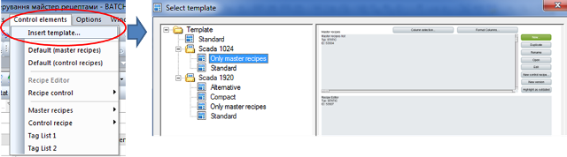
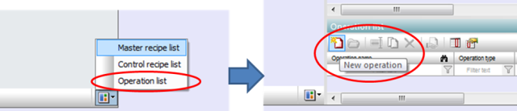
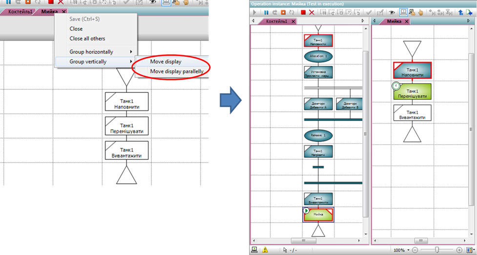
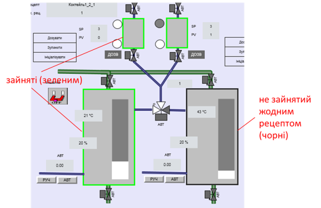
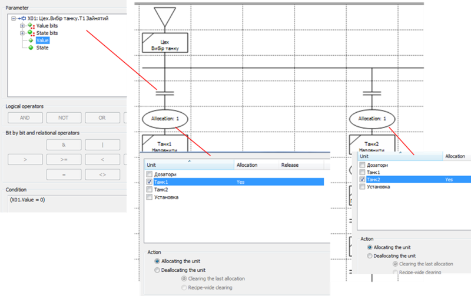

[Лабораторні](README.md)

# Лабораторна робота №7. Робота з майстер рецептами та керівними рецептами. Обробка винятків. 

Мета роботи –  

## Загальні теоретичні відомості

**Керівний рецепт** (**Control recipe**) використовується для створення конкретної партії. Його створюють шляхом копіювання одного з екземплярів майстер-рецепту, а потім за необхідністю модифікують. Керівний рецепт повинен містити:

- інформацію про продукт, яка необхідна для виготовлення конкретної партії цього продукту; 
- про обладнання та апаратурні об’єкти технологічної комірки, що будуть використовуватися для приготування з достатньою деталізацією для їх ініціації і моніторингу. 

Керівний рецепт може бути змінений для врахування фактичної якості сировини і фактичного обладнання, що необхідно використовувати. Деякі приклади необхідної зміни: 

- обладнання, яке насправді буде використовуватися для керівного рецепта визначають при ініціюванні партії, або безпосередньо перед використанням
- додають нові або змінюють існуючі параметри на основі даних про якість сировини, що використовується, або проміжних аналізів якості продукції партії;

- процедура керівного рецепту може бути змінена при нештатній ситуації 

Процедура технологічної комірки керівного рецепта (також називається просто "Рецептурна процедура") складається з рецептурних процедур апаратів, рецептурних операцій і рецептурних етапів, що відносяться безпосередньо до тих, які означені в майстер рецепті. У момент створення керівного рецепта, вони «копіюються» 1:1 з майстер рецепту. Керівний рецепт використовується також для збору інформації про хід виготовлення конкретної партії.

## Завдання до виконання лабораторної роботи

1. todo

## Порядок проведення роботи

### 1. Вікно керування майстер рецептами. 

У минулих лабораторних роботах майстер рецепти використовувалися тільки в режимі тестування. У цій лабораторній роботі необхідно випустити майстер рецепти (Release) для використання на їх основі керівних рецептів, що в свою чергу призначені для виготовлення конкретних партій продукту.  

У zenon необхідно створити вікно керування майстер рецептами 

- [ ] завантажте Unity PRO та проект з минулої лабораторної роботи, скомпілюйте проект, завантажте в імітатор ПЛК та запустіть на виконання

- [ ] завантажте проект zenon з минулої лабораторної роботи, скомпілюйте його та запустіть на виконання

- [ ] у проекті zenon створіть сторінку `Екран керування майстер рецептами` з типом сторінки `Batch Control` та фрейму, на базі якого був створений `Екран Cell` (див. рис.7.1)

                               

рис.7.1. Створення вікна керування рецептами 

- [ ] на екрані розмістіть керівні елементи за шаблоном для Майстер-рецептів (див.рис.7.2) 

 

рис.7.2. Розміщування елементів для керування Майстер-рецептами за замовченням 

- [ ] створіть функцію `Перемикання на екран керування майстер рецептами` для відкриття новоствореного екрану. У вікні налаштування фільтрів залиште все за замовченням

- [ ] на сторінці `Екран Меню` створіть кнопку з написом `Майстер рецепти` для перемикання на новостворенний екран

- [ ] Розтягніть елемент `Master recipes list` на всю ширину екрану з урахуванням розміщення з права кнопок керування;

- [ ] скомпілюйте та перезавантажте проект; відкрийте вікно керування майстер рецептами, використовуючи кнопку та вікно налаштування колонок добавте усі колонки (див. рис.7.3)

Тепер в списку майстер рецептів добре видно усі їх властивості. Однак для роботи з вікнами керування, операторам потрібні локалізовані назви параметрів. Тому в zenon треба налаштувати переклади.

 

рис.7.3. Добавлення усіх колонок до елементу відображення списку рецептів 

### 2. Локалізація текстів.

У zenon необхідно реалізувати мультимовну підтримку з україномовним перекладом системних вікон  

- [ ] створіть новий файл для збереження локалізованих текстів (мовний файл) з іменем `UKRAINIAN` (рис.7.4)

 

рис.7.4. Добавлення нового файлу локалізації (мови) 

Тепер усі тексти, які в середовищі розробки будуть починатися з символу `@` можна замінити на локалізовані версії. Для цього в полі "Keyword" вказується проектна назва (але вже без символу `@`), а в полі мовного перекладу локалізований текст. SCADA zenon дає можливість перекладати також оригінальні тексти виконавчої системи, що робить мультимовну підтримку дуже гнучкою. Для спрощення внесення текстів перекладів в zenon існує декілька помічників (Wizard). Є помічник, який вибирає всі існуючі тексти в проекті і заносить їх в поле `keyword`, при цьому з можливістю заміни звичайних текстів на мультимовні (доповнюючи тексти префіксом `@` ). Використовуючи помічник можна також заповнити колонки текстами вікон виконавчої системи zenon, та їх існуючими перекладами. 

- [ ] запустіть на виконання помічник формування системних текстів: меню File->Wizards->System Text Wizards (рис.7.5); 

 

рис.7.5.Виклик помічника для формування перекладених текстів вікон виконавчої системи zenon

- [ ] користуючись діалоговими вікнами помічника створіть тексти з існуючим перекладом англійькою мовою для `ZENONSTR.TXT` та російською `UKRAININAN.TXT` (див. рис.7.6). Після формування текстів закрийте вікна конфігурації. 

 

 

рис.7.6. Діалогові вікна помічника  

Тепер при старті виконавчої системи zenon оригінальні тексти будуть показуватися такими, як записано `ZENONSTR.TXT`. Для зміни текстів на ті, які внесені в `UKRAININAN.TXT` треба запустити функцію зміни мови. 

- [ ] Створіть функцію типу Language Switch з назвою `Зробити інтерфейс українською` (див.рис.7.7). 

 

рис.7.7. Створення функції зміни мови 

- [ ] для автоматичного виклику функції зміни мови при запуску виконавчої системи створіть скрипт з назвою `AUTOSTART` (див.рис.7.8)

Тепер усі існуючі функції, які будуть добавлені в скрипт AUTOSTART будуть викликатися при старті середовища виконання. 

 

рис.7.8. Створення скрипту `AUTOSTART` 

- [ ] добавте в скрипт `AUTOSTART` функції зміни мови та перемикання на `Екран Batch` (див.рис.7.9)

 

рис.7.9. Добавлення до скрипту AUTOSTART функцій 

- [ ] закрийте середовище виконання zenon (якщо воно виконується), скомпілюйте проект, та запустіть на виконання; проконтролюйте спрацювання функцій відкриття екрану Batch та зміни мови. Подивіться як перекладені російською терміни. 

Існуючий перекладений текст не завжди зрозумілий. Для зручності роботи при відлагодженні необхідно зробити можливість перемикання на англійську мову, а також імпортувати заздалегідь перекладені тексти.

- [ ] Створіть функцію типу `Language Switch` з назвою `Switch to English` з перемиканням на текстів на `ZENONSTR.TXT` . Добавте кнопки на `Екран Меню` відповідно з написами: `English ` – для перемикання на англійську мову; `Українська` – для перемикання на українську.

- [ ] використовуючи команду розширеного імпорту в контекстному меню мовних таблиць  – імпортуйте переклади з файлу `language_ukr.csv` (див. рис. 7.10) у мовні таблиці.

За необхідності мовні таблиці підправити у будь який момент часу. 

 

рис.7.10. Імпорт записів мовних таблиць з файлу CSV 

- [ ] запустіть середовище виконання zenon, подивіться як відображається редактор рецептів для різних мов на сторінках `Екран Batch` та `Майстер рецептів`. 

Надалі в опису лабораторних робіт буде використовуватися тільки англомовний варіант, однак Ви зможете перемикатися на україномовний для кращого розуміння. Якщо англомовні терміни більш зручніші – в функції автостарт виставте іншу мову.

### 3. Випуск Майстер рецептів.

У минулих лабораторних роботах Майстер рецепти створювалися та перевірялися в режимі тестування. Однак такі рецепти не є випущеними для використання (Released) тому не можуть бути основою для створення керівних рецептів. Нагадаємо, що керівні рецепти використовуються для створення конкретних партій продукту. Після тестування майстер рецепту, він повинен бути випущеним (Release) у використання. 

Коли майстер рецепт випущено, на основі нього, як шаблону, можуть бути створені керівні рецепти. При цьому він більше не може редагуватися. Тим не менше, з випущеного майстер рецепту можна робити копії (дублювати), які будуть доступні для редагування аж поки ті, в свою чергу, не будуть також випущеними. Коли рецепту вже не можна використовуватися при виготовленні продукції, його позначають як застарілий (Outdated). Застарілі рецепти можуть бути використані для дублювання а також відслідковування в історії виготовлення партій.   

У zenon необхідно продублювати існуючий рецепт, зробити його випуск, створити на його основі керівний рецепт та позначити його як застарілий.   

- [ ] відкрийте вікно `Майстер рецепти`, уважно передивіться властивості існуючих майстер рецептів 

- [ ] продублюйте рецепт `Коктейль1` через контекстне вікно списку майстер рецептів (див. рис.7.11). Подивіться які можливості доступні в контекстному меню `Коктейля 1_1`.

  

рис.7.11. копіювання рецепту 

- [ ] використовуючи команду `RELEASE` випустіть рецепт для використання; подивіться які операції доступні для випущеного майстер рецепту та як змінилися властивості рецепту

- [ ] у вікні редактору рецептів відобразіть список керівних рецептів та майстер рецептів (рис.7.12)

- [ ] на базі майстер рецепту створіть керівний рецепт; через вікно редактору рецепту відкрийте керівний рецепт та запустіть його на виконання; 

 

рис.7.12. Відображення списку керівних рецептів у вікні редактору 

- [ ] на базі випущеного майстер рецепту створіть керівний рецепт; 

- [ ] через вікно редактору рецепту відкрийте керівний рецепт та запустіть його на виконання; повторіть те саме ще для одного майстер рецепту; 

- [ ] вибираючи рецепт у списку майстер рецептів покажіть асоційовані з ним керівні рецепти (див. рис.7.13)

- [ ] позначте вибраний майстер рецепт як застарілий (`outdated`), проаналізуйте доступні команди та властивості майстер рецепту

 

рис.7.13. Відображення списку керівних рецептів асоційованих з вибраним майстер рецептом 

### 4. Матричні рецепти

Окрім мови PFC у різних середовищах Batch керування для створення рецептів можуть використовуватися і інші форми означення, такі як мова SFC, список, таблиця, діаграма Ганта, та інші. У zenon можна використовувати табличну форму, яка зветься Матричною. Матрична форма (Matrix) представлення рецептів є більш простішою і не має усіх можливостей, що доступні в PFC. Зокрема, тут немає вибору послідовності (альтернативного розгалуження), переходів з умовами та виділення (Allocation) апаратів. Рецепт створюється у вигляді таблиці, де рядки є послідовністю кроків, а стовпці – етапами або операціями. Кожна клітинка таблиці може бути активованою або деактивованою незалежно одна від одної. Активність етапу/операції на кожному кроці означує необхідність їх виконання на цьому кроці. Рядки і стовпці можна додавати за необхідністю.

У наступному завданні необхідно створити майстер рецепт мийки, який буде складатися з 4-рьох кроків, на кожному з яких повинен бути активним один або декілька з етапів набору танку 1:

- 1 крок (наповнення): активний етап `Наповнити` на `20%`

- 2 крок(нагрівання з перемішуванням): активні етапи `Перемішувати` та `Нагрівати` протягом 10 секунд 

- 3 крок (витримка з перемішуванням): активний етап `Перемішувати` протягом 20 секунд

- 4 крок (злити): активний етап `Вивантажити` до `0%`;

У zenon необхідно створити створити майстер рецепт `Мийка2` у матричному вигляді та перевірити його роботу.   

- [ ] у середовищі виконання zenon відкрийте вікно `Екран Batch`, та створіть новий рецепт `Мийка2` матричного вигляду (Matrix recipe) 

- [ ] добавте до рецепту 4 кроки та етапи для танку 1 (див.рис.7.14)

 

 

рис.7.14. Добавлення кроків та етапів/операцій 

- [ ] шляхом виставлення опції `Phase active in this step` виставте активність етапів на кроках, як це показано на рис.7.15

 

рис.7.15. Налаштування активності етапів на кожному кроці 

- [ ] налаштуйте інші параметри кроків, відповідно до поставленого завдання 

- [ ] запустіть майстер рецепт на виконання в тестовому режимі; це матиме вигляд як на рис.7.16

 

рис.7.16. Вигляд матричного рецепту в режимі виконання 

### 5. Operations (Операції)

Операції можуть бути використані для інкапсулювання задач, які повинні виконуватися в кількох рецептах. Прикладом цього є операція мийки, яку часто треба запускати після приготування будь-якого продукту. Замість трьох етапів, які постійно треба б було ставити в рецепт, туди можна помістити тільки одну операцію, яка буде заздалегідь створена з цих етапів. Так можна досягнути простішого та швидшого створення рецепту та зручнішого відображення великих рецептів. 

У zenon необхідно створити та перевірити роботу операції `Мийка`.   

- [ ] У середовищі виконання zenon відкрийте вікно `Екран Batch`, та використовуючи команди редактора рецепту створіть операцію `Мийка` (див.рис.7.17)

- [ ] Заповніть операцію аналогічно рецепту мийка, перевірте її правильність та збережіть

Операції не можуть бути перевірені безпосередньо. Щоб перевірити операцію, вона повинна бути частиною майстер рецепту і перевірена разом з ним. 

  

 рис.7.17. Відкриття списку операцій та створення нової операції 

- [ ] відкрийте майстер-рецепт `Коктейль1`, перейдіть в режим редагування та добавте після етапу `Вивантажити` операцію `Мийка` (рис.7.18)

- [ ] перевірте правильність рецепту: переведіть його в режим тестування та запустіть на виконання

 

рис.7.18. Наповнення операції "Мийка" та вставка його в процедуру майстер рецепту 

- [ ] під час роботи операції `Мийка` рецепту подвійним кліком зайдіть в операцію та подивіться її роботу

Операція відкривається подвійним кліком. Треба розуміти, що це не шаблон операції, а екземпляр цього шаблону, який є унікальним.

- [ ] Перемістіть екземпляр операції в свою власну групу так, щоб Ви могли побачити майстер рецепт і операцію поруч один з одним (рис.7.19)

Символ екземпляра операції представляє стан всіх вкладених в нього етапів. У підказці дається огляд помилок в екземплярі операції.

 

рис.7.19. Відображення поряд операції та майстер-рецепту.  

- [ ] випустіть операцію на використання (`Release`) через його контекстне меню

### 6. Керівний рецепт (Control recipe)

У стандарті ISA-88, проводиться відмінність між майстер рецептами (Master Recipe) і керівними рецептами (Control recipe). При цьому, керівні рецепти завжди походять від майстер рецептів. 

SCADA zenon не дає можливості змінювати процедуру в керівному рецепті. Після випуску майстер рецепту, з нього може бути створений керівний рецепт, який виконується тільки один раз. Таким чином керівний рецепт відповідає за виготовлення конкретної партії. 

У zenon необхідно створити вікно керування рецептами та перевірити його роботу 

- [ ] у проекті zenon створіть сторінку `Екран з рецептами` на базі типу сторінки `Batch Control` та шаблону екрану, на базі якого створений екран для керування майстер рецептами, використовуючи шаблон вставки (`Control Elements -> Insert Template->Compact`) 

- [ ] створіть функцію `Перемикання на екран керування рецептами` для перемикання на новостворений екран. У вікні налаштування фільтрів залиште все за замовченням 

- [ ] на сторінці `Екран Меню` створіть кнопку з написом `Усі рецепти` для перемикання на новостворенний екран

- [ ] Розтягніть елементи `Master recipe list` та `Control recipes list` таким чином, щоб разом вони зайняли  всю ширину екрану; також розтягніть `Recipe Editor` на всю ширину екрану; 

- [ ] скомпілюйте та перезавантажте проект; відкрийте вікно керування керівними рецептами, використовуючи кнопку та вікно налаштування колонок добавте усі колонки (див. рис.7.3)

- [ ] запустіть середовище виконання і відкрийте сторінку `Усі рецепти`

- [ ] у списку майстер рецепту виділіть рецепт `Коктейль1_1` (який був випущений для використання вище) та натисніть `Display associated control recipes in list`

- [ ] подивіться на екрані які є доступні опції фільтрів рецептів та кнопки керування  

- [ ] продублюйте майстер рецепт `Коктйель1` з назвою `Коктейль1_2` та випустіть його для використання 

- [ ] створіть керівний рецепт на базі Майстер рецепту `Коктейль1_2` (кнопка `New` при виділеному майстер рецепті), дайте йому довільну назву, та запустіть його на виконання (кнопка `Starting`)

- [ ] у списку керівних рецептів подивіться властивості нествореного рецепту, натисніть подвійним кліком по ньому (або натисніть кнопку `Open`), щоб він відобразився в редакторі рецепту

- [ ] до завершення рецепту перейдіть на екран `Екран Batch` та проконтролюйте виконання рецепту

- [ ] після закінчення виконання рецепту передивіться його властивості на екрані `Усі рецепти`

Зверніть увагу, що по завершенню керівного рецепту його не можна повторно виконати. Але керівний рецепт можна продублювати і знову виконати.

- [ ] виділіть керівний рецепт який щойно виконався, продублюйте його і новостворений рецепт запустіть на виконання 

За допомогою редагованих командних тегів, властивості в керівному рецепті можуть бути встановленими як змінювані в керівному рецепті (`Changeable in control recipe`). У результаті, стане можливим перезаписувати значення командних тегів в кожному керівному рецепті. Значення в керівному рецепті може бути змінено тільки в межах, які були встановлені для тега в майстер рецепті.

### 7. Створення, прив'язка змінних до Runtime Information Unit, відображення стану

Для того, щоб мати можливість контролювати стан виконання REE, рецепту або об'єктів в рецепті, модуль Batch Control пропонує прив’язувати цю інформацію до змінних. Ці змінні можуть бути відображені та використані для контролю.

В налаштуваннях Unit Batch Control для кожного апарату можна в налаштуваннях Runtime Information вказати змінні, в яких буде відображатися актуальний стан (див.рис.7.20) пов’язаних з ним в даний момент рецептів Master recipe (в режимі тестування, або на якому базується Control Recipe) та Control Recipe. До такої інформації відноситься: 

- `ID` – ідентифікатор рецепту (тип UDINT)
- `Description` – опис (string)
- `Name` – ім'я(string)
- `Version` – версія(udint)
- `Initial Version` – початкова версія(udint)
- `Job ID` – тільки для керівного рецепту (string)
- `Number of active recipes` (udint)

 

 

рис.7.20. Налаштування зв’язку інформації по апаратам (Unit) в модулі Batch zenon.  

- `Number of active recipes` – кількість активних рецептів: 0 або 1, при ручному форсуванні запуску рецепту може бути більше (тип UDINT)

- `Execution Status` – стан виконання (відповідно до автомату стану) рецепту в текстовому і числовому вигляді (string та numeric)

Таб.7.1. Числові значення статусів виконання рецепту 

| Статус     | Значення | Примітка                                                     |
| ---------- | -------- | ------------------------------------------------------------ |
| Idle       | 0        |                                                              |
| Running    | 1        |                                                              |
| Executed   | 2        | ніколи не відображається, оскільки виконаний рецепт ніколи не займає Unit |
| Stopping   | 3        |                                                              |
| Stopped    | 4        | ніколи не  відображається, оскільки зупинений рецепт ніколи не займає Unit |
| Pausing    | 5        |                                                              |
| Paused     | 6        |                                                              |
| Holding    | 7        |                                                              |
| Held       | 8        |                                                              |
| Aborting   | 9        |                                                              |
| Aborted    | 10       | ніколи не  відображається, оскільки відмінений рецепт ніколи не займає Unit |
| Restarting | 11       |                                                              |

- `Execution Mode` – режим виконання (відповідно до автомату стану) рецепту в текстовому і числовому вигляді (string та numeric)

Таб.7.2. Числові значення режимів виконання рецепту 

| Режими виконання рецепту | Значення | Примітка              |
| ------------------------ | -------- | --------------------- |
| Ignore                   | 0        | Рецепт не виконується |
| Automatic                | 1        |                       |
| Semi-automatic           | 2        |                       |
| Manual                   | 3        |                       |

`Phases` – перелік активних етапів, розділених символом кінця рядку (string)

Окрім наведених вище даних в налаштуваннях Runtime Information налаштовується також прив’язка змінних до інформації про помилки виконання та кроки матричного рецепту, якщо цей рецепт займає апарат. 

У zenon необхідно створити та налаштувати тип та змінні для відображення стану рецептів прив’язаних до апаратів  

- [ ] у проекті zenon створіть структурний тип `RECIPE_INFO` відповідно до наведеного рис.7.21

- [ ] створіть структурний тип `UNIT_INFO` відповідно до наведеного рис.7.21

- [ ] для кожного Unit в проекті створіть внутрішню змінну zenon, яка буде містити інформацію про рецепт (див. рис.7.21)  

 

рис.7.21. Створення змінних та типів для відображення актуальних станів прив’язаних до апаратів, агрегатів та технологічної комірки рецептів.  

- [ ]  в налаштуваннях Runtime Information для Unit `Танк1` прив’яжіть змінні, як це показано на рис.7.22   

 

рис.7.22. Налаштування Runtime Information для апарату Танк1.  

- [ ] аналогічно прив’яжіть змінні до інших Unit: `Танк2`, `Установка` та `Дозатори`   

Для зручності вибору змінних з великого переліку можна користуватися фільтрами.

- [ ] на екрані Batch покажіть інформацію про плинний стан рецептів, що займають апарати `Танк1` та `Танк2` та агрегат `Дозатори`; приклад показаний на рис.7.23   

- [ ] на `екрані Batch`, використовуючи поле змінних `N_ACTRCP` (Number of active recipes)  реалізуйте індикатор, який буде показувати, що Unit зараз використовуються в рецепті, наприклад:

- перейдіть в налаштування `Limits` поля `N_ACTRCP` типу `UNIT_INFO `добавте 2 границі: 

  - `0 – Minimum`, колір чорний; 
  - `1 – Maximum`, колір яскраво-зелений.
- на екрані Batch змініть контури апаратів та дозатору так, щоб вони змінювали свій колір в залежності від зайнятості рецептом (рис.7.24)

 

рис.7.23. Приклад вікна Batch Control з інформацію про плинний стан прив’язаних до апаратів та агрегату рецептів (червоним виділені нові елементи).  

 

рис.7.24. Відображення зайнятості апаратів та агрегату зміною кольору контуру обладнання.

### 8. Використання Runtime Information в процедурному керуванні рецептом

Інформацію про зайнятість обладнання можна використовувати і в логіці процедурного керування рецепту. У попередніх роботах для приготування одного і того самого продукту але в різних танках використовувалися різні майстер рецепти. Доречно в одному і тому самому рецепті прописувати процедуру приготування для усіх танків, в яких це можливо зробити. Вибір танку може проводитися вручну, або за певною умовою. Нижче описано, як реалізувати автоматичний вибір танку при запуску рецепту з використанням Unit Runtime Information. 

У zenon необхідно створити рецепт, який буде готовити продукт у будь-якому з вільних (не зайнятих іншим рецептом) танків  

- [ ] У проекті zenon в створіть Unit `Цех` в якому створіть етап `Вибір танку`, який буде передувати приготуванню продукту в конкретному танку (див. рис. 7.25)

Даний етап потрібен тільки для того, щоб створити в ньому теги перевірки зайнятості танків. Інакшим чином інформацію в процедурне керування рецепту передати не можна. Логічно було б створити етап уже в існуючому Unit `Установка`, який відповідає за функції Технологічної комірки (Process Cell). Однак, при виконанні етапу `Вибір танку` Unit буде зайнятий рецептом, що не дасть можливість запустити в іншому рецепті етап `Прокласти маршрут доз`. У зв’язку з цим необхідно створити новий Unit.  

- [ ] В етапі `Вибір танку` створіть теги зворотного зв'язку типу Numeric з іменами `T1 Зайнятий` та `T2 Зайнятий` та прив’яжіть їх до полів `N_ACTRRCP` змінних відповідних танків (див. рис. 7.25)

 

рис.7.25. Створення етапу Вибір танку, та тегів індикаторів зайнятості танків. 

Тепер в рецепті можна використовувати змінні, які будуть показувати скільки вже рецептів на даний момент використовують даний танк (займають його). Якщо кількість буде нульовою – танк незайнятий, тому його можна використовувати для приготування продукту в даному рецепті. Таким чином, в рецепті можна вказати процедуру приготування продукту в одному з двох танків, який буде вільним, через альтернативне розгалуження. 

- [ ] запустіть середовище виконання zenon і створіть ще одну операцію `Мийка2`, аналогічну операції `Мийка` але вже для виконання процедури мийки 2-го танку

- [ ] продублюйте Майстер рецепт `Коктейль1` (той, в якому була добавлена операція) та назвіть його `Коктейль Кровава Мері` 

- [ ] модифікуйте `Коктейль Кровава Мері` так, щоб він готовив продукт в одному з двох танків:

- загальний вигляд процедури рецепту показаний на рис.7.26, налаштування нових процедурних елементів показані на рис.7.27 

- аналогічно послідовності для приготування в `Танку1` створіть послідовність для `Танку2`, яка йде в альтернативній гілці

Після перевірки умови незайнятості танку програма буде йти по відповідній гілці. Для убезпечення займання танку іншим рецептом, спочатку проводиться його явне займання (Allocation), а після закінчення приготування - вивільнення (Release).  

- [ ] перевірте роботу майстер рецепту `Коктейль Кровава Мері` в режимі тестування: 

- спочатку запустіть цей рецепт і дочекайтеся його завершення: рецепт повинен приготувати продукт в Танку1;

- після завершення рецепту запустіть в режимі тестування майстер-рецепт `Коктейль1`, щоб той зайняв `Апарат1`; під час наповнення `Танку1` знову запустіть на виконання рецепт `Кровава Мері`; 

Тепер рецепт `Кровава Мері ` повинен зайняти 2-й танк.  Після перевірки майстер рецепту необхідно його випустити для експлуатації, щоб на базі нього можна було створювати керівні рецепти.

- [ ] Випустіть майстер-рецепт `Коктейль Кровава Мері` для використання (Release); перед випуском майстер Рецепту не забудьте випустити операцію `Мийка2` 

- [ ] на базі майстер рецепту `Коктейль Кровава Мері`  створіть три керівні рецепти, після чого послідовно запустіть їх на виконання

- [ ] спостерігаючи за написами стану (`Runtime Information`) прослідкуйте який рецепт в який час займає який апарат та агрегат дозування;   

 

рис.7.26. Загальний вигляд рецепту "Коктейль Кровава Мері".

 

 

рис.7.27. Налаштування деяких елементів рецепту "Коктейль Кровава Мері".

### 9. Обробка винятків (Error handling)

ISA88 передбачає врахування в автоматі станів результату обробки виняткових ситуацій. Ця обробка винятків як правило проводиться в логіці роботи апаратурних процедур (в ПЛК). Тим не менше, деякі винятки, наприклад комунікаційні помилки треба обробляти з обидвох боків - і з боку ПЛК (апаратурного керування) і з боку SCADA (апаратурне та рецептурне керування).   

У програмі етапу `phFILL` ПЛК та SCADA zenon в стані `RUNNING` необхідно створити обробник помилок клапану відкриття.  

- [ ] у проекті UNITY PRO відкрийте секцію функціонального блоку `phFILL` та змініть програму таким чином, щоб при будь-якій помилці клапану набору (статусні біти 0..3) етап переходив в стан `Holding` (рис.7.28);  зверніть увагу на дії, які відбуваються в стані Holding та як змінюється реакція автомату станів на команди керування; 

- [ ] самостійно модифікуйте програму так, щоб в стані `Held`, клапан набору завжди був закритим; 

- [ ] внесіть зміни в імітатор ПЛК;

 

 

рис.7.28. Модифікація програми для етапу `phFILL`.  

- [ ] в zenon для етапу `Наповнити` Танків створіть умову виникнення помилки як перехід етапу в ПЛК в стан `Held` (див.рис.7.29) та змініть умову `Restarted`;

- [ ] в реакціях етапу `Наповнити` створіть подію `PLC Error` в якій пропишіть перехід етапу в стан `Holding` (`Phase Holding`) (див.рис.7.30)

 

рис.7.29. Добавлення в zenon умови виникнення помилки для етапу. 

 

 

рис.7.30. Добавлення в zenon реакції на помилку в ПЛК.  

- [ ] в таблицю анімації UNITY PRO внесіть змінну `%I0.1.0`, та зафорсуйте її в стані `0`(FALSE)

- [ ] в середовищі виконання zenon на екрані Batch виберіть рецепт `Коктейль1` та в режимі тестування запустіть рецепт

- [ ] зверніть увагу на стан етапу наповнити (рис.7.31); коли етап перейде в стан `Held` зніміть в UNITY PRO форсування зі змінної `%I0.1.0` та перезапустіть етап; дочекайтеся виконання рецепту

 

рис.7.31. Вигляд етапу Наповнити в стані "Held"

За допомогою команд, що прописані в реакціях на події, можна реалізовувати поширення станів та режимів (propagation state, propagation mode) вгору. Тобто, наприклад, якщо важливий етап переходить в стан `Holding` можна перевести весь рецепт в стан `Holding` (`Command = Recipe Holding`).  

### 10. Поширення стану Held 

У zenon необхідно реалізувати перехід усього рецепту в стан `Holding`, коли етап `Нагрівати` переходить в `Holding`.  

- [ ] у реакції етапу на подію `Holding` пропишіть команду переходу усього рецепту в `Holding`

- [ ] запустіть рецепт `Коктейль1` на виконання в режиму тесту, виділіть етап `Нагрівати`, дочекайтеся його активації та переведіть командою керування з панелі в стан утримування (`Hold Phase`); весь рецепт повинен перейти в стан `Held`;

- [ ] перезапустіть рецепт (`Restart Recipe`) та дочекайтесь його закінчення;  

Для Batch Control дуже важливою є синхронізація між ПЛК і zenon. Кожен етап zenon може виявити проблеми зв'язку з ПЛК і реагувати на них. Етап повідомляє про втрату зв'язку, якщо параметри команди не можуть бути записані, або якщо результат виконання формули в обробнику помилок  дає істину. Якщо відбувається втрата зв'язку, етап призупиняється (`paused`) або утримується (`held`), і через налаштовані реакції може виконатися певна подія.

Після запису командних тегів (параметрів), значення відповідних змінних негайно зчитуються з ПЛК. Крок `Записати командний параметр` завершується тільки тоді, коли всі значення, які були прочитані відповідають записаним. Якщо хоча б одна змінна значення відрізняється, то після заданого часу очікування всі командні теги записуються знову. Якщо після третьої спроби запису усі прочитані змінні не будуть відповідати записуваним етап повідомляє про помилку зв'язку, після чого переходить в стан, означений в налаштуваннях Batch Control (рис.7.32). 

 

рис.7.32. Налаштування дій етапів при втраті зв’язку та при виконанні формули.  

На додаток до згаданого вище автоматичного виявлення помилок, для виявлення відмов зв'язку також можна пов'язати формулу (Loss of communication). Таким чином, можна виявити збої не тільки при запису значень параметрів, але і під час активності етапу. Для того, щоб гарантувати безпечний повторний запуск рецепта після втрати зв'язку, можна запросити підтвердження для відновленої зв'язку (Loss of communication acknowledged). Ці налаштування для кожного етапу проводяться окремо (див. рис.8.32). 

## Контрольні питання

1. 