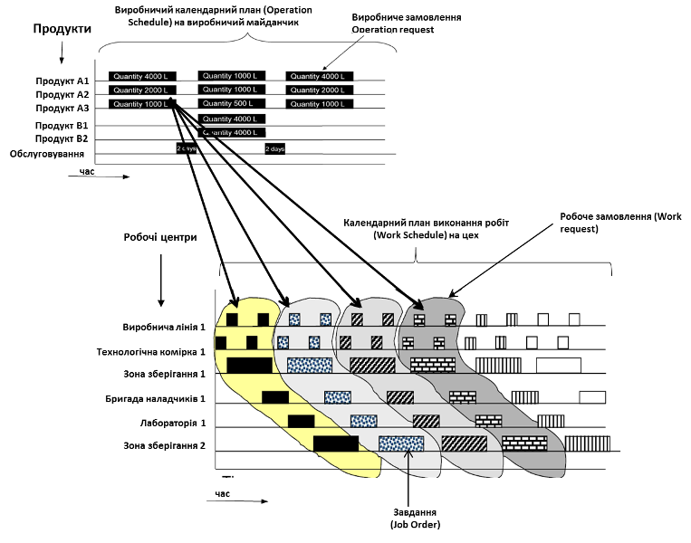
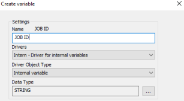
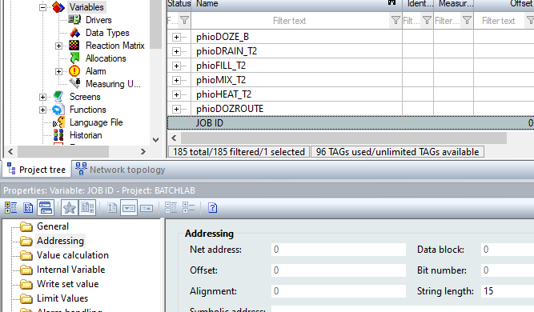
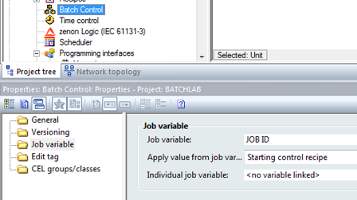
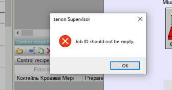
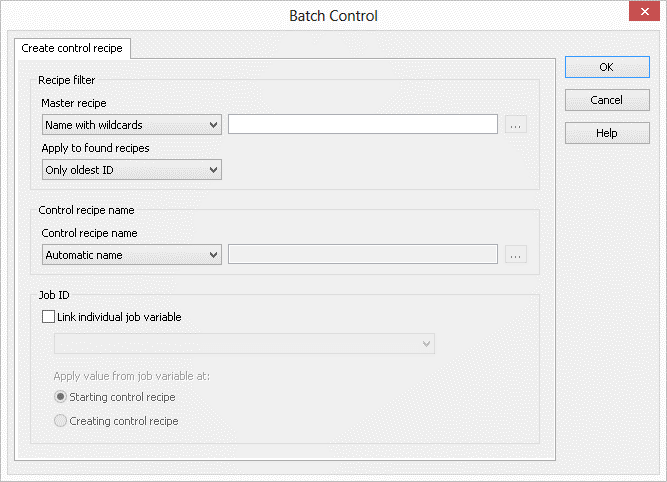
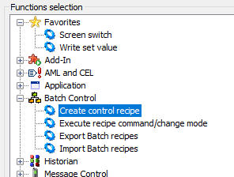

# ЛАБОРАТОРНА РОБОТА 8. Звітність 

Мета роботи –  

## Загальні теоретичні відомості

## Завдання до виконання лабораторної роботи

1. 

## Порядок проведення роботи

### 1. Використання Job ID

У ISA-88 кожна партія (Batch) повинна мати унікальний ідентифікатор - `Batch ID`, за якою можна буде зробити простеження. Крім порційних виробництв, за які відповідає ISA-88, можуть бути неперервні та дискретні виробництва, для яких можна також використовувати ті самі підходи що і ISA-88. Для керування такими виробництвами існує стандарт ISA-95 та його міжнародний аналог (IEC 62264). Згідно цього стандарту технологічна комірка (Process Cell) є робочим центром порційного типу, а керівний рецепт для партії/порції є одним з типів робочих завдань (Job Order). Слід відмітити, що хоч стандарти ISA-88/ISA-95 мають здебільшого спільну ідеологічну основу, деякі речі не повністю сумісні. Однак в даному випадку, можна вважати що `Batch = Job` .    

рис.8.1.

Для ідентифікації Job в стандарті ISA-95 (MES/MOM) використовується `JOB ID`, саме цей ідентифікатор використовується в zenon як більш універсальний. Batch Control дає можливість призначати керівні рецепти до цього ідентифікатору завдання (`job number`). Таким чином, можна призначати керівним рецептам чіткі ідентифікатори, які  можуть бути використані як для від фільтрації так і для архівів за партіями (lot archives). 

Необхідно створити Job variable у zenon та прив’язати її до Batch Control.

- [ ] Завантажте Unity PRO та проект з минулої лабораторної роботи, скомпілюйте проект, завантажте в емулятор ПЛК та запустіть на виконання

- [ ] Завантажте проект zenon з минулої лабораторної роботи, скомпілюйте його та запустіть на виконання, перевірте, що проект працює правильно 

- [ ] Створіть нову текстову (STRING) змінну `JOB ID` прив’язану до внутрішнього драйверу (`internal`); Властивість `STRING Length` зробіть рівною 15 символам;

рис.8.2.

- [ ] За допомогою елементу `Dynamic text` відобразіть змінну на екрані `Екран Batch` з можливістю зміни
- [ ] У дереві проекту, для Batch Control прив’яжіть властивість `Job variable` до новоствореної змінної та вкажіть що призначення ідентифікатора буде відбуватися при запуску рецепту (див. рис 8.6)  

                               

рис.8.3. Прив'язка змінної Job variable .

- [ ] Збережіть, скомпілюйте та запустіть на виконання проект zenon.

- [ ] На основі майстер рецепту `Коктейль Кровава Мері` створіть керівний рецепт, запустіть його на виконання.  Має з'явитися повідомлення, що значить, що поки ви не дасте значення змінній `JOB ID`, рецепт не буде запущено

рис.8.4.

- [ ] Дайте довільну назву `JOB ID`. Запустіть рецепт на виконання.

Система REE zenon перевіряє, чи має пов'язана змінна коректне значення при створенні керівних рецептів. Номер завдання (job number) завжди відображається в діалозі конфігурації при створенні керівних рецептів. Крім того, номер завдання відображається в списку керівних рецептів. Ви можете фільтрувати, сортувати і групувати список за номерами завдань. Крім того, коли викликається екран типу Batch Control, Ви можете використовувати фільтр по цьому номеру завдання.

### 2. Автоматизація створення керівних рецептів

Модуль Batch Control дає можливість створювати керівні рецепти і контролювати їх роботу не тільки вручну, але і автоматично за допомогою функції. Таким чином можуть бути створено кілька керівних рецептів і запуститися в певній час. Крім того, всі рецепти, які виконуються можуть бути одночасно припинені, наприклад у разі виникнення проблем. 

Для автоматичного створення керівних рецептів доступна функція `Create control recipe`. 

рис.8.5.     

- [ ] Створіть функцію типу `Create control recipe`, яка дозволяє створити кілька керівних рецептів в той же час

„   Майстер рецепти повинні бути в змозі бути вибраний за допомогою текстового фільтра в середовищі виконання

„   Зв'яжіть індивідуальну змінну робочого завдання і запишіть номер робочого завдання в рецепт при запуску

 

## 1.1          Звітування 

 

Рецепти від модуля Batch Control доступні для Report Viewer. Таким чином, можна створити детальну документацію по рецепту або зберегти у форматі PDF, якщо це необхідно. Дві речі, які необхідні для того, щоб мати можливість створювати такі звіти в режимі виконання: шаблон звіту (RDL-файл) і функцію, яка заповнює цей шаблон даними рецепта.

### Шаблон рецепту 

 

У стандартному шаблоні для звітів, який поставляється разом з zenon, всі необхідні набори даних і таблиці, які доступні для пакетних звітів включені. Щоб створити batch report, виконайте наступні дії:

„   Створіть новий файл означення звіту і відкрийте його в MS Report Builder

„   Видаліть всі непотрібні набори даних і таблиці з робочого листа

„   Збережіть файл.

### Перемикання екранів та фільтр рецептів 

 

При перемиканні екрану на екран Report Viewer, можна означити, використовуючи фільтр, дані якого рецепт, який повинен бути використаний для заповнення звіту.

​                                                    

Діалог фільтра пропонує вже знайомі настройки фільтра, такі як майстер рецепт/ керівний рецепт, фільтр відповідно до назви, ID і т.п. В якості альтернативи фільтрам для певного рецепта, також можна вибрати, щоб використовувати рецепт, обраний в списку рецептів. Для закінчення доступна настройка Accept selection from recipe list from calling Batch Control screen.

Задачі:

„   Створіть звіт, в якому перераховані всі етапи рецепта 

„   Створіть функцію, яка дозволяє заповнити звіт з даними з рецепта, який в даний час показаний

 

 

## 1.2          Збереження даних 

 Рецепти зберігаються в Batch Control модулі в Runtime. Дані рецепта не можуть бути імпортовані в редактор. Дані, отже, не зберігаються в каталозі Runtime. Є кілька файлів і папок під PROJECT\RT\FILES\zenon\system\BatchRecipes:

 

| Файл/папка               | Опис                                                         |
| ------------------------ | ------------------------------------------------------------ |
| xxx.MR                   | Збережений  майстер рецепт. xxx  - ID рецепту                |
| xxx.crd                  | Папка  для керівного рецепту майстре рецепту. xxx – це ID майстер  рецепту |
| Recipe.unique            | список  майстер рецептів. Список збережений в пам’яті  і записаний на диск як бекап |
| xxx.crd\yyy.CR           | Збережений  керівний рецепт. yyy - ID керівного рецепту      |
| xxx.crd\Recipe.unique    | Список  усіх керівних рецептів майстер рецепту               |
| Operations               | Папка  в якій зберігаються усі операції                      |
| Operations\zzz.OP        | Збережена  операція                                          |
| Operations\Recipe.unique | Список  усіх операцій                                        |

 

## 1.3          Образ (Image)

 

Статус виконання Batch recipes можуть бути збережені циклічно в файл зображення. В результаті цього забезпечується те, що, в разі незапланованого збою zenon Runtime (через відключення живлення, наприклад), всі рецепти можна продовжувати при перезапуску.

Для установки часу циклу для написання файлу зображення

„   Відкрийте властивості модуля Batch Control

„   Активуйте в групі властивостей General властивість Activate cyclical writing 

„   Встановіть властивість cycle time, значення > 30

 

Якщо циклічний написання буде вимкнено зображення записуються тільки якщо середовище виконання закрита належним чином. 

## Контрольні питання

1. 