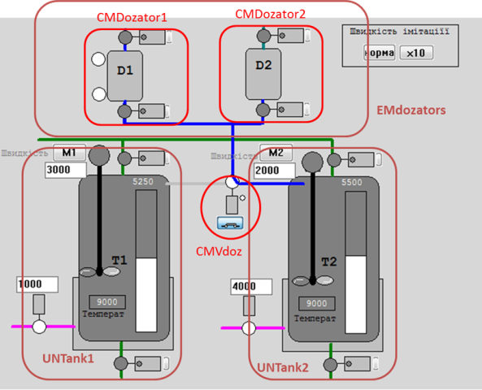

[Керування порційним виробництвом](../README.md)

# Лабораторний практикум

- [ЛР1](1.md) Встановлення та налаштування SCADA zenon
- [ЛР2](2.md) Основи роботи з Batch Control
- [ЛР3](3.md) Зв'язок рецептурного та апаратурного керування
- [ЛР4](4.md) Виконання процедур на рівні SCADA та ПЛК. Базові можливості рецептів в PFC
- [ЛР5](5.md) Реалізація Control Module
- [ЛР6](6.md) Модель апаратурних об’єктів та координаційне керування
- [ЛР7](7.md) Робота з майстер рецептами та керівними рецептами. Обробка винятків. 

У процесі виконання лабораторних робіт передбачається різноманітні діяльності в середовищі програмування Unity PRO та SCADA zenon для розроблення застосунку з керуванням порційним виготовленням продукції (Batch Control) згідно стандартів ISA-88/IEC-61512. Для прикладу взята установка для приготування соків. 

Демонстрація кінцевого варіанту показано на [цьому відео](https://youtu.be/jCCe0jQ84fk?si=VOV9pNShRG_gei-A), що доступне на каналі YouTube. Нижче описано які саме діяльності проводитимуться у лабораторних роботах. 

    

У [першій](1.md) лабораторній роботі виконується встановлення SCADA zenon, модуль Batch Control якої використовується для усіх лабораторних робіт. Середовище розроблення і виконання SCADA zenon має демо режим, який дозволяє використовувати її в навчальних цілях безкоштовно.

У [другій](2.md) лабораторній роботі здобувач знайомиться з основами розроблення та перевірки рецептів з використанням графічної мови PFC. Дана лабораторна робота тільки вводить в основи Batch Control, і в ній відсутня взаємодія з рівнем керування на ПЛК. 

[Третя](3.md) лабораторна робота зосереджується на взаємодії між Batch рецептами та керуванням обладнанням. На реальних прикладах розглядається що таке автомат станів для процедурних елементів і як він реалізовується на практичному завданні. У цій лабораторній роботі вже використовується рівень ПЛК, який базується на середовищі програмування ПЛК Schneider Electric Unity PRO з вбудованим емулятором ПЛК. Спеціально для цього лабораторного практикуму підготовлена імітаційна установка, для якої послідовно в лабораторних роботах розробляється рішення Batch Control, що дає змогу виконувати проект аналогічно як для реального обладнання. У даній лабораторній роботі рівень ПЛК використовується тільки для реалізації керуючих дій та збору даних з об'єкту, вся логіка керування поки залишається на рівні Batch Control SCADA.   

У [четвертій](4.md) лабораторній роботі використовується інший принцип, за яким логіка виконання етапів реалізована в ПЛК. Таким чином, етапи функціонують як в SCADA так і в ПЛК, зв’язуючись через команди та стани. Для цього в роботі реалізовується інтерфейс обміну станами, режимами та командами а також реалізовується процедурне керування (етапи) на рівні ПЛК. Більш детально розглядаються режими рецептурних елементів та рецепту, використовуються галуження в мові PFC.

[П'ята](5.md) лабораторна робота зосереджується на створенні та використанні логіки керування модулями керування CM (Control Module). Цей концепт є частиною стандарту ISA-88/IEC-61512 однак успішно використовується  при розробленні систем керування різними типами об'єктів. Він базується на об'єктному представленні керівного обладнання (клапани, двигуни, інші засоби КВПіА) та взаємодію з ним через змінні стану та керування. У якості прикладу розглядаються запірні та регулюючі клапани зі зворотнім зв'язком. Існуючі етапи модифікуються для їх взаємодії через модулі керування.       

[Шоста](6.md) лабораторна робота зосереджується на реалізації концепції обладнання в ієрархічній взаємодії між собою та певних видах координаційного керування. Здобувачі створюють в ПЛК та SCADA логіку для системи дозування, яка є Equipment Module, реалізовують для неї етапи. Розглядаються конфліктні ситуації доступу до одного ресурсу та способи їх вирішення. За допомогою спеціального елемента Allocation  мови PFC вирішується питання організації послідовного доступу до ресурсу в рецепті. У теоретичній частині пояснюється принципи визначення ієрархії обладнання, при побудові якої виділяються апаратурні об'єкти.     

У [сьомій](7.md) лабораторній роботі основна увага приділяється керуванню майстер рецептами (випуск, версіювання) та керівними рецептами (створення, запуск). За допомогою діяльностей по контролю стану керівних рецептів забезпечується автоматизація та координація розподілу обладнання. Розглядаються також операції та означення рецептів за допомогою матричного представлення. На останок в процедурному керуванні реалізовується обробка винятків.      

Усі лабораторні роботи супроводжуються теоретичними поясненнями, що дає можливість пов'язати їх виконання з конкретними рекомендаціями стандартів та кращими практиками.   

Лабораторні роботи розраховані на самостійне проходження, але Ви можете записатися на курси:

- [BAT111, Розробка систем керування порційними (BATCH) виробництвами відповідно до стандартів IEC 61512 (ISA-88) - Festo дидактика](https://www.festo.com/ua/uk/e/rishiennia/navchannia-ta-konsul-tatsiyi/nash-pierielik-kursiv/codesys-zenon-mitsubishi-mikrokontrolieri-ieliektronika-ieliektrotiekhnika-rietsiepti-id_1641847/) з видачею сертифікатів
- безпосередньо у розробника, за індивідуальним графіком

Розробник [Олександр Пупена](https://pupenasan.github.io/)

